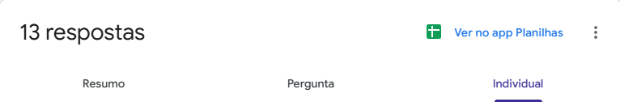
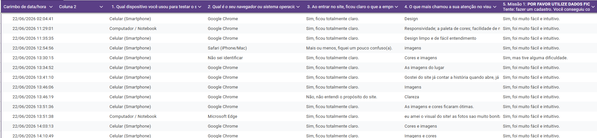
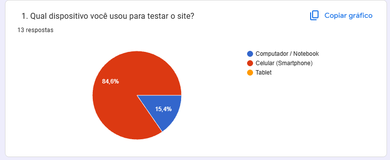
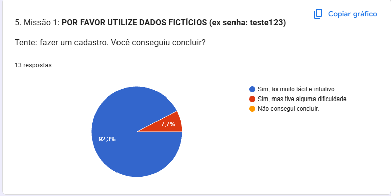

# 4.4. Iniciativas Extras

Registro de iniciativas complementares adotadas pela equipe na entrega de **Arquitetura & Reutilização de Software**.

---

## Comunicação

No início da Entrega 04, a equipe completa (**10 integrantes**) usou o **Discord** para alinhamentos gerais e referências de reutilização. Com a redução do time para **3 integrantes** (Amanda De Moura, Anna Clara Brandão e Mariana Martins), adotamos o **WhatsApp** para decisões síncronas e o **GitHub** para código, issues e documentação.

| Aspecto | Decisão |
| --- | --- |
| Estrutura do time | 3 pessoas, 2 frentes (FE/BE) |
| Canal síncrono | WhatsApp |
| Canal assíncrono | GitHub (código + issues) |
| Documentação | GitPages (`docs/`) |

| Fase | Canal | Finalidade |
| --- | --- | --- |
| Início do projeto | Discord | Alinhamentos e divisão inicial |
| Continuidade | WhatsApp | Organização e priorização |
| Desenvolvimento | GitHub + GitPages | Versionamento e documentação |

---

## Documentação de reutilização

**Responsáveis:** Amanda De Moura, Mariana Martins e Anna Clara Brandão

Cada item reutilizado deve responder:

| Pergunta | O que responder |
| --- | --- |
| **O que faz?** | Papel no sistema e padrão ou responsabilidade associada |
| **Por que utilizei?** | Alternativa descartada ou motivo da escolha |
| **No que ajudou?** | Impacto no projeto |

Esse roteiro está na [visão geral backend](/ArquiteturaReutilizacao/backend/00.VisaoGeral.md), [visão geral frontend](/ArquiteturaReutilizacao/frontend/00.VisaoGeral.md), nos módulos por RF ([backend 01–08](/ArquiteturaReutilizacao/backend/01.Autenticacao.md), [frontend 05–07](/ArquiteturaReutilizacao/frontend/05.RelatosExperiencia.md)) e nos documentos por requisito ([4.4](/requisitos/RF01-backend/4.4.Autenticacao.md)–[4.8](/requisitos/RF-google-places-backend/4.8.SincronizacaoGooglePlaces.md)).

---

## Fluxo de trabalho

**Responsável:** Anna Clara Brandão

Fluxo operacional do frontend:

```text
Issue → Desenvolvimento → Testes → Revisão → Merge em dev
```

| Etapa | Descrição |
| --- | --- |
| Issue | Card no GitHub Projects vinculado a um RF |
| Desenvolvimento | Implementação com componentes reutilizáveis (Atomic Design) |
| Testes | Vitest + Testing Library e validação manual |
| Revisão | Validação entre pares antes do merge |
| Merge | PR para a branch `dev` |

---

## Fluxo de desenvolvimento (Git)

Variante de **GitHub Flow** com branch de integração `dev`, adotada no **backend** e no **frontend**:

```text
Branch a partir de dev → Desenvolvimento → Commits → Atualizar com dev → Validar → PR para dev
```

| Etapa | Descrição |
| --- | --- |
| Branch | Criada a partir de `dev`, isolando trabalho por RF/issue |
| Commits | Incrementais, com histórico rastreável |
| Integração | Merge ou pull de `dev` antes do PR |
| Validação | Teste local após integração |
| PR | Revisão e merge em `dev` |

---

## Organização no Projects

**Responsável:** Amanda De Moura

Os RFs foram organizados no **GitHub Projects** (board *EU AMO PIRI*) com critérios de aceitação e cenários BDD nas issues.

| Coluna | Função |
| --- | --- |
| Requisitos | Catálogo dos RFs |
| Backlog | Itens não iniciados |
| Ready | Cards prontos para desenvolvimento |
| In progress | Em andamento (WIP limitado a 4) |
| In review | Validação antes de concluir |
| Done | RFs entregues |

Board: [GitHub Projects — UnBArqDsw2026-1-Turma02](https://github.com/orgs/UnBArqDsw2026-1-Turma02/projects).

---

## Validação do Projeto Final

**Responsável:** Mariana Martins 

A Validação foi feita via Google Forms, recolhemos os resultados de usuários que responderam algumas de nossas perguntas refentes ao uso e teste do nosso projeto final de Arquitetura e Desenho de Software.

Link: [Google Forms - Validação EU AMO PIRI ♡ ](https://docs.google.com/forms/d/e/1FAIpQLSe1Xt_oyP-khztGYZKVYQTkm5k1MIuOdfAiygmesQP3UCAgIw/viewform?usp=header).

<iframe src="https://docs.google.com/forms/d/e/1FAIpQLSe1Xt_oyP-khztGYZKVYQTkm5k1MIuOdfAiygmesQP3UCAgIw/viewform?embedded=true" width="50" height="200" frameborder="0" marginheight="0" marginwidth="0">Carregando…</iframe>

## Resultados: 

A partir desses pequenos resultados recolhidos, foi possível ter uma noção de responsividade em diversos tipos de navegadores e dispositivos, qual o grau de dificuldade em realizar uma tarefa no sistema como "criação de cadastro" e o quão informativo o site consegue ser sobre a cidade de Pirenópolis.

### Figura 1: Respostas ao Forms



### Figura 2: Participantes no Forms



### Figura 3: Teste de Responsividade



### Figura 4: Teste de Fluxo de Cadastro

