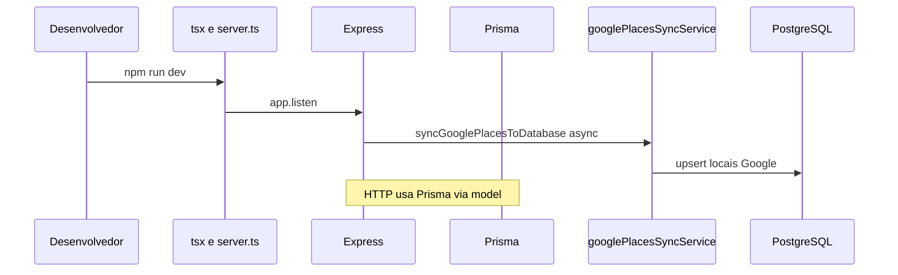

# Reutilização de Software no Backend — Visão Geral

Documento de síntese do módulo **Reutilização de Software** no escopo **exclusivo do backend** (API REST) da aplicação **Eu Amo Piri**.

## 1. Contexto do backend

O backend do Eu Amo Piri é uma **API REST** em **Node.js + TypeScript**. Nós organizamos o código segundo o padrão arquitetural **Model-View-Controller (MVC)**, formulado originalmente por **Reenskaug** no ecossistema Smalltalk-80 e sistematizado academicamente por **Krasner & Pope** (1988) como separação entre dados (**Model**), apresentação (**View**) e orquestração de entrada (**Controller**).

No Eu Amo Piri, o MVC orienta a estrutura de pastas em `backend/src/`:

| Papel MVC      | Pasta / artefato           | Responsabilidade no projeto                                                        |
| -------------- | -------------------------- | ---------------------------------------------------------------------------------- |
| **Model**      | `model/` + Prisma          | Persistência e consultas ao PostgreSQL                                             |
| **View**       | `views/`                   | Serialização JSON da API (`placeView`, `userView`, …) — *passive View* em API REST |
| **Controller** | `routes/` + `controllers/` | Contrato HTTP, status codes, delegação aos services                                |

A camada `**services/`** concentra regras de negócio (casos de uso) entre controller e model — extensão pragmática comum em APIs Node.js, alinhada à ideia de **Thin Controller** descrita na literatura de MVC para web (Buschmann et al., 1996 — *POSA*). O projeto também incorpora ideias de **Clean Architecture** (Martin, 2017) nos **adaptadores explícitos** (`storageService`, `googlePlacesService`), sem rigor formal de inversão de dependência em todos os módulos.

A reutilização no backend organiza-se em **três frentes complementares** — não apenas COTS:

| Frente              | O que é                                                                                                   | Exemplos no Eu Amo Piri                                       |
| ------------------- | --------------------------------------------------------------------------------------------------------- | ------------------------------------------------------------- |
| **COTS**            | Bibliotecas/serviços prontos de mercado                                                                   | Express, Prisma, Passport, bcrypt, GCS SDK                    |
| **DTOs próprios**   | Objetos de transferência que definem o **contrato HTTP** — padrão **Data Transfer Object** (Fowler, 2002) | `views/` — `formatPlace`, `formatUser`, `formatExperience`, … |
| **Domínio próprio** | Regras e vocabulário de Pirenópolis                                                                       | Blacklist, moderação, `placeCategoryMapper`, enums internos   |

Os **COTS** resolvem capacidades genéricas (HTTP, ORM, criptografia, object storage). Os **DTOs** materializam o desacoplamento entre entidades Prisma e o JSON consumido pelo frontend.

### 1.1 Baixo acoplamento e níveis de abstração

Além do MVC, nós adotamos como princípio explícito o **baixo acoplamento** entre serviços, endpoints REST e integrações externas — alinhado à decomposição por **esconder informação** (Parnas, 1972) e à busca de **alta coesão** dentro de cada módulo (Constantine & Yourdon, 1979). A ideia é que alterações em um nível (ex.: trocar GCS, ajustar contrato Google, mudar status HTTP) **não propaguem** em cadeia às demais camadas.

A organização segue uma **pilha de abstração** do mais concreto ao mais abstrato:

| Nível (baixo → alto)          | Pasta / artefato                        | Abstração                                                                  | Acoplamento evitado                                                    |
| ----------------------------- | --------------------------------------- | -------------------------------------------------------------------------- | ---------------------------------------------------------------------- |
| 1 — Infraestrutura de domínio | `utils/`, `constants/`                  | Funções puras reutilizáveis (`blacklist.ts`, `photoValidation.ts`)         | Regras transversais duplicadas em cada service                         |
| 2 — Persistência              | `model/` + Prisma                       | Acesso a dados por agregado (`placeModel`, `experienceModel`)              | SQL/ORM espalhado em controllers                                       |
| 3 — Casos de uso              | `services/`                             | Um service por capacidade de negócio (`placeService`, `commentService`, …) | Controllers com lógica de negócio                                      |
| 4 — Apresentação da API       | `views/`                                | DTOs JSON estáveis (`formatPlace`, `formatExperience`)                     | Schema Prisma vazando na resposta HTTP                                 |
| 5 — Orquestração HTTP         | `controllers/`                          | Traduz request/response; delega ao service                                 | Rotas acopladas ao banco                                               |
| 6 — Contrato de rotas         | `routes/`                               | Mapeamento URL → controller + middlewares                                  | Monolito de handlers no `server.ts`                                    |
| 7 — Fronteira transversal     | `middleware/`                           | Auth, upload, papéis — composição declarativa                              | Verificação JWT repetida em todo controller                            |
| 8 — Adaptadores externos      | `storageService`, `googlePlacesService` | Isolam SDKs e APIs de terceiros                                            | Services importando `@google-cloud/storage` ou URLs Google diretamente |
| 9 — Composição da aplicação   | `config/`, `server.ts`                  | Bootstrap, wiring Passport/Swagger, montagem de routers                    | Configuração misturada com regra de negócio                            |

**Serviços desacoplados entre si:** `placeService` não conhece detalhes de JWT; `experienceReportService` reutiliza `experienceModel` sem importar `placeService`; integrações Google e GCS ficam atrás de adaptadores — coerente com **Dependency Inversion** (Martin, 2017) nos pontos críticos.

**APIs desacopladas da persistência:** o cliente HTTP (SPA ou Swagger) enxerga apenas contratos em `views/`; mudanças no PostgreSQL ou no Prisma schema tendem a ficar contidas em `model/` + migration, sem reescrever rotas.

#### Trade-off assumido: mais arquivos, organização mais funcional

Essa preocupação com separação **aumentou o número de arquivos** em `backend/src/` (controllers, services e models por domínio, em vez de poucos módulos monolíticos). Nós DO Eu Amo Piri consideramos o trade-off **favorável** para o escopo do projeto:

| Aspecto                    | Monolito (menos arquivos)          | Organização atual (mais arquivos)          |
| -------------------------- | ---------------------------------- | ------------------------------------------ |
| Localizar responsabilidade | Busca em arquivo grande            | Um arquivo ≈ um papel (SRP)                |
| Novo RF (ex.: denúncia)    | Risco de conflito no mesmo handler | Copiar esqueleto MVC de `experience*`      |
| Testes unitários           | Mock amplo                         | Vitest focado em `*Service.test.ts`        |
| Onboarding                 | Curva inicial menor                | Estrutura previsível após entender a pilha |

Em síntese: **mais artefatos, porém cada um com escopo objetivo** — facilitando leitura, revisão de PR e reutilização white-box entre RFs (comentários, denúncia, locais), em linha com **modificabilidade** (Bass et al.) como atributo de qualidade prioritário na entrega.

### 1.2 DTOs (Data Transfer Objects)

No Eu Amo Piri, **DTO não é biblioteca COTS** — é **artefato implementado por nós** na pasta `views/`, reutilizado em todos os endpoints que devolvem JSON. Segue o padrão **Data Transfer Object** descrito por **Fowler** (*PoEAA*, 2002): estrutura mínima para **carregar dados entre camadas** (persistência → HTTP) sem expor o modelo interno completo.

#### Papel na arquitetura

| Tipo                         | Onde                                         | Direção                      | Função                                                                 |
| ---------------------------- | -------------------------------------------- | ---------------------------- | ---------------------------------------------------------------------- |
| **DTO de saída (response)**  | `views/*.ts`                                 | Model/Service → Cliente HTTP | Formata entidade Prisma em JSON estável; oculta campos sensíveis       |
| **DTO de entrada (request)** | Tipos em `services/` + parsing no controller | Cliente HTTP → Service       | Ex.: `RegisterInput`, `CreatePlaceInput` — validação antes do model    |
| **DTO externo (adaptador)**  | `googlePlacesService` (`GooglePlaceDto`)     | Google API → Domínio         | Traduz payload Google antes do upsert Prisma — *Anti-Corruption Layer* |

O controller **não** serializa entidades Prisma diretamente: chama `formatPlace(entity)` (ou equivalente), envia o DTO, e isso concretiza o **View** do MVC.

#### Módulos `views/` e o que cada DTO protege

| Arquivo             | Funções principais                                                   | DTO exposto                       | O que fica **fora** do contrato HTTP                                                      |
| ------------------- | -------------------------------------------------------------------- | --------------------------------- | ----------------------------------------------------------------------------------------- |
| `userView.ts`       | `formatUser`, `formatAuthResponse`                                   | Usuário logado / resposta de auth | `passwordHash`, campos internos do Prisma                                                 |
| `placeView.ts`      | `formatPlace`, `formatPlaceList`                                     | Local na listagem e detalhe       | URLs GCS brutas → paths relativos `/places/:id/photos/:photoId`; enums UPPER → labels API |
| `experienceView.ts` | `formatExperience`, `formatExperienceList`, `formatMyExperienceList` | Relato + agregados sociais        | Estrutura interna de fotos; enriquece com `commentsCount`, `reactions`                    |
| `commentView.ts`    | `formatComment`, `formatCommentList`                                 | Comentário em relato              | Relacionamentos Prisma desnecessários ao cliente                                          |

#### Por que DTOs próprios (e não só COTS)?

| Benefício                     | Como aparece no projeto                                                             |
| ----------------------------- | ----------------------------------------------------------------------------------- |
| **Baixo acoplamento FE ↔ BE** | Frontend (`placeAdaptor.js`) depende do JSON de `formatPlace`, não do schema Prisma |
| **Segurança**                 | `formatUser` nunca expõe hash de senha                                              |
| **Estabilidade de contrato**  | Renomear coluna no banco + ajustar só o view; rotas e Swagger permanecem coerentes  |
| **Reutilização interna**      | Mesmo `formatPlace` em `GET /places`, `GET /places/:id` e `POST /places`            |
| **Composição de respostas**   | `formatExperienceList` agrega contadores de comentários/reações sem alterar o model |

**Trade-off reconhecido:** duplicação leve entre shape Prisma e shape DTO (citado na § 5 — Adapter/view). Nós aceitamos esse custo em troca de **fronteira explícita** entre persistência e API — alinhado ao objetivo de baixo acoplamento da § 1.1.

Documentação OpenAPI em `swagger.ts` descreve os mesmos contratos que os DTOs materializam em runtime; o ideal é mantê-los sincronizados a cada evolução de `views/`.

---

## 2. Infraestrutura transversal

Na literatura de arquitetura de software, **preocupações transversais** (*cross-cutting concerns*) são capacidades que atravessam vários módulos funcionais sem pertencer a um único domínio de negócio — autenticação, persistência, configuração, documentação de interface e políticas de fronteira HTTP (Kiczales et al., 1997; Bass, Clements & Kazman, 2021). Em **arquitetura em camadas** (*Layered Architecture*, Buschmann et al., 1996), essas preocupações concentram-se tipicamente nas camadas inferiores e na **composição da aplicação**, sobre as quais os casos de uso (RF01–RF15) são montados de forma homogênea.

No Eu Amo Piri, nós não nomeamos um pacote “infraestrutura” isolado: a transversalidade materializa-se em `**server.ts`**, `**config/`**, middlewares globais e bibliotecas **COTS** (*Commercial Off-The-Shelf*, Bass et al.) reutilizadas por todos os módulos em `routes/`, `controllers/`, `services/` e `model/`. O objetivo arquitetural é **alta coesão dentro de cada RF** e **baixo acoplamento entre RFs e detalhes técnicos** . Uma vez configurado o pipeline HTTP e a persistência, novos endpoints reutilizam o mesmo arranjo sem reimplementar servidor, ORM ou política CORS diferentes. Logo não há uma reutilização somente de aplicações e módulos externos, mas também dentro da própria aplicação.

### 2.1 Conceito arquitetural e evidência no código

| Conceito                                                                     | Definição resumida                                                              | Onde aparece no backend                                                                                                         |
| ---------------------------------------------------------------------------- | ------------------------------------------------------------------------------- | ------------------------------------------------------------------------------------------------------------------------------- |
| **Camada de entrega / apresentação**                                         | Recebe requisições externas, serializa respostas, aplica políticas de fronteira | `server.ts`: `express()`, `cors()`, `express.json()`, montagem de routers                                                       |
| **Composição raiz** (*application composition*)                              | Ponto único que liga subsistemas sem misturar regra de negócio                  | `server.ts` importa `authRoutes`, `placeRoutes`, `experienceRoutes`, `adminRoutes`; inicializa Passport e Swagger               |
| **Externalização de configuração** (Fowler, 2002 — *External Configuration*) | Parâmetros sensíveis e dependentes de ambiente fora do código-fonte             | `dotenv/config` em `server.ts` e `prisma.ts`; variáveis `DATABASE_URL`, `JWT_SECRET`, `CORS_ORIGIN`, `API_URL`, credenciais GCS |
| **Abstração de persistência / Repository** (Fowler, 2002)                    | Oculta mecanismo de armazenamento dos casos de uso                              | `config/prisma.ts`: `PrismaClient` + adapter `@prisma/adapter-pg` sobre PostgreSQL; consumido por `model/*`                     |
| **Contrato de interface** (interoperabilidade)                               | Descrição formal da API para consumidores heterogêneos                          | `config/swagger.ts`: OpenAPI 3.0 via `swagger-jsdoc`; UI em `/api-docs` com `swagger-ui-express`                                |
| **Pipeline de middleware** (Express; encadeamento de responsabilidades)      | Processamento sequencial antes/depois dos handlers                              | Ordem em `server.ts`: CORS → JSON → `passport.initialize()` → rotas; por rota: `authMiddleware`, `multer`, papéis               |
| **Verificação na base da pirâmide de testes** (Fowler, 2006)                 | Testes unitários rápidos sobre lógica isolada                                   | `vitest` em `*.test.ts` (services, mappers); script `npm test` sem subir servidor HTTP                                          |

**Artefatos concretos verificáveis:**

| Artefato                           | Função transversal                                                                         | Módulos que dependem                                |
| ---------------------------------- | ------------------------------------------------------------------------------------------ | --------------------------------------------------- |
| `backend/src/server.ts`            | Bootstrap, CORS, JSON, Swagger, registro de routers, sync Google assíncrono no `listening` | Todos                                               |
| `backend/src/config/prisma.ts`     | Cliente Prisma singleton                                                                   | Todos os `model/`                                   |
| `backend/src/config/passport.ts`   | Estratégias Local + JWT (`session: false`)                                                 | Auth, perfil, relatos, comentários, denúncia, admin |
| `backend/src/config/swagger.ts`    | Especificação OpenAPI co-localizada                                                        | Documentação; alinhamento com contratos em `views/` |
| `backend/prisma/schema.prisma`     | Modelo relacional versionado + migrations                                                  | Persistência de todos os RFs                        |
| `docker-compose` / `.env` (README) | PostgreSQL local; Supabase em produção via `DATABASE_URL`                                  | Ambiente de dev e deploy                            |

### 2.2 Bibliotecas COTS

Cada dependência npm abaixo é **software pronto de mercado** (COTS), escolhida para resolver uma preocupação transversal.

| Biblioteca                               | Referência conceitual                                                      | Papel transversal                                     | Implementação observável                                                                       | Trade-off reconhecido                                              |
| ---------------------------------------- | -------------------------------------------------------------------------- | ----------------------------------------------------- | ---------------------------------------------------------------------------------------------- | ------------------------------------------------------------------ |
| **Express 5**                            | Camada de entrega em arquitetura em camadas (Buschmann et al., 1996)       | Servidor HTTP, roteamento, cadeia de middlewares      | `app.use("/auth", authRoutes)` etc. em `server.ts`                                             | Major 5 com ecossistema ainda em consolidação frente à v4          |
| **Prisma + `pg` + `@prisma/adapter-pg`** | *Repository* / *Data Mapper* (Fowler, 2002)                                | Abstração type-safe sobre PostgreSQL                  | Schema em `prisma/schema.prisma`; client em `generated/prisma/`; adapter em `config/prisma.ts` | Acoplamento ao ORM; queries atípicas exigem `$queryRaw`            |
| **cors**                                 | Política de segurança de fronteira (same-origin policy dos navegadores)    | Habilita SPA (Vite `:5173`) → API (`:3000` ou Render) | Lista `allowedOrigins` derivada de `CORS_ORIGIN`, `API_URL`, `RENDER_EXTERNAL_URL`             | Origem incorreta bloqueia ou expõe clientes não previstos          |
| **swagger-jsdoc + swagger-ui-express**   | Documentação como contrato de interface (Bass et al. — interoperabilidade) | OpenAPI 3.0 + UI `/api-docs`                          | `getSwaggerSpec(baseUrl)` ajusta `servers` à URL pública                                       | Drift possível entre JSDoc `@openapi`, tipos TS e DTOs em `views/` |
| **dotenv**                               | Externalização de configuração (Fowler, 2002)                              | Segredos e URLs fora do Git                           | `import "dotenv/config"` no entrypoint                                                         | `.env` local ≠ gestão de segredos em produção                      |
| **Vitest**                               | Pirâmide de testes — base unitária (Fowler, 2006)                          | Feedback rápido em ESM/TypeScript                     | `npm test` → `vitest run`                                                                      | Cobertura parcial; E2E não automatizado                            |
| **tsx**                                  | Toolchain de desenvolvimento (não é camada de runtime)                     | Executa TS sem build prévio                           | `node --import tsx ./src/server.ts` em `npm run dev`                                           | Deploy de produção exigiria compilação (`tsc`) ou bundler          |

**Integração verificável:** `backend/src/server.ts`, `backend/src/config/prisma.ts`, `backend/src/config/swagger.ts`, `backend/src/config/passport.ts`, `backend/prisma/schema.prisma`.

### 2.3 Fluxo de bootstrap da API

O arranque concretiza a separação entre **infraestrutura transversal** (servidor, ORM, documentação) e **tarefa de domínio assíncrona** (sync Google Places), de modo que falha na sincronização não impede a disponibilidade da API — decisão alinhada ao atributo **disponibilidade** (Bass et al., 2021).

Trecho correspondente em `server.ts`: após `server.on("listening")`, `syncGooglePlacesToDatabase().catch(...)` executa em paralelo ao atendimento HTTP; erros são registrados sem `process.exit`.

### 2.4 Análise crítica (teoria × prática)

| Decisão                            | Fundamentação                                                             | Evidência no projeto                                                                        | Limitação                                               |
| ---------------------------------- | ------------------------------------------------------------------------- | ------------------------------------------------------------------------------------------- | ------------------------------------------------------- |
| Monolito modular em camadas        | POSA — *Layered Architecture*; modificabilidade por separação de concerns | Pastas `routes/`, `services/`, `model/` por domínio; infra comum em `server.ts` + `config/` | Escalar horizontalmente exigiria extrair sync e uploads |
| Prisma 7 com client gerado         | Repository type-safe; schema como artefato versionado                     | `prisma generate`; output em `generated/prisma/`                                            | Onboarding exige passo documentado pós-clone            |
| Passport centralizado em `config/` | Strategy (Gamma et al., 1994) — algoritmos de auth intercambiáveis        | `LocalStrategy` + `JwtStrategy`; `session: false` (API stateless)                           | OAuth exigiria nova strategy no mesmo arquivo           |
| Swagger via JSDoc                  | Contrato explícito para stakeholders externos                             | `/api-docs` usado em demonstração e testes manuais                                          | Duplicação anotação ↔ implementação                     |
| CORS dinâmico                      | Fronteira de confiança entre origens web                                  | `resolvePublicBaseUrl` para proxy Render; `credentials: true`                               | Lista de origens deve acompanhar deploy do frontend     |

---

## 3. Mapa de módulos por requisito

| Documento                                                                                                                                                                   | RF                         | Módulo funcional      | Bibliotecas ou serviços reutilizados                            |
| --------------------------------------------------------------------------------------------------------------------------------------------------------------------------- | -------------------------- | --------------------- | --------------------------------------------------------------- |
| [RF01 — Autenticação](/ArquiteturaReutilizacao/backend/02.Autenticacao.md) · [4.4](/requisitos/RF01-backend/4.4.Autenticacao.md)                                            | RF01                       | Login, cadastro, JWT  | Passport.js, passport-local, passport-jwt, bcrypt, jsonwebtoken |
| [RF03 — Perfil e GCS](/ArquiteturaReutilizacao/backend/03.PerfilArmazenamento.md) · [4.5](/requisitos/RF03-backend/4.5.EdicaoPerfil.md)                                     | RF03                       | Foto de perfil        | @google-cloud/storage, multer                                   |
| [RF12/RF13 — Comentários e reações](/ArquiteturaReutilizacao/backend/04.ComentariosReacoes.md) · [4.6](/requisitos/RF12-RF13-backend/4.6.ComentariosReacoes.md)             | RF12, RF13                 | Interações sociais    | Prisma, Passport JWT, Vitest (reuso interno de blacklist e MVC) |
| [RF11 — Denúncia e moderação](/ArquiteturaReutilizacao/backend/05.DenunciaModeracao.md) · [4.7](/requisitos/RF-denuncia-backend/4.7.DenunciaModeracao.md)                   | RF11                       | Moderação de conteúdo | Prisma, Passport JWT, middlewares de papel                      |
| [RF15 — Google Places](/ArquiteturaReutilizacao/backend/06.SincronizacaoGooglePlaces.md) · [4.8](/requisitos/RF-google-places-backend/4.8.SincronizacaoGooglePlaces.md)     | RF15                       | Locais importados     | Google Places API (New), `fetch` nativo Node.js                 |
| [RF04/RF07 — Locais Morador](/ArquiteturaReutilizacao/backend/07.LocaisMorador.md) · [rf04](/requisitos/rf04-cadastro-local.md) · [rf07](/requisitos/rf07-edicao-locais.md) | RF04, RF07, RF10           | CRUD de locais        | multer, `storageService`, `photoValidation`, Passport JWT       |
| [RF05/RF08/RF09 — Relatos](/ArquiteturaReutilizacao/backend/08.RelatosExperiencia.md) · [rf08](/requisitos/rf08-edicao-relatos.md)                                          | RF05, RF08, RF09, RNF01–05 | Relatos e painéis     | Prisma, multer, GCS, `blacklist.ts`                             |
| [RF06 — Consulta pública](/ArquiteturaReutilizacao/backend/09.ConsultaPublica.md)                                                                                           | RF06                       | Listagem e detalhe    | Prisma, `placeView`, proxy GCS/Google, `optionalAuthMiddleware` |

---

## 4. Arquitetura MVC em camadas e papel da reutilização

O fluxo típico de uma requisição segue o ciclo MVC reutilizado em todos os RFs:

Diagrama de sequência — fluxo HTTP no backend (Cliente → routes → controllers → services → model → views → PostgreSQL)

Referência conceitual: separação Model–View–Controller (Reenskaug; Krasner & Pope, 1988); camadas complementares (Buschmann et al., 1996).

| Camada                     | Papel MVC                 | Responsabilidade própria                    | O que é delegado a bibliotecas                         |
| -------------------------- | ------------------------- | ------------------------------------------- | ------------------------------------------------------ |
| `routes/` + `controllers/` | **Controller**            | Contratos HTTP e status codes               | —                                                      |
| `services/`                | (caso de uso)             | Regras de negócio (moderação, sync, perfil) | Chamadas a GCS e Google Places isoladas em adaptadores |
| `model/`                   | **Model**                 | Queries e persistência                      | Prisma Client                                          |
| `views/`                   | **View**                  | Contrato JSON da API — formatação passiva   | —                                                      |
| `middleware/`              | (fronteira do Controller) | Auth, upload, papéis de usuário             | passport-jwt, multer                                   |
| `server.ts`                | (bootstrap)               | CORS, sync Google no startup                | Express, cors, swagger-ui-express, passport.initialize |
| `config/`                  | (wiring)                  | Estratégias e OpenAPI                       | passport-local, swagger-jsdoc                          |

---

## 5. Padrões de projeto e princípios aplicados

Mapeamento explícito aos padrões descritos por **Gamma et al.** (*Design Patterns*, 1994) e extensões de **Fowler** (*Patterns of Enterprise Application Architecture*, 2002):

| Padrão          | Onde no Eu Amo Piri                                                  | Problema que resolve                                    |
| --------------- | -------------------------------------------------------------------- | ------------------------------------------------------- |
| **Facade**      | `passport.authenticate()`, `authFacade` (FE), `storageService`       | Interface única sobre subsistemas complexos (auth, GCS) |
| **Strategy**    | `passport-local`, `passport-jwt`; `placeCategoryMapper`              | Algoritmos de auth/mapeamento intercambiáveis           |
| **Adapter**     | `googlePlacesService`, `authMapper`, adaptadores FE (`placeAdaptor`) | Traduz contrato externo → modelo interno                |
| **Proxy**       | `GET /places/:id/cover`, `GET /auth/me/photo`                        | Controla acesso a recursos remotos; oculta credenciais  |
|                 |                                                                      |                                                         |
| **DIP** (SOLID) | `profileService` → `storageService` → GCS SDK                        | Domínio não depende de SDK concreto                     |

---

## 6. Inventário consolidado de dependências npm (backend)

| Biblioteca                               | Versão (`package.json`)  | Módulos que consomem                                |
| ---------------------------------------- | ------------------------ | --------------------------------------------------- |
| express                                  | ^5.2.1                   | Todos                                               |
| @prisma/client + prisma                  | ^7.8.0                   | Todos (persistência)                                |
| passport + passport-local + passport-jwt | ^0.7.0 / ^1.0.0 / ^4.0.1 | Auth, perfil, relatos, comentários, denúncia, admin |
| bcrypt + jsonwebtoken                    | ^6.0.0 / ^9.0.3          | Auth                                                |
| @google-cloud/storage                    | ^7.21.0                  | Perfil, fotos de relatos                            |
| multer                                   | ^2.2.0                   | Perfil, fotos de relatos                            |
| cors                                     | ^2.8.6                   | Infraestrutura                                      |
| swagger-jsdoc + swagger-ui-express       | ^6.3.0 / ^5.0.1          | Infraestrutura                                      |
| dotenv                                   | ^17.4.2                  | Configuração                                        |
| pg + @prisma/adapter-pg                  | ^8.21.0 / ^7.8.0         | Driver PostgreSQL                                   |
| vitest                                   | ^1.6.0 (dev)             | Testes unitários                                    |

**Serviços externos sem SDK dedicado:** Google Places API (New) — consumida via `fetch` nativo do Node.js 18+.

---

## 7. Facilidade no desenvolvimento — síntese por fase

A tabela resume **o que cada reutilização facilitou na prática** para a equipe, fase a fase do backend. Os detalhes por RF estão nos módulos 02–06.

| Fase do desenvolvimento           | Biblioteca / serviço                | Facilidade trazida                                             | No que ajudou concretamente                                                                              |
| --------------------------------- | ----------------------------------- | -------------------------------------------------------------- | -------------------------------------------------------------------------------------------------------- |
| **Bootstrap da API**              | Express + tsx                       | Subir servidor e rotas em horas, sem HTTP manual               | `npm run dev` funcional após clone; novos endpoints seguem o mesmo padrão `router → controller`          |
| **Persistência**                  | Prisma + PostgreSQL                 | Schema declarativo e migrations versionadas no Git             | Novos RFs (comentários, denúncia, Google sync) = alterar `schema.prisma` + migration, sem reescrever SQL |
| **Integração frontend**           | cors                                | Uma linha de configuração resolve bloqueio do navegador        | Login, listagem e upload multipart testáveis entre Vite `:5173` e API `:3000`                            |
| **Documentação e demo**           | Swagger                             | UI interativa sem Postman obrigatório                          | Qualquer um da equipe testa o JWT, denúncia direto e etc em `/api-docs`                                  |
| **Autenticação (RF01)**           | Passport + bcrypt + JWT             | Login e rotas protegidas sem implementar criptografia          | Proteger nova rota = importar `authMiddleware`; hash de senha = duas funções (`hash`/`compare`)          |
| **Perfil e fotos (RF03)**         | multer + GCS SDK                    | Upload multipart e bucket resolvido por middleware + 3 funções | Equipe focou em `profileService` (regras); não parseou `multipart` nem assinou URLs GCS manualmente      |
| **Comentários/reações (RF12/13)** | Reuso Prisma + JWT + MVC            | Zero dependência nova; copiar esqueleto de `experience`*       | Entrega em paralelo: auth, blacklist e validação Local→Relato já existiam                                |
| **Denúncia/moderação**            | Reuso Prisma + middlewares de papel | Papéis turista/admin já prontos do RF01                        | Fila admin e POST `/report` montados com mesma cadeia de middlewares                                     |
| **Google Places**                 | Places API + fetch                  | Dezenas de POIs sem seed manual nem geocoder próprio           | Sync no startup popula `/locais`; frontend usa o mesmo `GET /places` já existente                        |
| **Locais morador (RF04/07)**      | Reuso multer + GCS + JWT            | Cadastro/edição sem nova lib de upload                         | `placeService` copia pipeline de `profileService`; `photoValidation` compartilhado                       |
| **Relatos (RF05/08/09)**          | Reuso Prisma + blacklist + GCS      | Publicação e painéis sem dependência nova                      | `validateExperienceInput` centraliza RNF01–03; RF09 via `GET /auth/me/experiences`                       |
| **Consulta (RF06)**               | Reuso Prisma + views + proxy        | Listagem unificada morador + Google                            | `GET /places` único; busca/filtro categoria no frontend                                                  |
| **Qualidade**                     | Vitest                              | Testes rápidos sem subir servidor                              | Refatorar mappers e services com feedback imediato (`npm test`)                                          |

## 9. O que a equipe implementou (específico do domínio - não reutilizou de biblioteca)

| Área                      | Implementação própria                                                                               |
| ------------------------- | --------------------------------------------------------------------------------------------------- |
| Domínio                   | Models Prisma, enums (`AccountType`, `PlaceCategory`, `ContentStatus`, `ReactionType`)              |
| Regras                    | Toggle de reações, fila de moderação, blacklist de linguagem, validação Local → Relato → Comentário |
| Integração Google         | `placeCategoryMapper`, `piriRegion`, sync top-N por categoria, upsert no PostgreSQL                 |
| DTOs de saída (response)  | `placeView`, `experienceView`, `commentView`, `userView` — funções `format`*                        |
| DTOs de entrada (request) | Tipos `*Input` nos services; parsing nos controllers                                                |
| DTOs externos (Google)    | `GooglePlaceDto` em `googlePlacesService` antes do upsert                                           |
| Autorização               | `requireAccountTypeMiddleware` (turista, morador, admin)                                            |

---

## 10. Evidência de execução

| Verificação   | Como reproduzir                                           |
| ------------- | --------------------------------------------------------- |
| API online    | `cd backend && npm run dev` → `GET http://localhost:3000` |
| Swagger       | `http://localhost:3000/api-docs`                          |
| Testes        | `cd backend && npm test`                                  |
|               |                                                           |
| Upload perfil | `PATCH /auth/me` multipart + `GET /auth/me/photo`         |

---

## 11. Referências bibliográficas

| Referência                                                                                                                                                                          | Aplicação no documento                                                                    |
| ----------------------------------------------------------------------------------------------------------------------------------------------------------------------------------- | ----------------------------------------------------------------------------------------- |
| Parnas, D. L. (1972). On the criteria to be used in decomposing systems into modules. *Communications of the ACM*, 15(12), 1053–1058                                                | Decomposição e baixo acoplamento entre módulos — § 1.1                                    |
| Constantine, L. L., & Yourdon, E. (1979). *Structured Design*. Prentice-Hall                                                                                                        | Coesão e acoplamento — § 1.1                                                              |
| Reenskaug, T. — *Models-Views-Controllers* (Xerox PARC / Smalltalk-80, 1979); *Applications Programming in Smalltalk-80(TM): How to use Model-View-Controller* (1988)               | Padrão arquitetural MVC — § 1, § 4                                                        |
| Krasner, G. E., & Pope, S. T. (1988). A cookbook for using the model-view controller user interface paradigm in Smalltalk-80. *Journal of Object-Oriented Programming*, 1(3), 26–49 | Definição acadêmica clássica de MVC; mapeamento Model / View / Controller — § 1           |
| Buschmann, F., Meunier, R., Rohnert, H., Sommerlad, P., & Stal, M. — *Pattern-Oriented Software Architecture: A System of Patterns* (Wiley, 1996)                                   | Camadas e padrões arquiteturais complementares ao MVC — § 1, § 2, § 4                     |
| Gamma, Helm, Johnson, Vlissides — *Design Patterns: Elements of Reusable Object-Oriented Software* (Addison-Wesley, 1994)                                                           | Facade, Strategy, Adapter, Proxy — § 2.4, § 5                                             |
| Fowler — *Patterns of Enterprise Application Architecture* (Addison-Wesley, 2002)                                                                                                   | Repository (Prisma), **Data Transfer Object** (`views/`) — § 1.2, § 2                     |
| Martin — *Clean Architecture* (Prentice Hall, 2017)                                                                                                                                 | Adaptadores explícitos, DIP — § 1.1                                                       |
| Martin — princípios SOLID                                                                                                                                                           | SRP (um service/controller por responsabilidade), DIP — § 1.1, § 5                        |
| Bass, Clements, Kazman — *Software Architecture in Practice* (4th ed.)                                                                                                              | Atributos de qualidade (modificabilidade, disponibilidade, interoperabilidade) — § 1, § 2 |
| Kiczales, G. et al. (1997). Aspect-Oriented Programming. *Proc. ECOOP*                                                                                                              | Preocupações transversais (*cross-cutting concerns*) — § 2                                |
| Fowler, M. (2006). Continuous Integration. *martinfowler.com* — pirâmide de testes                                                                                                  | Base unitária com Vitest — § 2.1, § 2.2                                                   |

---

## 13. Histórico de versões

| Versão | Data       | Descrição |
| ------ | ---------- | --------- |
| 2.0    | 21/06/2026 | Grupo 05 Eu Amo Piri — visão geral consolidada da reutilização no backend: MVC, infraestrutura transversal, DTOs, mapa por RF, padrões de projeto, inventário npm e referências bibliográficas alinhadas ao texto. |
