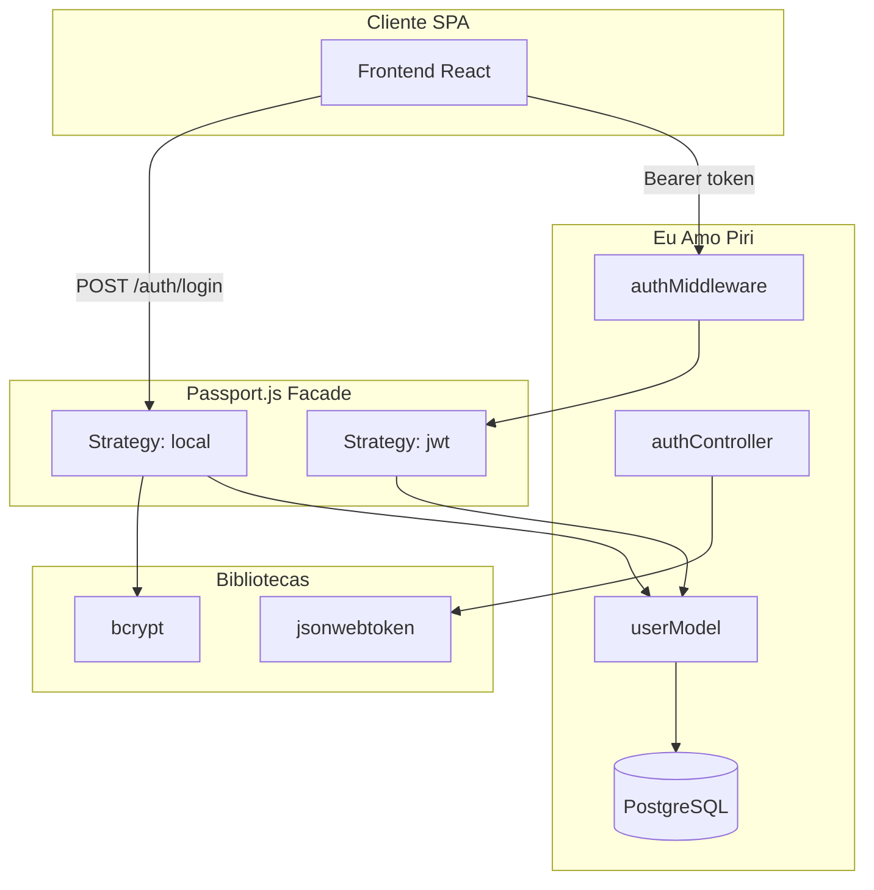

# Módulo 02 — Autenticação e Autorização (JWT)

Documento de reutilização de software para o subsistema de **autenticação** do backend Eu Amo Piri, vinculado ao **RF01**. A equipe implementou cadastro, login por email/senha e proteção de rotas via **JWT stateless**, reutilizando o ecossistema **Passport.js** e bibliotecas criptográficas consolidadas.

---

## 1. O que foi implementado

| Funcionalidade | Endpoint / artefato |
|----------------|---------------------|
| Cadastro de usuário (turista/morador) | `POST /auth/register` |
| Login email/senha | `POST /auth/login` |
| Perfil do usuário logado | `GET /auth/me` |
| Proteção de rotas | `authMiddleware` + estratégia `jwt` |
| Papéis de conta | `requireAccountTypeMiddleware` (turista, morador, admin) |
| Hash de senha | `utils/password.ts` |
| Emissão de token | `utils/jwt.ts` |

A persistência do usuário utiliza o model `User` no Prisma, com `passwordHash` opcional e enum `AccountType`.

---

## 2. Por que foi implementado

O Eu Amo Piri exige identidade do usuário para publicar relatos, comentar, reagir e denunciar conteúdo. A equipe optou por **autenticação stateless com JWT** porque:

1. A API é consumida por SPA React — sem sessão server-side em cookie;
2. Rotas protegidas precisam validar token em cada requisição de forma uniforme;
3. Passport.js oferece **interface única** (`passport.authenticate`) para múltiplos mecanismos futuros.

---

## 3. Bibliotecas reutilizadas

> A autenticação é um dos trechos em que a reutilização mais **reduziu código e risco**: a equipe não implementou hash, tokens nem parsing de Bearer manualmente.

### 3.1 Passport.js — Facade de autenticação

| Aspecto | Detalhe |
|---------|---------|
| **O que faz** | Orquestra estratégias de autenticação via middleware Express. |
| **Origem** | [passportjs.org](https://www.passportjs.org/) — `passport@^0.7.0` |
| **Por que a equipe utilizou** | Evita acoplar controllers a bcrypt, JWT e Prisma simultaneamente; padrão **Facade** reconhecido. |
| **Facilidade no desenvolvimento** | Um único `passport.authenticate('local' \| 'jwt')` substitui dezenas de linhas de verificação manual em cada rota. |
| **No que ajudou no projeto** | Login e rotas protegidas compartilham `config/passport.ts`; RF03, RF12 e moderação só importam `authMiddleware` — auth “pronta” para o restante do backend. |
| **Impacto arquitetural** | Subsistema de auth vira **ponto único de extensão** — novos mecanismos registram nova Strategy sem alterar controllers. |

**Arquivos:** `backend/src/config/passport.ts`, `backend/src/server.ts` (`passport.initialize()`).

---

### 3.2 passport-local — Strategy email/senha

| Aspecto | Detalhe |
|---------|---------|
| **O que faz** | Estratégia que valida credenciais locais contra callback customizado. |
| **Origem** | [passport-local](http://www.passportjs.org/packages/passport-local/) — `passport-local@^1.0.0` |
| **Por que a equipe utilizou** | Implementação padrão para login com email e senha; integração nativa com Passport. |
| **Facilidade no desenvolvimento** | O controller de login não implementa fluxo de credenciais — apenas chama `passport.authenticate('local')` e trata o resultado. |
| **No que ajudou no projeto** | Cenário BDD “conta inexistente → 404” ficou no callback da strategy (`USER_NOT_FOUND`), sem lógica espalhada no controller. |
| **Impacto arquitetural** | Padrão **Strategy** — algoritmo de autenticação local encapsulado e substituível. |

**Fluxo:** email → `userModel.findByEmail` → `comparePassword` (bcrypt) → usuário formatado ou erro.

---

### 3.3 passport-jwt — Strategy Bearer token

| Aspecto | Detalhe |
|---------|---------|
| **O que faz** | Extrai JWT do header `Authorization: Bearer` e valida assinatura + payload. |
| **Origem** | [passport-jwt](https://www.passportjs.org/packages/passport-jwt/) — `passport-jwt@^4.0.1` |
| **Por que a equipe utilizou** | Protege dezenas de rotas (relatos, perfil, denúncia, admin) com um middleware reutilizável. |
| **Facilidade no desenvolvimento** | Proteger endpoint = adicionar `authMiddleware` na rota; sem decodificar JWT, validar expiração ou buscar usuário em todo controller. |
| **No que ajudou no projeto** | `optionalAuthMiddleware` permitiu RF13 (`myReaction`) com JWT opcional no GET — mesma lib, configuração mínima extra. |
| **Impacto arquitetural** | **Middleware chain** Express + Passport — requisição interceptada antes do controller. |

**Arquivos:** `backend/src/middleware/authMiddleware.ts`, rotas em `experienceRoutes.ts`, `authRoutes.ts`, `adminRoutes.ts`.

---

### 3.4 bcrypt

| Aspecto | Detalhe |
|---------|---------|
| **O que faz** | Hash irreversível de senha com salt (funções `hash` e `compare`). |
| **Origem** | [node.bcrypt.js](https://github.com/kelektiv/node.bcrypt.js) — `bcrypt@^6.0.0` |
| **Por que a equipe utilizou** | Prática de mercado; senhas nunca persistidas em texto plano no PostgreSQL. |
| **Facilidade no desenvolvimento** | Duas funções (`hashPassword`, `comparePassword`) substituem implementação própria de KDF/salt — erro de segurança comum evitado. |
| **No que ajudou no projeto** | Cadastro e login confiáveis desde RF01; demais módulos assumem que identidade já está resolvida. |
| **Impacto arquitetural** | Segurança de credenciais delegada a biblioteca auditada — equipe não implementa KDF próprio. |

**Arquivo:** `backend/src/utils/password.ts`.

---

### 3.5 jsonwebtoken

| Aspecto | Detalhe |
|---------|---------|
| **O que faz** | Emite e verifica tokens JWT assinados (RFC 7519). |
| **Origem** | [node-jsonwebtoken](https://github.com/auth0/node-jsonwebtoken) — `jsonwebtoken@^9.0.3` |
| **Por que a equipe utilizou** | Payload compacto `{ sub: userId, email }` para sessão da aplicação sem estado no servidor. |
| **Facilidade no desenvolvimento** | Emissão em uma linha após login/cadastro; expiração configurável via `JWT_EXPIRES_IN` no `.env`. |
| **No que ajudou no projeto** | Frontend armazena token e reutiliza em todas as chamadas; Swagger “Authorize” usa o mesmo Bearer — fluxo único para dev, teste e demo. |
| **Impacto arquitetural** | Desacopla emissão (authService) de validação (passport-jwt) — responsabilidades distintas. |

**Arquivo:** `backend/src/utils/jwt.ts` — secret via `JWT_SECRET`, expiração via `JWT_EXPIRES_IN`.

---

## 4. Como a reutilização opera na arquitetura

---

## 5. O que a equipe implementou (não reutilizou)

| Implementação própria | Motivo |
|-----------------------|--------|
| Model `User` e validações de cadastro | Regras de domínio Eu Amo Piri (tipos de conta, campos de perfil) |
| `authService.ts` | Orquestra cadastro, emissão JWT e erros HTTP (`USER_NOT_FOUND`, conflito de email) |
| `requireAccountTypeMiddleware` | Autorização por papel (turista/morador/admin) além da autenticação JWT |
| `userView.formatUser` | Contrato JSON da API — oculta `passwordHash` |

---

## 6. Impacto da reutilização no projeto

| Benefício | Descrição |
|-----------|-----------|
| **Consistência** | Todos os módulos protegem rotas da mesma forma |
| **Extensibilidade** | Nova strategy Passport não exige reescrever controllers |
| **Segurança** | bcrypt + JWT seguem RFC e práticas OWASP comuns |
| **Demonstrabilidade** | Swagger Authorize + login → teste imediato de rotas protegidas |
| **Custo evitado** | Equipe não implementou servidor OAuth próprio (ADR: rejeitou `node-oauth2-server` por ser provider, não cliente) |

---

## 7. Rastreabilidade

| Requisito | Evidência |
|-----------|-----------|
| Login email/senha | `POST /auth/login` + passport-local |
| Cadastro | `POST /auth/register` |
| Conta inexistente → 404 | Strategy local retorna `USER_NOT_FOUND` |
| Rotas protegidas | JWT em `POST /places/:id/experiences`, comentários, denúncia, admin |

Documento complementar com ADRs e diagramas de sequência: [4.4. Autenticação](/docs/requisitos/RF01-backend/4.4.Autenticacao.md).

---

## 8. Referências

- [Passport.js Documentation](https://www.passportjs.org/docs/)
- [RFC 7519 — JWT](https://tools.ietf.org/html/rfc7519)
- [Visão geral — Infraestrutura transversal](/ArquiteturaReutilizacao/backend/00.VisaoGeral.md#2-infraestrutura-transversal)

---

## 9. Histórico de versões

| Versão | Data | Descrição |
|--------|------|-----------|
| 1.0 | 21/06/2026 | Versão inicial — reutilização Passport, bcrypt, JWT |
| 1.1 | 21/06/2026 | Facilidade no desenvolvimento e no que ajudou, por biblioteca |
