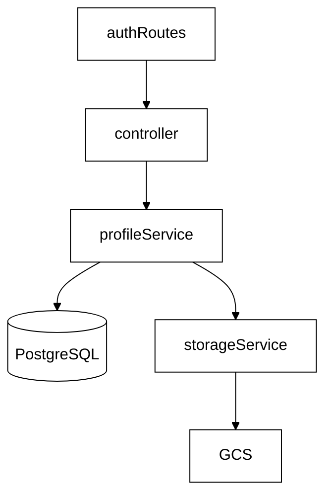
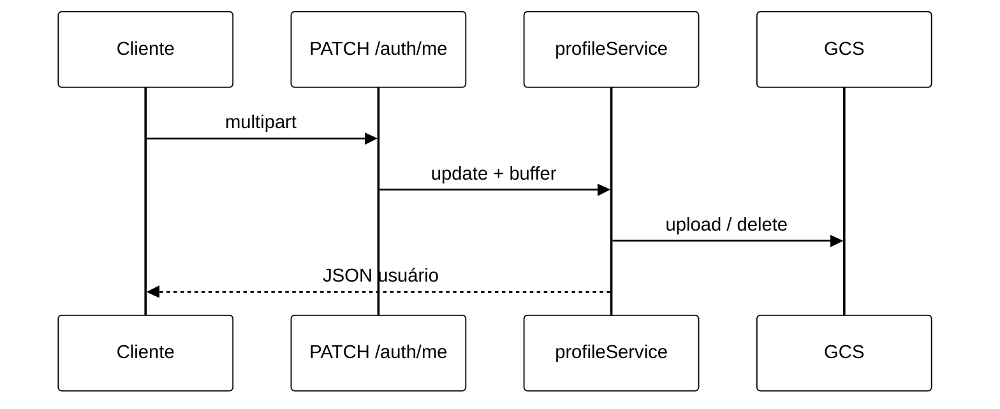

# Módulo 02 — Perfil do Usuário e Armazenamento de Objetos (GCS)

Documento de reutilização de software para **edição de perfil** e **foto de perfil** no backend Eu Amo Piri, vinculado ao **RF03**. A equipe separou metadados textuais (PostgreSQL) de binários de imagem (Google Cloud Storage), reutilizando o SDK oficial do Google e o middleware **multer**.

---

## 1. O que foi implementado

| Funcionalidade | Detalhe |
|----------------|---------|
| Atualização de perfil | `PATCH /auth/me` — campos textuais + foto opcional |
| Stream de foto autenticado | `GET /auth/me/photo` — proxy do bucket privado |
| Upload multipart | Campo `profilePhoto` (JPG/PNG, máx. 5 MB) |
| Referência no banco | Campo `profilePhotoUrl` armazena **chave GCS**, não o binário |
| Remoção de foto antiga | Ao substituir imagem, objeto anterior é deletado no bucket |

Camada de infraestrutura isolada: `storageService.ts` encapsula `@google-cloud/storage`.

---

## 2. Por que foi implementado

| Problema | Decisão da equipe |
|----------|-------------------|
| Imagens até 5 MB | PostgreSQL inadequado para BLOBs em escala — bucket de objetos |
| Bucket privado (segurança) | Backend faz proxy autenticado; frontend não acessa GCS diretamente |
| Múltiplos ambientes (local + Render) | SDK aceita arquivo JSON local ou `GCS_CREDENTIALS_JSON` inline |

---

## 3. Bibliotecas reutilizadas

> Neste módulo, a reutilização permitiu **focar nas regras de perfil** (diff obrigatório, validação de e-mail) em vez de infraestrutura de upload e armazenamento de arquivos.

### 3.1 @google-cloud/storage

| Aspecto | Detalhe |
|---------|---------|
| **O que faz** | SDK oficial Google Cloud para upload, delete e stream de objetos em bucket. |
| **Origem** | [Cloud Storage Node.js](https://cloud.google.com/nodejs/docs/reference/storage/latest) — `@google-cloud/storage@^7.21.0` |
| **Por que a equipe utilizou** | Integração nativa com IAM GCP; API estável para `save`, `delete`, `createReadStream`. |
| **Facilidade no desenvolvimento** | Upload, delete e stream com poucas linhas — sem implementar assinatura AWS-style, retry HTTP ou parsing de resposta GCS manualmente. |
| **No que ajudou no projeto** | `storageService` expõe três funções; `profileService` orquestra negócio sem importar o SDK. O mesmo serviço foi reaproveitado para **fotos de relatos**, evitando segundo adaptador de storage. |
| **Impacto arquitetural** | Padrão **Adapter**: contrato interno estável; troca de provedor de objetos afetaria só `storageService`. |

#### Como o Adapter se manifesta no código

No padrão **Adapter** (Gamma et al., 1994), um módulo traduz a interface de um sistema externo (*adaptee*) para um contrato que o restante da aplicação já entende (*target*). No RF03, isso acontece assim:

| Papel no padrão | Artefato no Eu Amo Piri |
|-----------------|-------------------------|
| **Target** (contrato interno) | Funções `uploadBuffer`, `deleteObject`, `getReadStream` e `getContentTypeFromKey` exportadas por `storageService.ts` |
| **Adaptee** (sistema externo) | SDK `@google-cloud/storage` — `Storage`, `bucket().file()`, `save()`, `delete()`, `createReadStream()` |
| **Adapter** | O próprio `storageService.ts`, que encapsula credenciais, bucket e chamadas GCS |

O `profileService` **não importa** `@google-cloud/storage`. Ele fala apenas o vocabulário do adaptador — chave de objeto (`string`), `Buffer` e `mimetype`:

```typescript
// profileService.ts — caso de uso de domínio
await storageService.uploadBuffer(newPhotoKey, file.buffer, file.mimetype);
storageService.deleteObject(oldPhotoKey);
stream: storageService.getReadStream(user.profilePhotoUrl),
```

Por dentro, o adaptador traduz essas operações simples para a API verbosa do GCS:

```typescript
// storageService.ts — tradução para o SDK Google
const file = getBucket().file(objectKey);
await file.save(buffer, { contentType, resumable: false, ... });
return getBucket().file(objectKey).createReadStream();
```

Detalhes do GCS que o domínio **não precisa conhecer** ficam isolados no adaptador: parsing de `GCS_CREDENTIALS_JSON`, instanciação de `Storage`, nome do bucket, flag `resumable: false`, `ignoreNotFound` no delete.

**Por que isso caracteriza Adapter (e não só “uso de biblioteca”):** `placeService` e `experienceService` reutilizam o **mesmo** contrato interno para fotos de locais e relatos — três casos de uso distintos dependem de uma interface única, enquanto o SDK Google permanece em um único arquivo. Se o provedor mudasse (ex.: S3), só `storageService.ts` precisaria ser reescrito; `profileService.ts` continuaria chamando `uploadBuffer` e `deleteObject` sem alteração.

**Arquivos:** `backend/src/services/storageService.ts`, consumido por `backend/src/services/profileService.ts`.

**Variáveis:** `GCS_BUCKET_NAME`, `GCS_PROJECT_ID`, `GCS_PROFILE_PREFIX`, `GOOGLE_APPLICATION_CREDENTIALS` ou `GCS_CREDENTIALS_JSON`.

---

### 3.2 multer

| Aspecto | Detalhe |
|---------|---------|
| **O que faz** | Middleware Express para parse de `multipart/form-data`; suporta `memoryStorage`. |
| **Origem** | npm `multer@^2.2.0` |
| **Por que a equipe utilizou** | Padrão de mercado para upload HTTP; buffer em memória simplifica passagem ao GCS sem disco temporário. |
| **Facilidade no desenvolvimento** | Parse de `multipart/form-data` e `req.file.buffer` prontos — sem ler streams manualmente nem implementar boundary MIME. |
| **No que ajudou no projeto** | `uploadProfilePhotoMiddleware` valida JPG/PNG e 5 MB antes do controller; frontend envia `FormData` e backend recebe buffer direto para o GCS. |
| **Impacto arquitetural** | Separa **transporte HTTP** (multer) de **regra de negócio** (profileService) e **persistência de objeto** (storageService). |

**Arquivos:** `backend/src/middleware/uploadProfilePhotoMiddleware.ts`, montado em `authRoutes.ts`.

---

### 3.3 Passport JWT (reutilização do Módulo 01)

| Aspecto | Detalhe |
|---------|---------|
| **O que faz** | Garante que apenas o usuário autenticado altere perfil ou leia sua foto. |
| **Por que a equipe reutilizou** | Mesma infraestrutura RF01 — zero dependência nova. |
| **Facilidade no desenvolvimento** | Rotas de perfil montadas com `authMiddleware` já existente — sem novo mecanismo de sessão. |
| **No que ajudou no projeto** | `PATCH /auth/me` e `GET /auth/me/photo` seguiram o mesmo padrão de relatos e comentários protegidos por JWT. |
| **Impacto arquitetural** | `PATCH /auth/me` e `GET /auth/me/photo` compõem cadeia `authMiddleware` → multer → controller. |

---

## 4. Arquitetura em camadas (Clean Architecture adaptada)



---

## 5. Fluxo — troca de foto de perfil



---

## 6. O que a equipe implementou (não reutilizou)

| Artefato | Responsabilidade |
|----------|------------------|
| `profileService.ts` | Diff obrigatório (`hasProfileChanges`), validação de e-mail, orquestra upload/remoção |
| `photoValidation.ts` | Regras JPG/PNG e limite 5 MB compartilhadas com fotos de relatos |
| `storageKeys.ts` | Geração de chaves únicas (`profile_photo/{userId}-{timestamp}.jpg`) |
| Proxy `GET /auth/me/photo` | Stream autenticado — `` não envia Bearer; frontend usa fetch + blob URL |

### Proxy de mídia

O proxy de perfil estabeleceu o **padrão estrutural** replicado em todo o Eu Amo Piri: o frontend **nunca** acessa diretamente o provedor de objetos (GCS ou Google Places) com credenciais.

| Endpoint | RF / módulo | Provedor real |
|----------|-------------|---------------|
| `GET /auth/me/photo` | RF03 — perfil | GCS |
| `GET /places/:id/photos/:photoId` | RF04 — locais comunitários | GCS |
| `GET /places/:id/cover` | RF Google Places — capa importada | Places Photo API |

A extensão do proxy para capas Google ([Módulo 08](/docs/ArquiteturaReutilizacao/backend/08.SincronizacaoGooglePlaces.md#5-proxy-de-capa-google--padrao-estrutural-do-projeto)) mantém **um único contrato** para o frontend: URLs relativas resolvidas por `resolveMediaUrl()`, segredos apenas no backend.

---

## 7. Impacto da reutilização no Eu Amo Piri

| Dimensão | Efeito |
|----------|--------|
| **Performance do banco** | PostgreSQL permanece leve — migrations rápidas, backups menores |
| **Segurança** | Credenciais GCP só no servidor; bucket não público |
| **Reuso futuro** | `storageService` também suporta fotos de relatos (`uploadPhotosMiddleware`) |
| **Deploy** | Mesmo padrão GCS_CREDENTIALS_JSON previsto para Render (fase 2) |

---

## 8. Senso crítico

| Limitação | Mitigação |
|-----------|-----------|
| Dependência GCP | Documentada no README; equipe compartilha service account por canal seguro |
| Proxy de imagem consome banda da API | Aceito em troca de bucket privado sem signed URLs no frontend |
| multer em memória | Limite 5 MB evita pressão excessiva de RAM |

---

## 9. Rastreabilidade

Documento complementar: [4.5. Edição de Perfil](/docs/requisitos/RF03-backend/4.5.EdicaoPerfil.md).

| Critério BDD | Implementação |
|--------------|---------------|
| JPG/PNG ≤ 5 MB | multer + `photoValidation` |
| Ao menos uma alteração | `hasProfileChanges` |
| Foto persistida | GCS + proxy autenticado |

---

## 10. Referências

- [@google-cloud/storage](https://cloud.google.com/nodejs/docs/reference/storage/latest)
- [multer](https://github.com/expressjs/multer)
- [Módulo 01 — Autenticação](/docs/ArquiteturaReutilizacao/backend/01.Autenticacao.md)

---

## 11. Histórico de versões

| Versão | Data | Descrição |
|--------|------|-----------|
| 1.0 | 21/06/2026 | Versão inicial — GCS + multer + inversão de dependência |
| 1.1 | 21/06/2026 | Facilidade no desenvolvimento e no que ajudou, por biblioteca |
| 1.2 | 21/06/2026 | Padrão transversal de proxy de mídia — referência a `GET /places/:id/cover` (Módulo 08) |
| 1.3 | 22/06/2026 | Seção 3.1 — explicação textual do padrão Adapter em `storageService` |
