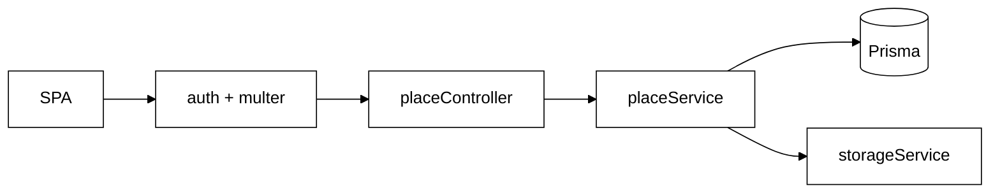

# Módulo 03 — Cadastro, Edição e Exclusão de Locais (Morador)

Documento de reutilização de software para **RF04** (cadastro de locais) e **RF07** (edição/exclusão de locais) no backend Eu Amo Piri. A equipe **não adicionou bibliotecas npm novas** para este escopo; a reutilização concentra-se na **stack já instalada** (Passport JWT, multer, GCS via `storageService`, Prisma) e em **utilitários internos** produzidos para RF03 (perfil) e RF01 (autorização por papel).

---

## 1. O que foi implementado

| RF | Funcionalidade | Endpoint | Restrição |
|----|----------------|----------|-----------|
| RF04 | Cadastrar local com fotos | `POST /places` | `authMiddleware` + `requireMorador` |
| RF07 | Atualizar local do morador | `PATCH /places/:id` | Dono (`moradorId`) + locais `MORADOR` (não Google) |
| RF07 | Excluir local do morador | `DELETE /places/:id` | Dono; cascade de relatos e fotos |
| — | Stream de capa e fotos | `GET /places/:id/cover`, `GET /places/:placeId/photos/:photoId` | Público; proxy GCS ou Google Places |

**Campos obrigatórios no cadastro:** nome, endereço, categoria (`CACHOEIRA`, `RESTAURANTE`, `POUSADA`), descrição e **1 a 3 fotos** (JPG/PNG, máx. 5 MB cada). Link do Maps, telefone e data de abertura são opcionais.

**Validações de negócio:** duplicidade por nome+endereço (`PLACE_DUPLICATE`); locais importados do Google são somente leitura (`GOOGLE_PLACE_READONLY`).

Models Prisma: `Place`, `PlacePhoto`, enum `PlaceCategory`, campo `source` (`MORADOR` | `GOOGLE`).

---

## 2. Por que foi implementado

Moradores são responsáveis por enriquecer o catálogo de Pirenópolis com estabelecimentos e pontos turísticos autênticos. A equipe manteve o **mesmo pipeline de upload e armazenamento** já validado em RF03 (foto de perfil), aplicando-o a fotos de locais — reduzindo risco e tempo de entrega sem duplicar integração com GCS.

A autorização por **dono do recurso** (`assertPlaceOwner`) complementa o middleware de papel (`requireMorador`), garantindo que um morador não edite locais de outro.

---

## 3. Reutilização de software

> RF04/RF07 ilustram **reutilização em cascata**: infraestrutura de auth (RF01), storage (RF03) e validação de fotos compartilhada com relatos (RF05).

### 3.1 Passport JWT + `requireMorador`

| Aspecto | Detalhe |
|---------|---------|
| **O que faz** | `authMiddleware` valida Bearer token; `requireMorador` restringe `accountType === MORADOR`. |
| **Por que a equipe reutilizou** | Infraestrutura RF01 — cadastro de local exige identidade e papel sem reimplementar JWT. |
| **Facilidade no desenvolvimento** | Proteger `POST/PATCH/DELETE /places` = duas linhas na rota; controllers assumem `req.user` presente. |
| **No que ajudou no projeto** | Mesma cadeia usada em denúncia e moderação; Swagger Authorize testa fluxo completo morador. |
| **Impacto arquitetural** | Padrão **Guard** + **Strategy** (Passport) — composição declarativa na `placeRoutes.ts`. |

**Arquivos:** `backend/src/routes/placeRoutes.ts`, `backend/src/middleware/requireAccountTypeMiddleware.ts`.

---

### 3.2 multer — upload multipart de fotos

| Aspecto | Detalhe |
|---------|---------|
| **O que faz** | Parse de `multipart/form-data`; `upload.array("photos", 3)` limita quantidade. |
| **Origem** | [multer](https://github.com/expressjs/multer) — `multer@^2.2.0` |
| **Por que a equipe reutilizou** | Mesma lib de RF03 (`uploadProfilePhotoMiddleware`) — padrão consolidado no Express. |
| **Facilidade no desenvolvimento** | Controller recebe `req.files` prontos em memória; sem parsing manual de boundary MIME. |
| **No que ajudou no projeto** | `uploadPlacePhotos` e `uploadExperiencePhotos` compartilham config base (`memoryStorage`, limites). |
| **Impacto arquitetural** | **Middleware chain**: multer → `handlePhotoUploadError` → controller. |

**Arquivo:** `backend/src/middleware/uploadPhotosMiddleware.ts`.

---

### 3.3 `storageService` + `@google-cloud/storage`

| Aspecto | Detalhe |
|---------|---------|
| **O que faz** | Upload, delete e stream de fotos no bucket privado GCS. |
| **Por que a equipe reutilizou** | Adaptador já criado em RF03 — **Adapter** com contrato estável (`uploadBuffer`, `deleteObject`, `getReadStream`). |
| **Facilidade no desenvolvimento** | `placeService` gera chaves via `buildPlacePhotoKey` e delega binários ao storage; rollback em falha de upload. |
| **No que ajudou no projeto** | Perfil, locais e relatos usam **um único ponto de integração GCS** — modificabilidade (Bass et al.). |
| **Impacto arquitetural** | Padrão **Proxy** (BFF): frontend consome `/places/:id/cover`, nunca URL assinada do bucket. |

**Arquivos:** `backend/src/services/placeService.ts`, `backend/src/services/storageService.ts`, `backend/src/utils/storageKeys.ts`.

---

### 3.4 Prisma ORM

| Aspecto | Detalhe |
|---------|---------|
| **O que faz** | Persiste `Place` e `PlacePhoto`; `ON DELETE CASCADE` remove relatos ao excluir local. |
| **Por que a equipe reutilizou** | Stack transversal — tipagem gerada, migrations versionadas. |
| **Facilidade no desenvolvimento** | `createPlaceWithPhotos`, `replacePlacePhotos`, `findPlacesByMoradorId` seguem estilo de `userModel`. |
| **No que ajudou no projeto** | RF10 (painel morador) reutiliza `findPlacesByMoradorId` sem endpoint dedicado. |
| **Impacto arquitetural** | Padrão **Repository** (Fowler) — queries isoladas em `placeModel.ts`. |

---

### 3.5 `photoValidation.ts` — utilitário interno (white-box)

| Aspecto | Detalhe |
|---------|---------|
| **O que faz** | Valida quantidade (min/max), MIME (JPG/PNG) e tamanho (5 MB) de fotos. |
| **Por que a equipe reutilizou** | Extraído para módulo compartilhado entre locais (RF04/07) e relatos (RF05/08). |
| **Facilidade no desenvolvimento** | Regra “1–3 fotos” centralizada; multer trata limite superior, service trata mínimo. |
| **No que ajudou no projeto** | Mensagens de erro consistentes (`PhotoValidationError` → `PlaceError`). |
| **Impacto arquitetural** | **DRY** interno — modificabilidade sem nova dependência npm. |

**Arquivo:** `backend/src/utils/photoValidation.ts`.

---

## 4. Como a reutilização opera no projeto

---

## 5. O que a equipe implementou (não reutilizou)

| Implementação própria | Motivo |
|-----------------------|--------|
| `assertPlaceOwner` | Regra de domínio — apenas dono edita/exclui |
| Bloqueio de edição Google (`GOOGLE_PLACE_READONLY`) | Locais sync não pertencem a morador |
| Detecção de duplicata nome+endereço | Integridade do catálogo comunitário |
| Rollback transacional em falha de upload | Consistência place ↔ fotos no GCS |
| `placeView.formatPlace` | Contrato JSON da API (URLs relativas de fotos) |

---

## 6. Impacto da reutilização no projeto

| Benefício | Descrição |
|-----------|-----------|
| **Velocidade** | RF04/07 entregues reaproveitando multer + GCS + auth já testados |
| **Consistência** | Mesmos limites de foto em locais, relatos e perfil |
| **Segurança** | Bucket privado; proxy de imagens no backend |
| **Modificabilidade** | Trocar provedor de objetos afeta só `storageService` |
| **Testabilidade** | `placeService.test.ts` mocka Prisma e storage |

---

## 7. Rastreabilidade

| Requisito | Critério de aceitação | Evidência backend |
|-----------|----------------------|-------------------|
| RF04 | Formulário só para Morador | `requireMorador` em `POST /places` |
| RF04 | Bloqueia campos vazios | Validação em `placeService.createPlace` |
| RF04 | 1–3 fotos obrigatórias | `validatePhotoFiles({ min: 1, max: 3 })` |
| RF07 | Morador edita/exclui seus locais | `assertPlaceOwner` + `PATCH/DELETE /places/:id` |
| RF10 | Painel com relatos nos locais do morador | `GET /places?moradorId` — UI: [frontend/07.PaineisUsuario](/ArquiteturaReutilizacao/frontend/07.PaineisUsuario.md) |

Documentação de frontend: [rf04-cadastro-local](/requisitos/rf04-cadastro-local.md) · [rf07-edicao-locais](/requisitos/rf07-edicao-locais.md).

---

## 8. Referências

- [Visão geral — Infraestrutura transversal](/ArquiteturaReutilizacao/backend/00.VisaoGeral.md#2-infraestrutura-transversal)
- [Módulo 02 — Perfil e GCS](/ArquiteturaReutilizacao/backend/02.PerfilArmazenamento.md)
- [Módulo 01 — Autenticação](/ArquiteturaReutilizacao/backend/01.Autenticacao.md)

---

## 9. Histórico de versões

| Versão | Data | Descrição |
| --- | --- | --- |
| 1.0 | 21/06/2026 | Versão inicial — RF04 e RF07; reuso multer, GCS, Passport, photoValidation |
