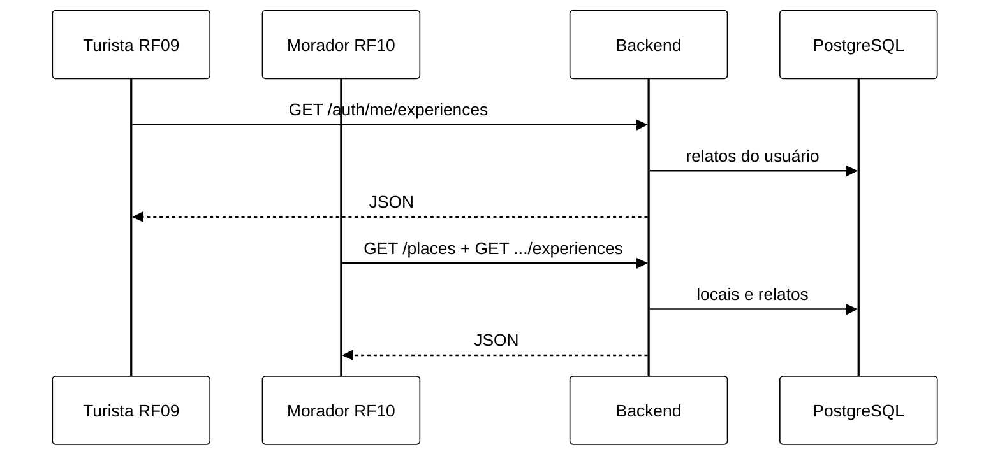

# Módulo 04 — Relatos de Experiência, Painéis e Validação de Conteúdo

Documento de reutilização de software para **RF05** (cadastro de relato), **RF08** (edição/exclusão de relato), **RF09** (gestão de contribuições do turista), **RF10** (acompanhamento pelo morador) e **RNFs transversais** (RNF01, RNF02, RNF03, RNF04, RNF05) no backend Eu Amo Piri.

A equipe **não adicionou bibliotecas npm novas** para relatos; reutilizou Passport JWT, multer, `storageService`, Prisma e o utilitário interno `blacklist.ts` — compartilhado também com comentários (RF12).

---

## 1. O que foi implementado

| RF / RNF | Funcionalidade | Endpoint | Restrição |
|----------|----------------|----------|-----------|
| RF05 | Publicar relato em um local | `POST /places/:placeId/experiences` | Turista autenticado |
| RF08 | Editar relato próprio | `PATCH /places/:placeId/experiences/:experienceId` | Autor (`userId`) |
| RF08 | Excluir relato próprio | `DELETE /places/:placeId/experiences/:experienceId` | Autor |
| RF09 | Painel do turista — meus relatos | `GET /auth/me/experiences` | JWT obrigatório; filtra por `userId` |
| RF10 | Painel do morador — relatos nos seus locais | Composição: `GET /places?moradorId` + `GET /places/:id/experiences` | Morador consulta locais próprios e relatos públicos de cada um |
| RNF01 | Texto obrigatório com avaliação | Validação em `validateExperienceInput` | Código `RNF01` |
| RNF02 | Blacklist lexical | `containsBlacklistedWord` | Código `BLACKLISTED_CONTENT` |
| RNF03 | Limite 2000 caracteres | Constante `MAX_TEXT_LENGTH` | Código `RNF03` |
| RNF04 | Histórico privado do autor | Sem endpoint público de relatos por usuário | Apenas `GET /auth/me/experiences` autenticado |
| RNF05 | Ordenação cronológica decrescente | `orderBy: { createdAt: "desc" }` no Prisma | Listagens de local e painel turista |

**Campos do relato:** avaliação (1–5 estrelas), texto (100–2000 caracteres), data da visita, título opcional, 0–3 fotos.

Models Prisma: `Experiences`, `ExperiencePhoto`, enum `ContentStatus` (`PUBLIC`, `HIDDEN`, `REPORTED`).

---

## 2. Por que foi implementado

Relatos são o núcleo colaborativo do Eu Amo Piri. A equipe centralizou **validação de conteúdo** em `experienceService.validateExperienceInput` e reutilizou `blacklist.ts` — evitando duplicar regras RNF01–RNF03 entre relatos e comentários.

RF09 e RF10 não ganharam endpoints monolíticos dedicados: a equipe preferiu **composição REST** (listar locais do morador + listar relatos por local; listar relatos do turista logado), reutilizando queries Prisma existentes — trade-off de simplicidade vs. agregação server-side.

---

## 3. Reutilização de software

### 3.1 Passport JWT + middlewares de papel

| Aspecto | Detalhe |
|---------|---------|
| **O que faz** | `requireTurista` protege POST/PATCH/DELETE; `optionalAuthMiddleware` enriquece GET com `myReaction`. |
| **Por que a equipe reutilizou** | Infraestrutura RF01 — mesmo padrão de RF04 e RF12. |
| **Facilidade no desenvolvimento** | Novo relato = `authMiddleware` + `requireTurista` na rota. |
| **No que ajudou no projeto** | Painel turista (`GET /auth/me/experiences`) usa `authMiddleware` padrão. |
| **Impacto arquitetural** | **Middleware chain** composável; controllers finos. |

**Arquivos:** `backend/src/routes/experienceRoutes.ts`, `backend/src/routes/authRoutes.ts`.

---

### 3.2 multer + `storageService` (fotos de relato)

| Aspecto | Detalhe |
|---------|---------|
| **O que faz** | Upload 0–3 fotos; persistência de chaves GCS em `ExperiencePhoto`. |
| **Por que a equipe reutilizou** | Mesmo pipeline de RF03/RF04 — **Adapter** `storageService` + `uploadExperiencePhotos`. |
| **Facilidade no desenvolvimento** | `uploadExperiencePhotoRecords` copia padrão de `placeService`. |
| **No que ajudou no projeto** | Proxy `GET .../photos/:photoId` oculta bucket — padrão **Proxy** (BFF). |
| **Impacto arquitetural** | Binários fora do PostgreSQL; rollback em falha de upload. |

---

### 3.3 Prisma ORM

| Aspecto | Detalhe |
|---------|---------|
| **O que faz** | CRUD de relatos; filtro `status !== HIDDEN` em listagens públicas; ordenação `createdAt desc`. |
| **Por que a equipe reutilizou** | Stack transversal — FK Local → Relato com cascade. |
| **Facilidade no desenvolvimento** | `findExperiencesByUserId` e `findAllExperiencesByPlaceId` compartilham `experienceInclude`. |
| **No que ajudou no projeto** | RF12/13 aninham comentários/reações sob o mesmo model `Experiences`. |
| **Impacto arquitetural** | **Repository** — `experienceModel.ts` isola queries. |

---

### 3.4 `blacklist.ts` — utilitário interno (RNF02)

| Aspecto | Detalhe |
|---------|---------|
| **O que faz** | Normaliza texto (NFD, deofuscação), detecta palavras e frases proibidas. |
| **Por que a equipe implementou internamente** | Regra de domínio Eu Amo Piri — vocabulário customizado para moderação comunitária. |
| **Facilidade no desenvolvimento** | Função pura `containsBlacklistedWord(...parts)` — testável com Vitest (`blacklist.test.ts`). |
| **No que ajudou no projeto** | **Reuso white-box** em `commentService` — RNF02 único ponto de manutenção. |
| **Impacto arquitetural** | **Strategy** implícita — lista configurável sem dependência externa de moderação. |

**Arquivos:** `backend/src/utils/blacklist.ts`, consumido por `experienceService.ts` e `commentService.ts`.

---

### 3.5 `photoValidation.ts` — utilitário interno

| Aspecto | Detalhe |
|---------|---------|
| **O que faz** | Valida 0–3 fotos (relatos) vs. 1–3 (locais). |
| **Por que a equipe reutilizou** | Módulo compartilhado com RF04/07 — DRY interno. |
| **Impacto arquitetural** | Consistência de limites MIME/tamanho em todo upload de imagem. |

---

### 3.6 Reuso de services em listagem enriquecida

| Aspecto | Detalhe |
|---------|---------|
| **O que faz** | `listExperiencesByPlace` agrega contadores de comentários e reações via import dinâmico. |
| **Por que a equipe reutilizou** | RF12/13 já expunham `getCommentCountsByExperienceIds` e `getReactionCountsByExperienceIds`. |
| **Facilidade no desenvolvimento** | GET relatos retorna dados sociais sem endpoint extra. |
| **Impacto arquitetural** | Composição de services — acoplamento moderado aceito no prazo. |

---

## 4. RNFs — implementação backend

| RNF | Regra | Onde | Código de erro |
|-----|-------|------|----------------|
| **RNF01** | Avaliação exige texto | `validateExperienceInput` — rejeita `text` vazio | `RNF01` |
| **RNF02** | Blacklist na submissão | `containsBlacklistedWord(text, title)` | `BLACKLISTED_CONTENT` |
| **RNF03** | Máx. 2000 caracteres | `MAX_TEXT_LENGTH = 2000` | `RNF03` |
| **RNF04** | Histórico só no painel do autor | Sem `GET /users/:id/experiences`; `GET /auth/me/experiences` exige JWT | — |
| **RNF05** | Ordem cronológica decrescente | `orderBy: { createdAt: "desc" }` em `experienceModel` | — |

**Nota:** mínimo de 100 caracteres no texto é regra de produto além do RNF01 — código `MIN_TEXT_LENGTH`.

RNFs predominantemente de interface (**RNF06** responsividade, **RNF07** acessibilidade) estão documentados no frontend. **RNF08** (simplicidade de cadastro) materializa-se em `authService.registerUser` — campos essenciais apenas (RF01).

---

## 5. Composição RF09 e RF10 (sem endpoint agregador)

A equipe **reutilizou endpoints existentes** em vez de criar `/morador/dashboard`.

---

## 6. O que a equipe implementou (não reutilizou)

| Implementação própria | Motivo |
|-----------------------|--------|
| `validateExperienceInput` | Orquestra RNF01, RNF02, RNF03 e regras de rating/data |
| `assertExperienceOwner` | Autorização por autor do relato (RF08) |
| `formatMyExperienceList` | Contrato do painel turista com `placeName` |
| Filtro `PUBLIC_STATUS_FILTER` | Oculta relatos moderados (`HIDDEN`) da listagem pública |
| Snapshot `userName` no relato | Desnormalização para exibição sem join extra |

---

## 7. Impacto da reutilização no projeto

| Benefício | Descrição |
|-----------|-----------|
| **Consistência normativa** | RNF02 único em `blacklist.ts` — relatos e comentários |
| **Velocidade RF09/RF10** | Zero endpoints novos; composição de queries Prisma |
| **Segurança** | RNF04 — histórico do turista não exposto por ID público |
| **Testabilidade** | `experienceService.test.ts`, `blacklist.test.ts` |

---

## 8. Rastreabilidade

| Requisito | Evidência |
|-----------|-----------|
| RF05 — turista publica relato | `POST /places/:placeId/experiences` |
| RF05 — bloqueia blacklist / 2000 chars | `validateExperienceInput` |
| RF08 — turista edita/exclui próprio relato | `PATCH/DELETE` + `assertExperienceOwner` |
| RF09 — painel turista | `GET /auth/me/experiences` — UI: [frontend/07.PaineisUsuario](/ArquiteturaReutilizacao/frontend/07.PaineisUsuario.md) |
| RF10 — relatos nos locais do morador | `GET /places?moradorId` + `GET .../experiences` — UI: [frontend/07.PaineisUsuario](/ArquiteturaReutilizacao/frontend/07.PaineisUsuario.md) |
| RNF05 — ordem decrescente | `experienceModel` `orderBy createdAt desc` |

Documentação de frontend: [05.RelatosExperiencia](/ArquiteturaReutilizacao/frontend/05.RelatosExperiencia.md) · [rf08-edicao-relatos](/requisitos/rf08-edicao-relatos.md).

---

## 9. Referências

- [Módulo 03 — Locais Morador](/ArquiteturaReutilizacao/backend/03.LocaisMorador.md)
- [Módulo 07 — Comentários e reações](/ArquiteturaReutilizacao/backend/07.ComentariosReacoes.md)
- [Módulo 01 — Autenticação](/ArquiteturaReutilizacao/backend/01.Autenticacao.md)

---

## 10. Histórico de versões

| Versão | Data | Descrição |
| --- | --- | --- |
| 1.0 | 21/06/2026 | Versão inicial — RF05, RF08, RF09, RF10 e RNFs RNF01–RNF05 |
