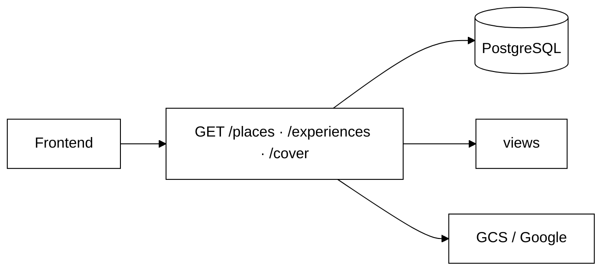

# Módulo 05 — Consulta Pública de Locais e Relatos

Documento de reutilização de software para **RF06** (consulta de locais e relatos) no backend Eu Amo Piri. Endpoints públicos ou semi-públicos permitem que visitantes autenticados ou não consultem o catálogo de Pirenópolis. A equipe **reutilizou Prisma, views JSON, proxy de mídia e integração Google Places** sem novas dependências npm.

---

## 1. O que foi implementado

| Funcionalidade | Endpoint | Autenticação |
|----------------|----------|--------------|
| Listar todos os locais | `GET /places` | Nenhuma |
| Listar locais de um morador | `GET /places?moradorId={id}` | Nenhuma (filtro opcional) |
| Detalhe de um local | `GET /places/:id` | Nenhuma |
| Capa do local (proxy) | `GET /places/:id/cover` | Nenhuma |
| Foto do local (proxy) | `GET /places/:placeId/photos/:photoId` | Nenhuma |
| Relatos de um local | `GET /places/:placeId/experiences` | JWT opcional (`optionalAuthMiddleware`) |

**RF06 — busca e filtros por categoria:** responsabilidade do frontend — ver [frontend/06.ConsultaLocais.md](/ArquiteturaReutilizacao/frontend/06.ConsultaLocais.md). O backend entrega a lista completa unificada via `GET /places`.

**RF06 — relatos publicados:** cada local expõe relatos via `GET /places/:placeId/experiences`, ordenados por `createdAt desc` (RNF05).

---

## 2. Por que foi implementado

A consulta pública é pré-requisito para descoberta de Pirenópolis antes do login. A equipe manteve **listagem unificada** (`GET /places`) após sync Google Places — frontend consome um único contrato (documentado em [Módulo 08](/ArquiteturaReutilizacao/backend/08.SincronizacaoGooglePlaces.md)), evitando endpoints paralelos para POIs importados vs. cadastrados.

Filtros de busca no cliente reduzem complexidade da API no prazo da entrega; trade-off: payload maior vs. latência de query parametrizada no PostgreSQL.

---

## 3. Reutilização de software

### 3.1 Prisma ORM

| Aspecto | Detalhe |
|---------|---------|
| **O que faz** | `findAllPlaces`, `findPlaceById`, `findAllExperiencesByPlaceId` com includes de fotos e ratings. |
| **Por que a equipe reutilizou** | Stack transversal — mesmas queries usadas por RF04/05 e sync Google. |
| **Facilidade no desenvolvimento** | `placeInclude` centraliza joins; média de rating calculada na view. |
| **No que ajudou no projeto** | Google sync e morador alimentam a mesma tabela `Place` — RF06 transparente à origem. |
| **Impacto arquitetural** | **Repository** — leitura desacoplada de escrita. |

**Arquivos:** `backend/src/model/placeModel.ts`, `backend/src/model/experienceModel.ts`.

---

### 3.2 Views JSON — contrato da API

| Aspecto | Detalhe |
|---------|---------|
| **O que faz** | `placeView.formatPlace`, `experienceView.formatExperienceList` — URLs relativas, labels de categoria. |
| **Por que a equipe implementou views dedicadas** | Desacopla schema Prisma do JSON consumido pelo React — padrão **Presenter** (MVP). |
| **Facilidade no desenvolvimento** | Frontend usa paths estáveis (`/places/:id/cover`) independente de GCS ou Google. |
| **No que ajudou no projeto** | `placeAdaptor.js` mapeia resposta única para cards e mapa. |
| **Impacto arquitetural** | Modificabilidade — alterar persistência sem quebrar contrato HTTP. |

**Arquivos:** `backend/src/views/placeView.ts`, `backend/src/views/experienceView.ts`.

---

### 3.3 Proxy de mídia — GCS + Google Places

| Aspecto | Detalhe |
|---------|---------|
| **O que faz** | `getPlaceCoverStream` tenta foto GCS do morador; fallback para `fetchExternalPhotoMedia` (Google). |
| **Por que a equipe reutilizou** | `storageService` (RF03) + `googlePlacesService` (RF sync) — **Adapter** + **Proxy**. |
| **Facilidade no desenvolvimento** | Cliente não distingue origem da imagem — mesma URL `/places/:id/cover`. |
| **No que ajudou no projeto** | RF06 exibe capas uniformes para locais MORADOR e GOOGLE na mesma listagem. |
| **Impacto arquitetural** | Segurança (credenciais Google no servidor); trade-off bandwidth no BFF. |

**Arquivo:** `backend/src/services/placeService.ts` (`getPlaceCoverStream`).

---

### 3.4 `optionalAuthMiddleware` (Passport JWT)

| Aspecto | Detalhe |
|---------|---------|
| **O que faz** | Hidrata `req.user` se Bearer válido; não bloqueia visitante anônimo. |
| **Por que a equipe reutilizou** | Infraestrutura RF01 — enriquece listagem de relatos com `myReaction` (RF13). |
| **Facilidade no desenvolvimento** | Um middleware serve visitante e usuário logado no mesmo GET. |
| **No que ajudou no projeto** | RF06 atende “autenticado ou não” sem duplicar rotas. |
| **Impacto arquitetural** | **Optional Guard** — composição sobre Strategy JWT. |

**Arquivo:** `backend/src/middleware/authMiddleware.ts`.

---

### 3.5 Agregação de interações sociais (RF12/13)

| Aspecto | Detalhe |
|---------|---------|
| **O que faz** | `listExperiencesByPlace` inclui `commentsCount`, `reactions`, `myReaction`. |
| **Por que a equipe reutilizou** | Services de comentários/reações já existentes — **reuso white-box**. |
| **Impacto arquitetural** | Consulta de relatos (RF06) entrega dados sociais em uma ida ao backend. |

---

## 4. Como a reutilização opera no projeto

---

## 5. O que a equipe implementou (não reutilizou)

| Implementação própria | Motivo |
|-----------------------|--------|
| Filtro `moradorId` opcional em `listPlaces` | Painel morador (RF10) e perfil |
| Cálculo de rating médio na view | Agregação leve para cards de listagem |
| `CATEGORY_LABELS` na view | Vocabulário PT-BR da API (`cachoeira`, `restaurante`, `pousada`) |
| Filtro client-side no FE | Busca e chips de categoria (RF06) |

---

## 6. Impacto da reutilização no projeto

| Benefício | Descrição |
|-----------|-----------|
| **Catálogo unificado** | Morador + Google na mesma `GET /places` |
| **Contrato estável** | Views JSON isolam Prisma do frontend |
| **Experiência consistente** | Proxy de capa abstrai origem da foto |
| **Extensibilidade** | Filtros server-side (categoria, `q=`) podem ser adicionados sem mudar FE |

---

## 7. Rastreabilidade

| Requisito | Critério | Evidência |
|-----------|----------|-----------|
| RF06 | Listagem pública de locais | `GET /places` sem auth |
| RF06 | Relatos na página do local | `GET /places/:placeId/experiences` |
| RF06 | Busca/filtro categoria | Frontend — [06.ConsultaLocais](/ArquiteturaReutilizacao/frontend/06.ConsultaLocais.md) |
| RNF05 | Relatos em ordem decrescente | `experienceModel` `orderBy createdAt desc` |

Integração Google: [Módulo 08 — Sincronização Google Places](/ArquiteturaReutilizacao/backend/08.SincronizacaoGooglePlaces.md).

---

## 8. Referências

- [Visão geral](/ArquiteturaReutilizacao/backend/00.VisaoGeral.md)
- [Módulo 04 — Relatos](/ArquiteturaReutilizacao/backend/04.RelatosExperiencia.md)
- [Módulo 08 — Google Places](/ArquiteturaReutilizacao/backend/08.SincronizacaoGooglePlaces.md)

---

## 9. Histórico de versões

| Versão | Data | Descrição |
| --- | --- | --- |
| 1.0 | 21/06/2026 | Versão inicial — RF06; reuso Prisma, views, proxy GCS/Google, optionalAuth |
