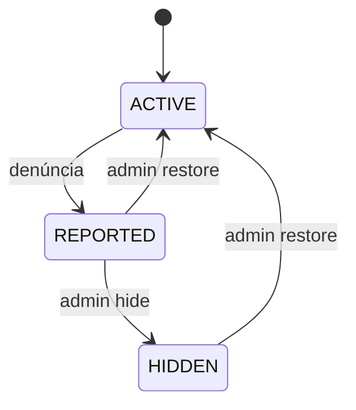
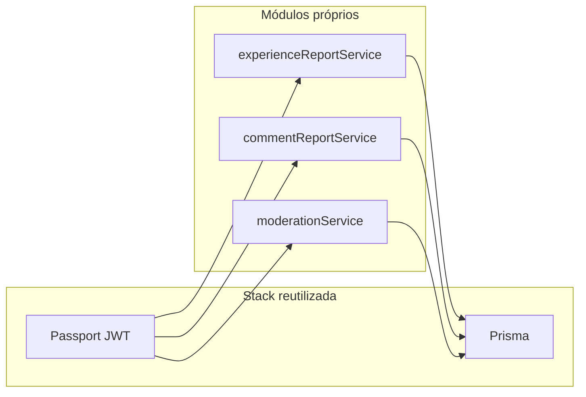
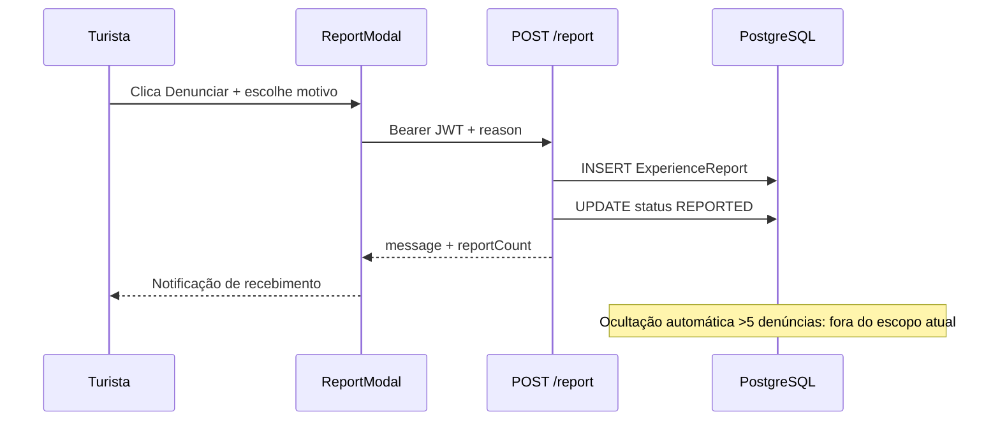

# Módulo 05 — Denúncia e Moderação Comunitária (RF11)

Documento de reutilização de software para **RF11 — Moderação Comunitária (Denúncia)** no backend Eu Amo Piri. A equipe **não introduziu bibliotecas npm dedicadas a moderação**; a reutilização apoia-se em Prisma, Passport JWT, Express e na **estrutura MVC já estabelecida** (RF05/RF12).

---

## 1. O que foi implementado

| Funcionalidade | Endpoint | Papel |
|----------------|----------|-------|
| Denunciar relato | `POST /places/:placeId/experiences/:experienceId/report` | Turista ou admin |
| Denunciar comentário | `POST .../comments/:commentId/report` | Turista ou admin |
| Fila de moderação | `GET /admin/moderation?status=REPORTED` | Admin |
| Restaurar conteúdo | `PATCH /admin/experiences/:id/restore` | Admin → `ACTIVE` |
| Ocultar conteúdo | `PATCH /admin/experiences/:id/hide` | Admin → `HIDDEN` |
| Idem para comentários | `PATCH /admin/comments/:id/restore` \| `/hide` | Admin |

Enum `ContentStatus`: `ACTIVE`, `REPORTED`, `HIDDEN`. Enum `ReportReason`: `ODIO`, `FALSO`, `SENSIVEL`, `OUTRO`.

---

## 2. Por que foi implementado

Plataformas colaborativas precisam canal de sinalização de conteúdo inadequado **sem ocultação automática** — decisão humana do admin preserva due process. A equipe estendeu o modelo de dados existente (relatos e comentários) em vez de integrar SaaS de moderação (Perspective API, etc.), priorizando controle, custo zero adicional e alinhamento ao escopo acadêmico.

---

## 3. Reutilização de software

> Denúncia e moderação foram viáveis porque a equipe **reaproveitou auth, schema Prisma e esqueleto MVC** — o esforço concentrou-se nas regras de status e fila admin, não em infraestrutura nova.

### 3.1 Prisma ORM

| Aspecto | Detalhe |
|---------|---------|
| **O que faz** | Models `ExperienceReport`, `ExperienceCommentReport`; campos `status` em `Experiences` e `ExperienceComment`; constraints `@@unique` por denunciante. |
| **Por que a equipe reutilizou** | Mesmo ORM e pipeline de migrations — denúncia é extensão natural do schema. |
| **Facilidade no desenvolvimento** | Enums `ContentStatus` e `ReportReason` + FKs criados como extensão do schema existente — sem segundo banco ou ORM. |
| **No que ajudou no projeto** | Filtro `status: { not: HIDDEN }` nas listagens públicas reutiliza o mesmo client Prisma; admin vê fila com queries tipadas. |
| **Impacto arquitetural** | Moderação compartilha camada `model/` com comentários e relatos — **coesão de persistência**. |

---

### 3.2 Passport JWT + middlewares de papel

| Middleware | Rotas |
|------------|-------|
| `authMiddleware` + `requireTuristaOrAdmin` | POST `/report` |
| `authMiddleware` + `requireAdmin` | `/admin/*` |

| Aspecto | Detalhe |
|---------|---------|
| **Por que a equipe reutilizou** | RF01 já define JWT e enum `AccountType` incluindo `ADMIN`. |
| **Facilidade no desenvolvimento** | `requireTuristaOrAdmin` e `requireAdmin` são middlewares declarativos — política de acesso sem `if` espalhado nos controllers. |
| **No que ajudou no projeto** | Morador bloqueado na denúncia; admin acessa `/admin/moderation` com o mesmo token do login — frontend `canReport` alinhado ao backend. |
| **Impacto arquitetural** | Autorização **componível** — denúncia e moderação são políticas sobre a mesma identidade. |

**Arquivo:** `backend/src/middleware/requireAccountTypeMiddleware.ts`.

---

### 3.3 Express — routers separados

| Router | Montagem |
|--------|----------|
| `experienceRoutes` | Rotas de denúncia aninhadas sob relatos |
| `adminRoutes` | Prefixo `/admin` isolado |

| Aspecto | Detalhe |
|---------|---------|
| **Facilidade no desenvolvimento** | Revisão de segurança e documentação Swagger concentradas: todas rotas admin em um arquivo. |
| **No que ajudou no projeto** | Equipe audita permissões admin em um único módulo; denúncia permanece aninhada na URL do relato/comentário. |

---

### 3.4 Vitest

| Aspecto | Detalhe |
|---------|---------|
| **Facilidade no desenvolvimento** | Mesmos padrões de mock de `commentService.test.ts` aplicados a `experienceReportService` e `moderationService`. |
| **No que ajudou no projeto** | Transições `ACTIVE` → `REPORTED` → `HIDDEN` e erros (`ALREADY_REPORTED`, `CANNOT_REPORT_OWN`) validados sem subir fila real no banco. |

**Arquivos:** `experienceReportService.test.ts`, `moderationService.test.ts`, `reportReasons.test.ts`.

---

### 3.5 Código interno reutilizado

| Artefato | Facilidade / no que ajudou |
|----------|----------------------------|
| Padrão MVC de `comment*` / `reaction*` | Estrutura `*Report*` e `moderation*` montada em dias, não semanas |
| `findExperienceByIdAndPlaceId` | Denúncia de relato reutiliza validação de URL já testada em RF12 |
| `reportReasons.ts` | Motivos alinhados ao `ReportModal` frontend — uma fonte de verdade |
| Filtro `HIDDEN` em models | Listagens públicas ocultam conteúdo moderado sem lógica duplicada na view |

---

## 4. Ciclo de status e arquitetura

---

## 5. O que a equipe implementou (não reutilizou)

| Regra de negócio | Implementação |
|------------------|---------------|
| Denúncia não oculta automaticamente | Status → `REPORTED` apenas |
| Uma denúncia por usuário por item | Unique constraint + `ALREADY_REPORTED` (409) |
| Autor não denuncia próprio conteúdo | `CANNOT_REPORT_OWN` (403) |
| Motivo OUTRO exige descrição | `DESCRIPTION_REQUIRED` (400) |
| Admin só modera itens `REPORTED` | `INVALID_STATUS_TRANSITION` |

---

## 6. Impacto da reutilização

| Dimensão | Efeito |
|----------|--------|
| **Velocidade de entrega** | Novo domínio em ~1 sprint copiando esqueleto MVC |
| **Segurança** | Mesmo JWT testado em RF01; admin isolado em `/admin` |
| **Manutenção** | Motivos de denúncia centralizados em `reportReasons.ts` |
| **Custo** | Sem API externa de moderação paga |

---

## 7. Senso crítico

| Alternativa não adotada | Motivo |
|-------------------------|--------|
| Google Perspective API | Escopo, custo e privacidade — moderação manual suficiente para MVP |
| Ocultação automática por N denúncias | ADR: revisão humana explícita |
| Denunciar `Place` | Fora do requisito — foco em UGC (relato/comentário) |

---

## 8. Rastreabilidade — RF11

| Critério / BDD | Status | Evidência |
|----------------|--------|-----------|
| Turista denuncia relato falso, ofensivo ou sensível | Implementado | `POST .../experiences/:experienceId/report` + `requireTuristaOrAdmin` |
| Modal de confirmação/motivo no frontend | Implementado (FE) | [4.7 § frontend](/requisitos/RF-denuncia-backend/4.7.DenunciaModeracao.md) · `ReportModal.jsx` |
| Notificação de recebimento da denúncia | Implementado | Resposta `{ message: "Denúncia recebida!..." }` |
| Relato sinalizado no sistema interno | Implementado | Status `ACTIVE` → `REPORTED`; registro em `ExperienceReport` |
| Ocultar automaticamente com **> 5 denúncias** | **Não implementado** | ADR: ocultação apenas via admin (`PATCH /admin/experiences/:id/hide`). Relato `REPORTED` permanece visível publicamente até decisão humana |
| Admin revisa fila | Implementado | `GET /admin/moderation?status=REPORTED` |
| Autor não denuncia próprio conteúdo | Implementado | `CANNOT_REPORT_OWN` (403) |
| Uma denúncia por usuário por item | Implementado | `@@unique` + `ALREADY_REPORTED` (409) |

Documento complementar: [4.7. Denúncia e Moderação](/docs/requisitos/RF-denuncia-backend/4.7.DenunciaModeracao.md).

### Cenário BDD mapeado

---

## 9. Referências

- [Módulo 04 — Comentários](/docs/ArquiteturaReutilizacao/backend/04.ComentariosReacoes.md)
- [Módulo 02 — Autenticação](/docs/ArquiteturaReutilizacao/backend/02.Autenticacao.md)

---

## 10. Histórico de versões

| Versão | Data | Descrição |
|--------|------|-----------|
| 1.0 | 21/06/2026 | Versão inicial — denúncia e moderação com reuso Prisma + JWT |
| 1.1 | 21/06/2026 | Facilidade no desenvolvimento e no que ajudou, por biblioteca |
| 1.2 | 21/06/2026 | Rastreabilidade RF11 — critérios de aceitação e BDD; gap ocultação >5 denúncias |
