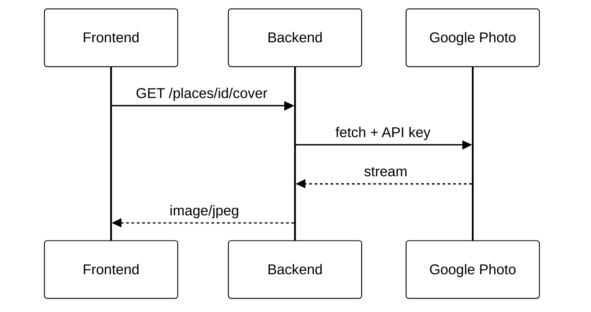
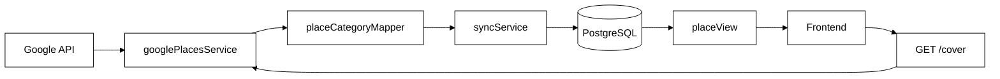

# Módulo 08 — Sincronização e Categorização Google Places (RF15)

Documento de reutilização de software para **RF15 — Sincronização e Categorização de Locais via Google Maps** no backend Eu Amo Piri. A equipe reutiliza a **Google Places API (New)** como fonte complementar ao cadastro comunitário, persistindo resultados no PostgreSQL via Prisma — **sem SDK npm adicional** para Places (cliente HTTP nativo).

---

## 1. O que foi implementado

| Funcionalidade | Detalhe |
|----------------|---------|
| Sync automático no startup | `server.ts` → `syncGooglePlacesToDatabase()` |
| Sync manual admin | `POST /places/gmaps/sync` (JWT + `ADMIN`) |
| Listagem unificada | `GET /places` — locais `source: community` + `source: google` |
| Top N por categoria | Até `GOOGLE_SYNC_PER_CATEGORY` (padrão 40) — cachoeira, restaurante, pousada |
| Upsert idempotente | Chave `googlePlaceId`; não remove locais antigos fora do top N |
| Mapper de categorias | Vocabulário Google → enum `PlaceCategory` Eu Amo Piri |
| **Proxy de capa Google** | `GET /places/:id/cover` — stream server-side da Places Photo API |

---

## 2. Por que foi implementado

| Problema | Solução via reutilização Google |
|----------|--------------------------------|
| Poucos locais cadastrados por moradores no lançamento | Importação automática de dezenas de POIs em Pirenópolis |
| Curadoria manual de coordenadas/endereços | Google mantém geodata atualizado |
| Diferencial do Eu Amo Piri não é mapa genérico | Plataforma **enriquece** POIs Google com relatos e fotos da comunidade |

A equipe **não construiu** base cartográfica própria — custo de oportunidade inviável para o escopo do projeto.

---

## 3. Serviços e bibliotecas reutilizados

> A integração Google evitou que a equipe construísse **geocoder, base de POIs e paginação HTTP** do zero — o trabalho focou em mapper, sync e upsert no modelo `Place` já existente.

### 3.1 Google Places API (New) — Text Search

| Aspecto | Detalhe |
|---------|---------|
| **O que faz** | Busca textual de estabelecimentos com `locationBias` circular; retorna id, nome, coordenadas, tipos, rating, fotos. |
| **Origem** | [Google Maps Platform — Places API (New)](https://developers.google.com/maps/documentation/places/web-service/op-overview) |
| **Por que a equipe utilizou** | Cobertura imediata de POIs turísticos em Pirenópolis; qualidade geográfica reconhecida. |
| **Facilidade no desenvolvimento** | Endereços, coordenadas, ratings e fotos de capa chegam prontos na resposta JSON — sem cadastro manual morador a morador para popular o mapa inicial. |
| **No que ajudou no projeto** | Página `/locais` útil desde o primeiro deploy com API key; turista publica relato em local Google com o mesmo fluxo de local comunitário (`GET /places` → id numérico). |
| **Impacto arquitetural** | Google atua como **bounded context externo** — traduzido por `googlePlacesService` + `placeCategoryMapper` antes de entrar no domínio Prisma. |

**Endpoint consumido:**

```
POST https://places.googleapis.com/v1/places:searchText
```

Headers: `X-Goog-Api-Key`, `X-Goog-FieldMask`. Corpo: `textQuery` + `locationBias.circle` (centro Pirenópolis, raio ~12 km).

---

### 3.2 fetch nativo (Node.js 18+)

| Aspecto | Detalhe |
|---------|---------|
| **O que faz** | Cliente HTTP para Text Search e paginação com `pageToken`. |
| **Origem** | API Web estável do Node.js — **sem dependência `@googlemaps/google-maps-services`** |
| **Por que a equipe utilizou** | API Places (New) usa REST JSON simples; evita SDK desatualizado ou peso extra no `package.json`. |
| **Facilidade no desenvolvimento** | Paginação com `pageToken`, headers `FieldMask` e tratamento de erro centralizados em ~200 linhas de `googlePlacesService.ts` — sem aprender SDK monolítico. |
| **No que ajudou no projeto** | Testes unitários mockam `global.fetch`; sync no startup não exige container ou lib extra; admin re-sincroniza via Swagger sem redeploy. |
| **Impacto arquitetural** | Padrão **Adapter/Facade** — restante do backend desconhece URLs e headers Google. |

**Arquivos:** `googlePlacesService.ts`, `googlePlacesSyncService.ts`, `constants/piriRegion.ts`.

---

### 3.3 Prisma ORM + PostgreSQL

| Aspecto | Detalhe |
|---------|---------|
| **O que faz** | Persiste locais sincronizados com `source = GOOGLE`, `googlePlaceId`, ratings Google, `externalPhotoUrl`. |
| **Por que a equipe reutilizou** | Mesma listagem `GET /places` para comunidade e Google — **modelo unificado** `Place`. |
| **Facilidade no desenvolvimento** | Frontend não precisou de segundo endpoint (`/places/gmaps`) nem IDs especiais — sync grava no mesmo model que moradores já usam. |
| **No que ajudou no projeto** | `placeAdaptor.js` e `PlacesPage` permaneceram inalterados na essência; equipe removeu catálogo em memória e simplificou a arquitetura. |
| **Impacto arquitetural** | Sync-on-write substitui catálogo em memória — arquitetura simplificada e persistente. |

---

### 3.4 Express + Passport JWT (sync admin)

| Aspecto | Detalhe |
|---------|---------|
| **O que faz** | Expõe `POST /places/gmaps/sync` protegido por admin. |
| **Por que a equipe reutilizou** | Reaproveita auth RF01; evita endpoint público que consumiria cota Google. |
| **Facilidade no desenvolvimento** | Proteção admin = `authMiddleware` + `requireAdmin` já usados em `/admin/*` — três linhas na rota. |
| **No que ajudou no projeto** | Re-sync manual documentado no Swagger; turista/morador recebem 403 sem código de autorização duplicado. |

---

### 3.5 Vitest

| Aspecto | Detalhe |
|---------|---------|
| **Facilidade no desenvolvimento** | `placeCategoryMapper.test.ts` valida regras `lodging` → pousada sem chamar API paga; regressão rápida ao ajustar mapper. |
| **No que ajudou no projeto** | BDD de categorias e paginação comprovados em CI/local antes de gastar cota Google em teste manual. |

**Arquivos:** `placeCategoryMapper.test.ts`, `googlePlacesService.test.ts`, `placeService.test.ts`.

---

## 4. Implementação própria — camada de tradução

### placeCategoryMapper.ts (Strategy / Anti-Corruption Layer)

| Entrada Google | Saída Eu Amo Piri |
|----------------|-------------------|
| `lodging`, `hotel`, `guest_house` | `POUSADA` |
| `restaurant`, `food`, `cafe`, `bar` | `RESTAURANTE` |
| `natural_feature`, `park` ou nome contém "cachoeira" | `CACHOEIRA` |
| Demais | Descartado |

POIs sem nome, id ou coordenadas válidas são filtrados em `formatGooglePlace()`.

### piriRegion.ts

Centraliza centro geográfico, raio de busca e text queries — **domínio Pirenópolis** não reutilizável de biblioteca externa.

---

## 5. Proxy de capa Google — padrão estrutural do projeto

### 5.1 Problema que motivou o proxy

No sync, a equipe persiste em `externalPhotoUrl` a URL completa da **Places Photo API** (`/v1/{photoName}/media?key=…`). A primeira abordagem expunha essa URL em `coverImage` no JSON de `GET /places`, e o frontend carregava a imagem diretamente no ``.

Isso falhava na prática com **403 Forbidden**, porque:

| Contexto | Restrição típica da chave | Quem faz a requisição |
|----------|---------------------------|------------------------|
| Sync / Text Search (backend) | Chave de **servidor** (sem HTTP referrer ou restrita por IP) | Node.js |
| `` (frontend) | Mesma chave, mas requisição sai do **navegador** | Cliente do usuário |

A Places Web Service **não aceita** o mesmo modelo de chave restrita a referrer que o SDK JavaScript do Maps. Expor a chave no HTML também viola o princípio de **segredos só no backend** (`GOOGLE_MAPS_API_KEY` nunca vai para o frontend).

### 5.2 Solução — Proxy / Backend-for-Frontend (BFF)

A equipe adotou o **mesmo padrão estrutural** já usado para mídia privada no RF03 (`GET /auth/me/photo` → GCS) e para fotos comunitárias (`GET /places/:id/photos/:photoId` → GCS):



| Camada | Responsabilidade |
|--------|------------------|
| **Persistência** | `externalPhotoUrl` guarda referência interna (URL Places) — **não** é exposta na API pública |
| **View** | `placeView.ts` devolve `coverImage: "/places/{id}/cover"` quando há foto Google |
| **Serviço** | `fetchExternalPhotoMedia()` em `googlePlacesService.ts` — `refreshExternalPhotoUrl()` reaplica a chave atual |
| **Controller** | `getPlaceCover()` — pipe do stream com `Cache-Control: public, max-age=3600` |
| **Frontend** | `placeAdaptor.js` + `resolveMediaUrl()` — trata `/places/{id}/cover` como qualquer mídia relativa da API |

**Endpoint:** `GET /places/:id/cover` (público, sem JWT — capa é conteúdo de catálogo).

### 5.3 Por que é padrão estrutural (e não detalhe de implementação)

No Eu Amo Piri, **todo binário de imagem passa pelo backend** antes de chegar ao navegador:

| Origem | Endpoint proxy | Motivo |
|--------|----------------|--------|
| Perfil (GCS privado) | `GET /auth/me/photo` | Bucket privado + JWT |
| Local comunitário (GCS) | `GET /places/:id/photos/:photoId` | Bucket privado + URL estável |
| **Capa Google (Places API)** | **`GET /places/:id/cover`** | **Chave de servidor + evitar 403 no browser** |

Esse desenho é **transversal ao projeto**: unifica segurança (segredos no servidor), contrato REST previsível (URLs relativas `/places/…`) e UX (mesmo `` para Google e comunidade). Novos integradores externos (outra API de mídia) devem seguir o mesmo padrão — **persistir referência, expor proxy, nunca repassar URL autenticada ao cliente**.

**Arquivos:** `googlePlacesService.ts` (`fetchExternalPhotoMedia`, `refreshExternalPhotoUrl`), `placeService.ts` (`getPlaceCoverStream`), `placeController.ts` (`getPlaceCover`), `placeView.ts`, `placeRoutes.ts`.

---

## 6. Organização no Eu Amo Piri



---

## 7. Impacto da reutilização

| Dimensão | Efeito |
|----------|--------|
| **Cobertura inicial** | Dezenas de locais por categoria sem seed manual |
| **UX** | `/locais` funcional desde primeiro deploy com API key |
| **Relatos** | Locais Google aceitam `POST /places/:id/experiences` — valor agregado da comunidade |
| **Ratings** | `placeView` prioriza média de relatos Eu Amo Piri; fallback para `googleRating` |
| **Fotos** | Capa Google via proxy `GET /places/:id/cover`; referência em `externalPhotoUrl` só no servidor |
| **Segurança** | `GOOGLE_MAPS_API_KEY` nunca aparece no Network tab do navegador |
| **Resiliência** | Falha no sync não derruba API — locais comunitários permanecem em `GET /places` |

---

## 8. Senso crítico e limitações

| Limitação | Mitigação da equipe |
|-----------|---------------------|
| Dependência de billing Google | Paginação limitada; chave só no backend |
| Categorias imperfeitas do Google | Mapper customizado + descarte de types não mapeados |
| Chave com restrição HTTP referrer | Chave de servidor no sync; fotos via proxy `/cover`, não no browser |
| 403 ao carregar capa no `` | Proxy server-side — padrão estrutural alinhado a GCS e perfil |
| Locais Google read-only | `GOOGLE_PLACE_READONLY` — morador não edita POI importado |
| Upsert não remove antigos | Preserva relatos históricos em POIs fora do top 40 atual |

---

## 9. O que não foi reutilizado

| Item | Motivo |
|------|--------|
| SDK `@googlemaps/google-maps-services` | API New + fetch suficientes |
| Catálogo em memória (`GET /places/gmaps`) | Removido — sync PostgreSQL unifica fontes |
| Cron job externo | Sync no startup + endpoint admin manual |

---

## 10. Rastreabilidade — RF15

| Critério / BDD | Status | Evidência |
|----------------|--------|-----------|
| Busca geograficamente delimitada a Pirenópolis | Implementado | `piriRegion.ts` — `locationBias.circle` (centro + raio ~12 km) e queries textuais `"pousada em Pirenópolis GO"`, etc. |
| Mapper Google types → categorias internas | Implementado | `placeCategoryMapper.ts` — `lodging`→Pousada, `restaurant`→Restaurante, `natural_feature`/nome→Cachoeira |
| Lista formatada para o frontend | Implementado | `GET /places` unificado (`placeView.formatPlaceList`) — `source: google` + comunitários |
| Filtro de categoria instantâneo no frontend | Implementado (FE) | [frontend/06.ConsultaLocais](/ArquiteturaReutilizacao/frontend/06.ConsultaLocais.md) |
| BDD 1 — `lodging` categorizado como Pousada | Implementado | Testes em `placeCategoryMapper.test.ts` |
| BDD 2 — filtro “Cachoeiras” oculta demais categorias | Implementado (FE) | [frontend/06.ConsultaLocais](/ArquiteturaReutilizacao/frontend/06.ConsultaLocais.md) |
| Capa Google sem expor chave API | Implementado | Proxy `GET /places/:id/cover` — padrão BFF |

Documento complementar: [4.8. Sincronização Google Places](/docs/requisitos/RF-google-places-backend/4.8.SincronizacaoGooglePlaces.md).

**Variáveis:** `GOOGLE_MAPS_API_KEY`, `GOOGLE_SYNC_PER_CATEGORY`, `PIRI_CENTER_LAT`, `PIRI_CENTER_LNG`, `PIRI_SEARCH_RADIUS_M`.

---

## 11. Referências

- [Text Search (New)](https://developers.google.com/maps/documentation/places/web-service/text-search)
- [Field Mask](https://developers.google.com/maps/documentation/places/web-service/choose-fields)
- [Visão geral — Infraestrutura transversal](/ArquiteturaReutilizacao/backend/00.VisaoGeral.md#2-infraestrutura-transversal)

---

## 12. Histórico de versões

| Versão | Data | Descrição |
|--------|------|-----------|
| 1.0 | 21/06/2026 | Versão inicial — Google Places API + fetch + sync Prisma |
| 1.1 | 21/06/2026 | Facilidade no desenvolvimento e no que ajudou, por biblioteca |
| 1.2 | 21/06/2026 | Proxy `GET /places/:id/cover` — padrão estrutural BFF para capas Google |
| 1.3 | 21/06/2026 | Rastreabilidade RF15 — critérios de aceitação e cenários BDD |
| 1.4 | 22/06/2026 | Remoção da § 6 (diagrama do pipeline de sincronização); renumeração das seções |
