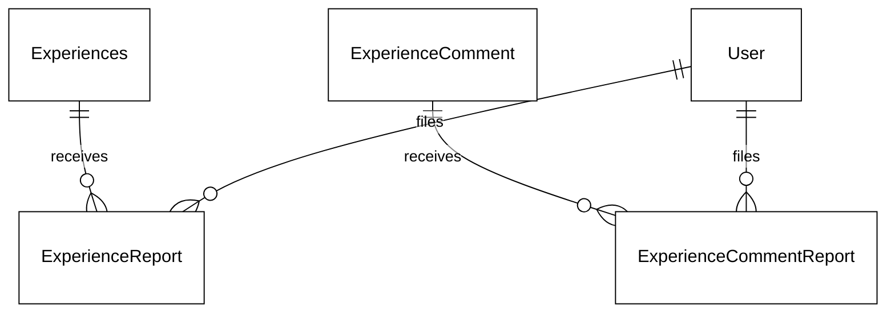
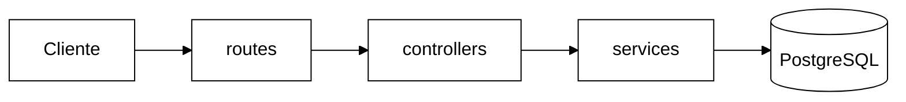
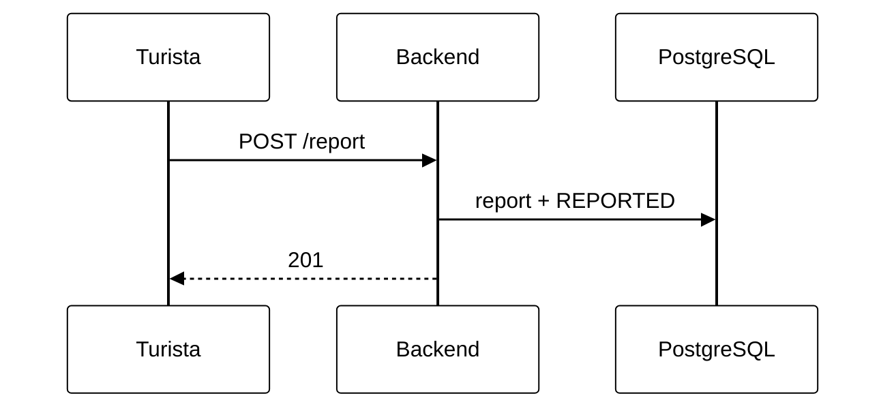
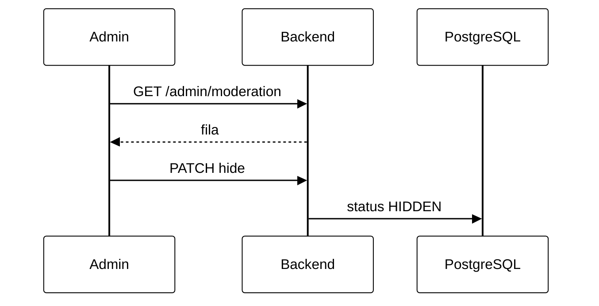

# 4.7. Denúncia e Moderação de Relatos e Comentários — Reutilização de Software

Documento técnico do módulo de Reutilização de Software do projeto **Eu Amo Piri**.

---

## 1. Introdução e contexto

O Eu Amo Piri permite que turistas compartilhem **relatos de experiência** (`Experiences`) vinculados a **locais** (`Place`). Sobre cada relato, outros turistas podem publicar **comentários** em texto (`ExperienceComment`) — ver [4.6. Comentários e Reações](/docs/requisitos/RF12-RF13-backend/4.6.ComentariosReacoes.md).

Este requisito adiciona **denúncia** e **moderação** de conteúdo:

| Funcionalidade | Descrição | Quem |
|----------------|-----------|------|
| **Denunciar relato** | Sinalizar relato falso, ofensivo ou sensível | Turista ou Admin autenticado |
| **Denunciar comentário** | Sinalizar comentário inapropriado | Turista ou Admin autenticado |
| **Moderar** | Restaurar (`ACTIVE`) ou ocultar (`HIDDEN`) item denunciado | **Somente Admin** |

### Hierarquia de domínio

```
Place (local)                    ← NÃO denunciável
 └── Experiences (relato)        ← denunciável · status ACTIVE | REPORTED | HIDDEN
      ├── ExperienceComment      ← denunciável · status ACTIVE | REPORTED | HIDDEN
      └── ExperienceReaction     ← fora do escopo de denúncia
```

**Relato e comentário são entidades distintas.** Comentário pertence a um relato na cadeia **Local → Relato → Comentário**.

### Ciclo de status

| Status | Significado | Visível na plataforma? |
|--------|-------------|------------------------|
| `ACTIVE` | Normal ou reativado pelo admin | Sim |
| `REPORTED` | Denunciado; aguarda revisão | Sim |
| `HIDDEN` | Ocultado pelo admin | Não |

Denunciar altera `ACTIVE` → `REPORTED`. Apenas o admin pode restaurar (`ACTIVE`) ou ocultar (`HIDDEN`). **Não há ocultação automática** por quantidade de denúncias.

A implementação está no backend (`backend/`) e frontend (`frontend/`), seguindo o padrão MVC existente. Documentação interativa da API: `/api-docs`.

---

## 2. Reutilização de software

| Componente | Origem | Papel no Eu Amo Piri |
|---|---|---|
| **Prisma ORM** | [prisma.io](https://www.prisma.io/) | Enums `ContentStatus`, `ReportReason`; models `ExperienceReport`, `ExperienceCommentReport` |
| **Passport JWT** | Passport ecosystem | `authMiddleware` + `requireTuristaOrAdmin` / `requireAdmin` |
| **Express** | npm | Rotas aninhadas em `experienceRoutes` e montagem `/admin` |
| **Vitest** | npm | Testes de denúncia e moderação |
| **swagger-jsdoc** | npm | Schemas `CreateReportRequest`, `ReportResponse` |
| **ReportModal** | Frontend (molécula) | UI de denúncia reutilizável para relato e comentário |

### O que foi reutilizado vs. implementado pelo projeto

| Reutilizado | Implementado pelo Eu Amo Piri |
|---|---|
| Padrão MVC de `comment*` / `reaction*` | Módulos `*Report*` e `moderation*` |
| `findExperienceByIdAndPlaceId` | Validação cadeia Local → Relato → Comentário |
| `requireAccountTypeMiddleware` | `requireTuristaOrAdmin`, `requireAdmin` |
| `ReportModal.jsx` (frontend) | Integração em `PlaceDetailPage` e `DenunciaTestPage` |
| `AuthContext.canReport` | Gate turista/admin no frontend |

**Não há biblioteca externa nova** dedicada a moderação.

---

## 3. Bibliotecas utilizadas no escopo da task

Nenhuma dependência nova foi adicionada ao `package.json`.

### 3.1 Prisma (`@prisma/client` + `prisma`)

| Item | Detalhe |
|---|---|
| **Versão** | ^7.8.0 |
| **Finalidade** | Persistência de denúncias, status de moderação, FKs com cascade |
| **Uso no projeto** | `schema.prisma`, `experienceReportModel.ts`, `commentReportModel.ts` |

### 3.2 Passport JWT (`passport-jwt`)

| Item | Detalhe |
|---|---|
| **Versão** | ^4.0.1 |
| **Finalidade** | Autenticar turista/admin na denúncia; admin na moderação |
| **Uso no projeto** | `authMiddleware.ts`, rotas POST `/report`, rotas `/admin/*` |

### 3.3 Vitest

| Item | Detalhe |
|---|---|
| **Versão** | ^1.6.0 |
| **Uso no projeto** | `experienceReportService.test.ts`, `moderationService.test.ts`, `reportReasons.test.ts` |

### 3.4 swagger-jsdoc

Schemas: `CreateReportRequest`, `ReportResponse`; campos `status` em `Experience` e `ExperienceComment`.

---

## 4. Visão lógica

### 4.1 Modelo de dados (ER)



- `@@unique([experienceId, reporterId])` e `@@unique([commentId, reporterId])` — uma denúncia por usuário por item.

### 4.2 Diagrama de componentes (camadas MVC)



### 4.3 Fluxo — denunciar relato



### 4.4 Fluxo — moderação admin



### 4.5 Filtragem nas listagens

Listagens públicas aplicam `where: { status: { not: HIDDEN } }` em relatos e comentários. Itens `REPORTED` permanecem visíveis até decisão do admin.

---

## 5. Padrões de projeto

### 5.1 Camadas MVC

Espelha `commentService` / `reactionService`: routes → controller → service (`*Error`) → model.

### 5.2 Middleware em cadeia

| Rota | Middlewares |
|------|-------------|
| `POST .../report` (relato/comentário) | `authMiddleware` → `requireTuristaOrAdmin` |
| `GET /admin/moderation` | `authMiddleware` → `requireAdmin` |
| `PATCH /admin/.../restore` \| `/hide` | `authMiddleware` → `requireAdmin` |

### 5.3 Motivos de denúncia (`reportReasons.ts`)

Enum Prisma `ReportReason` alinhado ao `ReportModal` frontend:

| API / DB | Label UI |
|----------|----------|
| `ODIO` | Discurso de Ódio |
| `FALSO` | Conteúdo Falso |
| `SENSIVEL` | Informações Sensíveis |
| `OUTRO` | Outro (descrição obrigatória) |

---

## 6. Decisões arquiteturais (ADRs)

### ADR-01: Denúncia não oculta automaticamente

| | |
|--|--|
| **Contexto** | Conteúdo denunciado deve ser revisado antes de sumir da plataforma. |
| **Decisão** | Denunciar apenas muda status para `REPORTED`; ocultação é ação explícita do admin. |
| **Consequência** | Fila `/admin/moderation` para revisão humana. |

### ADR-02: Status enum em relato e comentário

| | |
|--|--|
| **Decisão** | Campo `status ContentStatus` em `Experiences` e `ExperienceComment`. |
| **Consequência** | Transições explícitas; listagens filtram `HIDDEN`. |

### ADR-03: Local fora do escopo

| | |
|--|--|
| **Decisão** | Denúncia apenas de relato ou comentário; `Place` não possui report. |
| **Consequência** | Rotas aninhadas sob `/places/:placeId/experiences/...`. |

### ADR-04: Turista e Admin denunciam; só Admin modera

| | |
|--|--|
| **Decisão** | `requireTuristaOrAdmin` na denúncia; `requireAdmin` na moderação. |
| **Consequência** | Morador não denuncia; frontend usa `canReport` no `AuthContext`. |

---

## 7. Mapeamento requisitos → implementação

### Denúncia

| Critério | Implementação |
|----------|---------------|
| Botão abre modal com motivo | `ReportModal.jsx` + ícone ⚠ em `PlaceDetailPage` |
| Turista/admin autenticado denuncia | `requireTuristaOrAdmin` + `canReport` |
| Relato denunciado → REPORTED | `experienceReportService.reportExperience` |
| Comentário denunciado → REPORTED | `commentReportService.reportComment` |
| Notificação de recebimento | Modal sucesso "Denúncia recebida!" |
| Não denunciar próprio conteúdo | `CANNOT_REPORT_OWN` (403) |

**Exemplo request:**

```json
{
  "reason": "FALSO",
  "description": "Informação incorreta sobre horário de funcionamento."
}
```

**Exemplo response (201):**

```json
{
  "message": "Denúncia recebida! O relato foi sinalizado para revisão.",
  "reportCount": 1,
  "status": "REPORTED"
}
```

### Moderação admin

| Critério | Implementação |
|----------|---------------|
| Fila de denunciados | `GET /admin/moderation?status=REPORTED` |
| Restaurar | `PATCH /admin/experiences/:id/restore` → `ACTIVE` |
| Ocultar | `PATCH /admin/experiences/:id/hide` → `HIDDEN` |
| UI admin | `ModeracaoAdminPage` — rota `/admin/moderacao` |

### Códigos de erro

| HTTP | code | Situação |
|------|------|----------|
| 400 | `INVALID_REASON` | Motivo inválido |
| 400 | `DESCRIPTION_REQUIRED` | OUTRO sem descrição |
| 403 | `CANNOT_REPORT_OWN` | Autor denunciando próprio conteúdo |
| 403 | `FORBIDDEN_ACCOUNT_TYPE` | Morador tentando denunciar |
| 409 | `ALREADY_REPORTED` | Denúncia duplicada |
| 410 | `CONTENT_UNAVAILABLE` | Item já `HIDDEN` |
| 400 | `INVALID_STATUS_TRANSITION` | Admin tenta moderar item não `REPORTED` |

---

## 8. Endpoints documentados

Documentação interativa: `http://localhost:3000/api-docs`

| Método | Rota | Autenticação |
|--------|------|--------------|
| `POST` | `/places/:placeId/experiences/:experienceId/report` | Bearer + Turista/Admin |
| `POST` | `/places/:placeId/experiences/:experienceId/comments/:commentId/report` | Bearer + Turista/Admin |
| `GET` | `/admin/moderation?status=REPORTED` | Bearer + Admin |
| `PATCH` | `/admin/experiences/:experienceId/restore` | Bearer + Admin |
| `PATCH` | `/admin/experiences/:experienceId/hide` | Bearer + Admin |
| `PATCH` | `/admin/comments/:commentId/restore` | Bearer + Admin |
| `PATCH` | `/admin/comments/:commentId/hide` | Bearer + Admin |

---

## 9. Artefatos e migrations

| Artefato | Localização |
|----------|-------------|
| Schema Prisma | `backend/prisma/schema.prisma` |
| Migration | `prisma/migrations/20260621193000_add_content_reports_and_status/` |
| Constantes | `backend/src/constants/reportReasons.ts` |
| Testes | `experienceReportService.test.ts`, `moderationService.test.ts` |
| Frontend modal | `frontend/src/presentation/molecules/ReportModal.jsx` |
| Página teste | `frontend/src/teste/DenunciaTestPage.jsx` — `/teste/denuncia` |
| Painel admin | `frontend/src/pages/ModeracaoAdminPage.jsx` — `/admin/moderacao` |

### Checklist pós-deploy

- [ ] `npx prisma migrate deploy` no ambiente alvo
- [ ] `npx prisma generate`
- [ ] Reiniciar backend
- [ ] Testar denúncia via Swagger (turista) → status `REPORTED`
- [ ] Testar moderação admin → restore / hide
- [ ] Confirmar morador recebe 403 em POST report

---

## 10. Estrutura de arquivos

```
backend/src/
├── constants/
│   └── reportReasons.ts
├── controllers/
│   ├── experienceReportController.ts
│   ├── commentReportController.ts
│   └── moderationController.ts
├── middleware/
│   └── requireAccountTypeMiddleware.ts   # + requireTuristaOrAdmin
├── model/
│   ├── experienceReportModel.ts
│   ├── commentReportModel.ts
│   ├── experienceModel.ts                # filtro HIDDEN, findReportedExperiences
│   └── commentModel.ts                   # filtro HIDDEN, findReportedComments
├── routes/
│   ├── experienceRoutes.ts               # POST /report
│   └── adminRoutes.ts
├── services/
│   ├── experienceReportService.ts
│   ├── commentReportService.ts
│   └── moderationService.ts
└── views/
    ├── experienceView.ts                 # campo status
    └── commentView.ts

frontend/src/
├── presentation/molecules/ReportModal.jsx
├── pages/PlaceDetailPage.jsx
├── pages/ModeracaoAdminPage.jsx
└── teste/DenunciaTestPage.jsx
```

---

## 11. Referências

### Documentos relacionados no projeto

- [4.6. Comentários e Reações](/docs/requisitos/RF12-RF13-backend/4.6.ComentariosReacoes.md) — cadeia Local → Relato → Comentário
- [4.4. Autenticação](/docs/requisitos/RF01-backend/4.4.Autenticacao.md) — JWT e papéis de usuário

---

## 12. Histórico de versões

| Versão | Data | Autor | Descrição |
|--------|------|-------|-----------|
| 1.0 | 21/06/2026 | Grupo 05 Eu Amo Piri | Versão inicial — denúncia de relato/comentário, moderação admin, status ACTIVE/REPORTED/HIDDEN |
