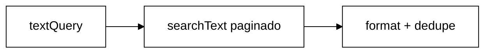
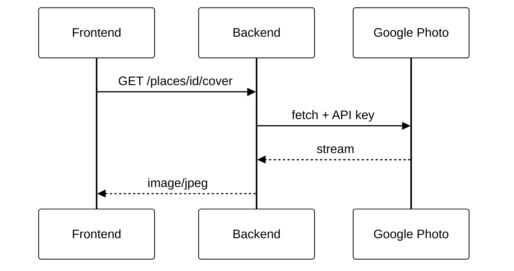
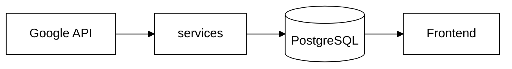
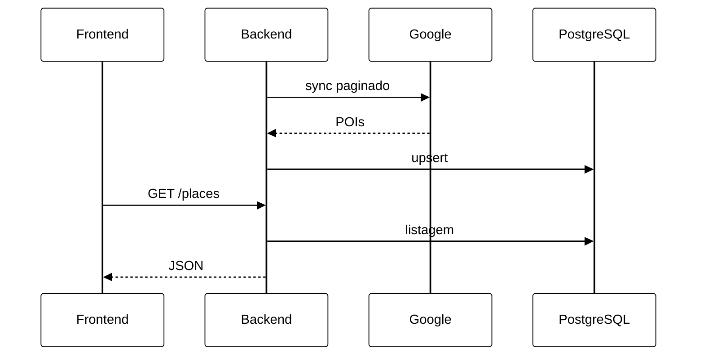

# 4.8. Sincronização Google Places — Pirenópolis (Reutilização de Software)

Documento técnico do módulo de Reutilização de Software do projeto **Eu Amo Piri**.

---

## 1. Introdução e contexto

O Eu Amo Piri é uma aplicação web para compartilhar experiências sobre **Pirenópolis**. Antes deste módulo, a listagem de locais dependia exclusivamente de **cadastro manual** por moradores (`Place` no PostgreSQL), o que limitava a cobertura inicial da plataforma.

Este requisito integra a **Google Places API (New)** como **fonte complementar de dados geográficos**, persistidos no banco via **sincronização automática**:

| Fonte | Endpoint | Papel |
|-------|----------|-------|
| **Google Places (sincronizados)** | `GET /places` | Até **40 por categoria** no PostgreSQL — detalhe, mapa e **relatos** |
| **Comunidade** | `GET /places` | Locais cadastrados por moradores + relatos e fotos autênticas |

Na **inicialização do backend** (e, quando necessário, via `POST /places/gmaps/sync` por **admin**), o serviço consulta a Google Places API com **paginação** (`pageToken`), ordena por popularidade e **persiste/atualiza os melhores até `GOOGLE_SYNC_PER_CATEGORY` (padrão: 40) por categoria** (restaurantes, cachoeiras, pousadas) no PostgreSQL.

Não há catálogo extra em memória nem páginas de protótipo no frontend — a aplicação usa apenas **`/locais`** (`PlacesPage`) alimentada por `GET /places`.

---

## 2. Reutilização de software

| Componente | Origem | Papel no Eu Amo Piri |
|---|---|---|
| **Google Places API (New)** | [Google Maps Platform](https://developers.google.com/maps/documentation/places/web-service/op-overview) | Base externa de POIs, geolocalização e metadados |
| **Text Search (`places:searchText`)** | Google Maps Platform | Busca textual delimitada à região de Pirenópolis |
| **`fetch` nativo (Node.js 18+)** | Node.js | Cliente HTTP para a API Google (sem SDK adicional) |
| **Express + Vitest** | npm | Endpoint REST e testes automatizados |
| **React + useMemo** | npm (frontend) | Filtro client-side instantâneo em `/locais` |

### O que foi reutilizado vs. implementado pelo projeto

| Reutilizado (serviço/biblioteca externa) | Implementado pelo Eu Amo Piri |
|---|---|
| Base global de lugares do Google | `placeCategoryMapper.ts` — tradução `lodging`→Pousada, `restaurant`→Restaurante, `natural_feature`/nome "Cachoeira"→Cachoeira |
| Geocoding e endereços formatados | `piriRegion.ts` — centro, raio e queries de Pirenópolis |
| Avaliações e fotos do Google | `googlePlacesService.ts` — Adapter/Facade, paginação Text Search |
| UI de listagem existente | Chips de categoria, `GET /places` único no `placeAdaptor.js` |

**Por que reutilizar o Google em vez de construir do zero?**

1. **Cobertura imediata** — dezenas de POIs em Pirenópolis sem seed manual.
2. **Qualidade geográfica** — coordenadas e endereços mantidos pelo ecossistema Google.
3. **Custo de oportunidade** — evita implementar geocoding, base cartográfica e curadoria própria.
4. **Diferencial do Eu Amo Piri** — não compete com o Google Maps genérico; **filtra, categoriza para o domínio local** e **enriquece com relatos da comunidade**.

---

## 3. Como funciona a Google Places API neste módulo

### 3.1 Text Search (New)

O backend envia requisições `POST` para:

```
https://places.googleapis.com/v1/places:searchText
```

**Headers:**

| Header | Valor |
|--------|-------|
| `Content-Type` | `application/json` |
| `X-Goog-Api-Key` | `GOOGLE_MAPS_API_KEY` (somente backend) |
| `X-Goog-FieldMask` | Campos solicitados (id, displayName, location, types, rating, etc.) |

**Corpo (exemplo simplificado):**

```json
{
  "textQuery": "cachoeira em Pirenópolis GO",
  "locationBias": {
    "circle": {
      "center": { "latitude": -15.8503, "longitude": -48.9571 },
      "radius": 12000
    }
  }
}
```

O `locationBias` circular delimita a busca à região de Pirenópolis (~12 km de raio). Três queries fixas são executadas (definidas em `piriRegion.ts`):

| Query Text Search |
|-------------------|
| `pousada em Pirenópolis GO` |
| `restaurante em Pirenópolis GO` |
| `cachoeira em Pirenópolis GO` |

**Field Mask** (`X-Goog-FieldMask`) — campos solicitados por requisição:

```
places.id, places.displayName, places.formattedAddress, places.location,
places.types, places.rating, places.userRatingCount, places.googleMapsUri,
places.photos, places.editorialSummary
```

O `nextPageToken` vem na resposta JSON (não precisa constar no Field Mask).

### 3.2 Paginação Text Search

A API devolve no máximo **20 POIs por página** (`pageSize: 20`). Para atingir até **40/categoria**, o serviço `searchTextQueryAll()` pagina com `pageToken` até:

- coletar `GOOGLE_SYNC_PER_CATEGORY` resultados brutos **por query**, ou
- esgotar páginas (`nextPageToken` ausente).

Fluxo por query:



**Cota estimada no sync:** 3 queries × até 2 páginas = **até 6 chamadas** Text Search por execução (startup ou sync manual).

### 3.3 Parser de categorias (`placeCategoryMapper.ts`)

| Entrada Google | Categoria Eu Amo Piri |
|----------------|----------------------|
| `types` contém `lodging`, `hotel`, `guest_house` | `POUSADA` → `"pousada"` |
| `types` contém `restaurant`, `food`, `cafe`, `bar` | `RESTAURANTE` → `"restaurante"` |
| `types` contém `natural_feature`, `park` **ou** nome contém `"cachoeira"` | `CACHOEIRA` → `"cachoeira"` |
| Demais | Descartado (não entra no sync) |

POIs sem `displayName`, `id`, ou coordenadas válidas também são descartados em `formatGooglePlace()`.

### 3.4 Sincronização no PostgreSQL

**Gatilhos:**

| Momento | Onde | Auth | Comportamento |
|---------|------|------|---------------|
| Startup do backend | `server.ts` → `syncGooglePlacesToDatabase()` | — | Sync assíncrono; falha logada, **API continua no ar** |
| Manual (admin) | `POST /places/gmaps/sync` | **JWT + `accountType: ADMIN`** | Mesmo pipeline; retorna JSON `{ synced, perCategory }` |

**Pipeline (`googlePlacesSyncService.ts`):**

1. `fetchAllGooglePlacesFromApi()` — 3 queries paginadas, dedupe global por `googlePlaceId`.
2. `groupByCategory()` — agrupa em cachoeira / restaurante / pousada.
3. Ordenação por popularidade: `userRatingCount` desc, depois `rating` desc.
4. `slice(0, GOOGLE_SYNC_PER_CATEGORY)` por categoria (padrão **40**).
5. `upsertGoogleSyncedPlace()` — `source = GOOGLE`, chave única `googlePlaceId`.

**Campos persistidos no modelo `Place`:**

| Campo | Origem |
|-------|--------|
| `googlePlaceId` | Places API (`places.id`, sem prefixo `places/`) |
| `source` | `GOOGLE` |
| `latitude` / `longitude` | `places.location` |
| `externalPhotoUrl` | URL Places Photo (`/v1/{photoName}/media`) — **persistida no servidor; não exposta no JSON público** |
| `googleRating` / `googleReviewCount` | Avaliações Google (referência na UI) |
| `moradorId` | `null` (somente leitura; morador não edita) |

**Upsert não remove** locais Google que saíram do top N — preserva relatos e histórico. Re-sync apenas **atualiza** metadados dos que permanecem no ranking e **insere** novos POIs que entram no top N.

### 3.5 Avaliações exibidas (`placeView.ts`)

| Situação | `rating` / `reviewsCount` em `GET /places` |
|----------|---------------------------------------------|
| Local com relatos da comunidade | Média e contagem dos **relatos** (prioridade) |
| Local Google sem relatos | `googleRating` / `googleReviewCount` do sync |
| Local comunidade sem relatos | `null` / `0` |

Na página de detalhe, barras por estrela refletem **relatos Eu Amo Piri**; o resumo numérico pode mostrar Google Maps quando ainda não há relatos.

### 3.6 Fotos de capa — proxy backend (padrão estrutural)

#### Problema

A Places Photo API exige `GOOGLE_MAPS_API_KEY` na URL de mídia. Expor essa URL em `coverImage` faz o navegador chamar `places.googleapis.com` diretamente, o que resulta em **403 Forbidden** quando a chave é de **servidor** (restrição por IP ou sem HTTP referrer). Além disso, a chave ficaria visível no DevTools.

#### Decisão arquitetural — Proxy / BFF

A equipe **não** envia a URL Google ao frontend. O fluxo adota o **mesmo padrão estrutural** de mídia já usado no projeto:

| Tipo de mídia | Endpoint proxy | Armazenamento |
|---------------|----------------|---------------|
| Perfil | `GET /auth/me/photo` | GCS (bucket privado) |
| Local comunitário | `GET /places/:id/photos/:photoId` | GCS |
| **Capa local Google** | **`GET /places/:id/cover`** | **Referência em `externalPhotoUrl` + fetch server-side** |



**Implementação:**

| Artefato | Função |
|----------|--------|
| `googlePlacesService.fetchExternalPhotoMedia()` | Busca a foto no Google via `fetch` (redirect follow) |
| `googlePlacesService.refreshExternalPhotoUrl()` | Reaplica a chave atual do `.env` à URL persistida |
| `placeService.getPlaceCoverStream()` | Orquestra: foto GCS (se houver) ou proxy Google |
| `placeView.formatPlace()` | `coverImage: "/places/{id}/cover"` quando `externalPhotoUrl` existe |
| `placeController.getPlaceCover()` | Stream HTTP com `Cache-Control: public, max-age=3600` |
| `placeAdaptor.js` | `resolveMediaUrl("/places/43/cover")` → URL da API |

**Importância para o projeto:** o proxy não é um workaround pontual — é a **extensão natural** da política “mídia passa pelo backend”. Garante segurança (segredo no servidor), contrato uniforme (URLs relativas) e compatibilidade com chaves Google restritas a IP. Qualquer nova integração de imagem externa deve seguir o mesmo desenho.

Locais da comunidade continuam com fotos no GCS via `/places/{id}/photos/{photoId}`. Locais Google **não** armazenam binário no GCS — apenas a referência Places no campo `externalPhotoUrl`.

Documentação complementar do padrão: [Módulo 08 — Proxy de capa](/docs/ArquiteturaReutilizacao/backend/08.SincronizacaoGooglePlaces.md#5-proxy-de-capa-google--padrao-estrutural-do-projeto).

### 3.7 Listagem única no frontend

- `placeAdaptor.js`: `fetchPlaces()` → `GET /places` e `fetchPlaceById()` → `GET /places/:id`.
- **Removidos:** cache em memória, `GET /places/gmaps`, IDs `gmaps:…`, catálogo paginado separado, página `/teste/google-places` e `syncGooglePlaces()` no adaptor.
- Sync manual: **somente via Swagger** (`POST /places/gmaps/sync`, admin autenticado) — **sem botão na UI** para o usuário final.

---

## 4. Arquitetura e reutilização

### 4.1 Camadas



### 4.2 Sequência — carregamento da listagem



### 4.3 Padrões arquiteturais

| Padrão | Onde | Finalidade |
|--------|------|------------|
| **Adapter / Facade** | `googlePlacesService.ts` | Isola contrato Google do restante da API REST |
| **Strategy / Mapper** | `placeCategoryMapper.ts` | Traduz vocabulário Google → enum `PlaceCategory` |
| **Sync-on-startup** | `googlePlacesSyncService.ts` | Persiste top N por categoria no PostgreSQL |
| **Proxy / BFF (mídia)** | `GET /places/:id/cover` | Stream server-side da capa Google; chave nunca no frontend |
| **Separation of concerns** | Um endpoint de listagem | Google sincronizado + comunidade em `GET /places`; relatos no PostgreSQL |

### 4.4 Por que o Google complementa a comunidade

| Dimensão | Google (sincronizado) | Comunidade |
|----------|----------------------|------------|
| Cobertura inicial | Alta (até 40/categoria) | Baixa (depende de moradores) |
| Coordenadas / endereço | Automático | Manual |
| Atualização | Startup do backend ou `POST /places/gmaps/sync` (admin via Swagger) | Edição manual |
| Relatos e fotos locais | Habilitados após sync (ID numérico) | Sim (valor agregado do Eu Amo Piri) |

O visitante encontra **base Google enriquecível**; moradores **complementam** com experiências autênticas.

---

## 5. Senso crítico e limitações

| Limitação | Mitigação adotada |
|-----------|-------------------|
| Dependência de serviço externo | Sync tolera falha no startup; comunidade continua visível em `GET /places` |
| Cota e billing Google | Paginação limitada a `GOOGLE_SYNC_PER_CATEGORY`; chave apenas no backend |
| Categorias imperfeitas do Google | Mapper customizado + descarte de types não mapeados |
| Volume real por categoria | API pode devolver menos de 40 POIs válidos em Pirenópolis — sync grava o que existir |
| Chave de API | `GOOGLE_MAPS_API_KEY` só no backend; mapa Leaflet no frontend usa tiles OpenStreetMap |
| Locais Google fora do top 40 atual | Upsert não exclui registros antigos — preserva relatos |
| Sync manual aberto | Endpoint protegido — apenas **ADMIN** com JWT |

---

## 6. Endpoints e contratos

### Endpoints ativos

| Método | Rota | Auth | Descrição |
|--------|------|------|-----------|
| `GET` | `/places` | Não | Lista unificada (comunidade + Google sincronizados) |
| `GET` | `/places/:id` | Não | Detalhe de um local (ID numérico PostgreSQL) |
| `GET` | `/places/:id/cover` | Não | Stream da capa (proxy GCS ou Google Places) |
| `POST` | `/places/gmaps/sync` | **Sim — ADMIN** | Re-sincroniza com a Google Places API |

### Endpoints removidos (não usar)

| Rota | Motivo |
|------|--------|
| `GET /places/gmaps` | Catálogo extra em memória — substituído por sync no PostgreSQL |
| `GET /places/gmaps/:id` | Detalhe de ID `gmaps:…` — substituído por `GET /places/:id` |

### `GET /places`

**Auth:** não requerida.

**Resposta `200`:** array unificado de locais da comunidade e Google sincronizados (`source: "community"` ou `"google"`), todos com **ID numérico** do PostgreSQL.

**Exemplo (item Google):**

```json
{
  "id": 43,
  "googlePlaceId": "ChIJ123abc",
  "name": "Cachoeira da Rosário",
  "category": "cachoeira",
  "address": "Estrada da Rosário, Pirenópolis, GO",
  "lat": -15.8312,
  "lng": -48.9423,
  "mapsLink": "https://maps.google.com/?cid=123",
  "source": "google",
  "rating": 4.8,
  "reviewsCount": 120,
  "description": "Cachoeira da Rosário — local em Pirenópolis importado do Google Maps.",
  "coverImage": "/places/43/cover"
}
```

> **Nota:** `coverImage` é sempre uma URL **relativa da API Eu Amo Piri**. O frontend resolve via `resolveMediaUrl()`; o backend busca a imagem no Google com `GOOGLE_MAPS_API_KEY` em `GET /places/43/cover`.

### `GET /places/:id/cover`

**Auth:** não requerida.

**Comportamento:**

1. Local com fotos no GCS → stream da primeira foto (`/photos/:photoId` internamente).
2. Local Google com `externalPhotoUrl` → proxy via `fetchExternalPhotoMedia()`.
3. Sem capa → `404`.

**Headers de resposta:** `Content-Type: image/jpeg` (ou PNG), `Cache-Control: public, max-age=3600`.

### `POST /places/gmaps/sync`

**Auth:** obrigatória — header `Authorization: Bearer <JWT>` de usuário com `accountType: ADMIN`.

**Como obter token admin (Swagger):**

1. Crie um usuário normal (`POST /auth/register`) ou use um existente.
2. Promova no banco: `UPDATE "User" SET "accountType" = 'ADMIN' WHERE email = 'admin@exemplo.com';`
3. `POST /auth/login` → copie o `token`.
4. No Swagger (`/api-docs`), clique **Authorize** e informe o Bearer token.
5. Execute **Places → POST /places/gmaps/sync**.

**Resposta `200`:**

```json
{
  "synced": 87,
  "perCategory": {
    "cachoeira": 28,
    "restaurante": 35,
    "pousada": 24
  }
}
```

**Erros comuns:**

| HTTP | `code` | Causa |
|------|--------|-------|
| 401 | — | Token ausente ou inválido |
| 403 | `FORBIDDEN_ACCOUNT_TYPE` | Usuário autenticado não é ADMIN |
| 503 | `GOOGLE_MAPS_API_KEY_MISSING` | Variável ausente no `.env` |
| 503 | `API_KEY_HTTP_REFERRER_BLOCKED` | Chave restrita a HTTP referrers (navegador) |
| 502 | `GOOGLE_PLACES_ERROR` | Falha genérica na API Google |

Locais da comunidade em `GET /places` **não são afetados** se o sync falhar.

### Regras de negócio — locais Google

| Ação | Permitido? |
|------|------------|
| Listar / ver detalhe | Sim (`GET /places`, `/locais/:id`) |
| Cadastrar relato (turista) | Sim — ID numérico no banco |
| Editar / excluir local (morador) | Não — retorna `GOOGLE_PLACE_READONLY` |
| Disparar sync manual | Sim — **apenas ADMIN** via Swagger (`POST /places/gmaps/sync`) |

### Arquivos principais

| Camada | Arquivo |
|--------|---------|
| Constantes regionais | `backend/src/constants/piriRegion.ts` |
| Mapper | `backend/src/services/placeCategoryMapper.ts` |
| Sync | `backend/src/services/googlePlacesSyncService.ts` |
| Serviço Google | `backend/src/services/googlePlacesService.ts` |
| View (coverImage) | `backend/src/views/placeView.ts` |
| Proxy capa | `getPlaceCover` em `placeController.ts`, rota `/:id/cover` em `placeRoutes.ts` |
| Controller / Rota | `backend/src/controllers/placeController.ts`, `backend/src/routes/placeRoutes.ts` |
| Adaptor frontend | `frontend/src/infra/adaptor/placeAdaptor.js` |
| UI listagem | `frontend/src/pages/PlacesPage.jsx` |
| UI detalhe + relatos | `frontend/src/pages/PlaceDetailPage.jsx` |
| Startup sync | `backend/src/server.ts` |
| Migration | `backend/prisma/migrations/20260621120000_add_google_place_sync/` |

---

## 7. Evidência de execução

### 7.1 Variáveis de ambiente

Copie de `backend/.env.example`:

```env
GOOGLE_MAPS_API_KEY=sua-chave-servidor-aqui
GOOGLE_SYNC_PER_CATEGORY=40
PIRI_CENTER_LAT=-15.8503
PIRI_CENTER_LNG=-48.9571
PIRI_SEARCH_RADIUS_M=12000
```

> **Nota:** `GOOGLE_PLACES_CACHE_TTL_MS` existia em versões anteriores (catálogo em memória) e **não é mais utilizada**.

**Produção (Render / Supabase):** defina `GOOGLE_MAPS_API_KEY` e `GOOGLE_SYNC_PER_CATEGORY=40` no painel de Environment do backend. Após deploy ou restart, o sync roda automaticamente no startup. Para forçar nova sincronização sem reiniciar, use `POST /places/gmaps/sync` no Swagger com usuário **ADMIN**.

Ative **Places API (New)** no Google Cloud Console.

**Erro comum `API_KEY_HTTP_REFERRER_BLOCKED` (403):** a chave foi criada com restrição **Sites (HTTP referrers)** — isso só funciona no navegador. O backend Node.js chama a API **sem referrer**. Solução:

1. No [Google Cloud Console → Credenciais](https://console.cloud.google.com/apis/credentials), crie uma **nova chave de API** para o servidor.
2. **Restrição de aplicativo:** `Nenhuma` (desenvolvimento) ou `Endereços IP` (produção).
3. **Restrição de API:** marque apenas **Places API (New)**.
4. Cole em `backend/.env` como `GOOGLE_MAPS_API_KEY=...` e reinicie o backend.

### 7.2 Migration e subir o backend

```bash
cd backend
npx prisma migrate deploy   # ou npm run prisma:migrate:prod em produção
npm run dev                 # dev local — sync no startup
# npm run dev:prod          # dev apontando ao Supabase
```

Log esperado após sync bem-sucedido:

```
Google Places sync: 87 locais no banco.
```

### 7.3 Testar endpoints

```bash
curl -s http://localhost:3000/places | head -c 500
```

Com API key válida e sync concluído: JSON com locais da comunidade e Google (`source: "google"`). Sem chave ou com erro 403: sync falha (log no console), mas **`GET /places` ainda retorna locais da comunidade**.

Sync manual (substitua `SEU_TOKEN_ADMIN`):

```bash
curl -X POST http://localhost:3000/places/gmaps/sync \
  -H "Authorization: Bearer SEU_TOKEN_ADMIN"
```

### 7.4 Swagger

Documentação interativa: `http://localhost:3000/api-docs`

| Passo | Ação |
|-------|------|
| 1 | `POST /auth/login` com usuário **ADMIN** |
| 2 | **Authorize** → Bearer + token |
| 3 | **Places** → `POST /places/gmaps/sync` → **Execute** |
| 4 | `GET /places` → validar locais com `source: "google"` |

Schema de resposta: `GoogleSyncResult` (`synced`, `perCategory`).

### 7.5 Frontend

```bash
cd frontend
npm run dev
```

| Rota | Descrição |
|------|-----------|
| `/locais` | Lista e mapa — única fonte `GET /places` |
| `/locais/:id` | Detalhe, relatos e estatísticas (Google + comunidade) |
| `/locais/:id/relatos/novo` | Cadastro de relato em local Google (ID numérico) |

Não há rota de teste no frontend; a sincronização é feita no **startup do backend** ou manualmente pelo **admin no Swagger**.

### 7.6 Testes automatizados

```bash
cd backend
npm test -- --run src/services/placeCategoryMapper.test.ts src/services/googlePlacesService.test.ts

cd frontend
npm test -- --run src/pages/PlacesPage.test.jsx
```

### 7.7 Checklist BDD

| Cenário | Resultado esperado | Evidência |
|---------|-------------------|-----------|
| **BDD 1** — Busca e mapeamento | `lodging` → `"pousada"`; locais Google em `GET /places` com `source: "google"` | Teste `placeCategoryMapper.test.ts`; resposta JSON do endpoint |
| **BDD 2** — Filtro no frontend | Clicar "Cachoeiras" oculta restaurantes/pousadas imediatamente | Teste `PlacesPage.test.jsx` |
| **BDD 3** — Sync manual (admin) | `POST /places/gmaps/sync` com JWT admin retorna `synced` > 0 | Swagger ou curl + JSON de resposta |
| **BDD 4** — Relatos em local Google | Turista cadastra relato em `/locais/{id}/relatos/novo` | ID numérico de `GET /places` |
| **BDD 5** — Sync negado | Turista/morador sem token recebe 401; turista autenticado recebe 403 | Swagger / curl |

---

## 8. Referências

- [Google Places API (New) — Overview](https://developers.google.com/maps/documentation/places/web-service/op-overview)
- [Text Search (New)](https://developers.google.com/maps/documentation/places/web-service/text-search)
- [FieldMask](https://developers.google.com/maps/documentation/places/web-service/choose-fields)
- [Eu Amo Piri — README](/docs/README.md)

---

## 9. Histórico de versões

| Versão | Data | Autor | Descrição |
|--------|------|-------|-----------|
| 1.0 | 21/06/2026 | Grupo 05 Eu Amo Piri | Versão inicial — catálogo Google Places + filtros + documentação de reutilização |
| 1.1 | 21/06/2026 | Grupo 05 Eu Amo Piri | 40/categoria com paginação; fim do catálogo extra; lista única `GET /places` |
| 1.2 | 21/06/2026 | Grupo 05 Eu Amo Piri | Documentação alinhada à implementação: paginação, upsert, ratings, deploy e endpoints removidos |
| 1.3 | 21/06/2026 | Grupo 05 Eu Amo Piri | Renomeado para **Sincronização Google Places**; sync admin via Swagger; remoção de páginas de teste no frontend |
| 1.4 | 21/06/2026 | Grupo 05 Eu Amo Piri | Documentação restrita ao que está implementado (startup + sync admin; sem cron) |
| 1.5 | 21/06/2026 | Grupo 05 Eu Amo Piri | Proxy `GET /places/:id/cover` — padrão estrutural BFF; `coverImage` relativo; seção 3.6 ampliada |
