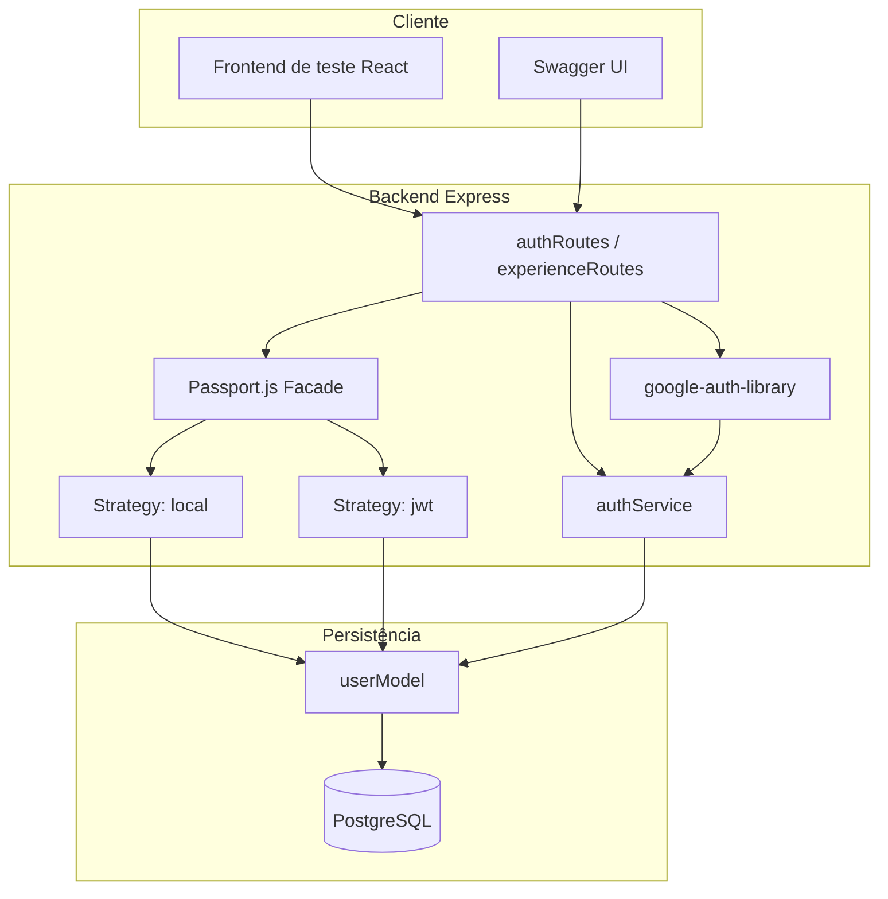
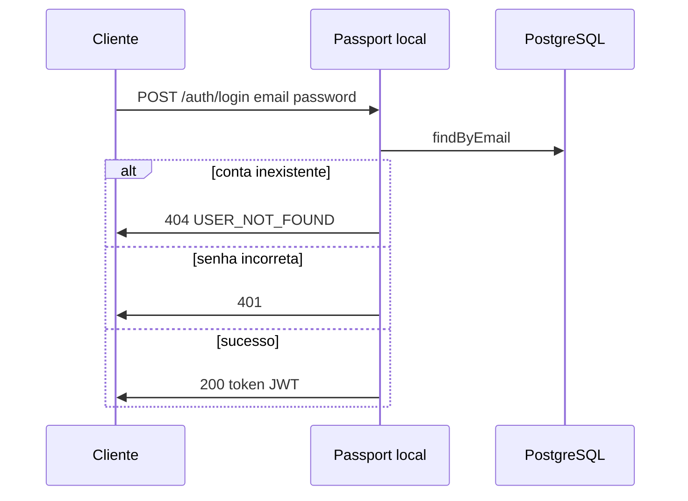
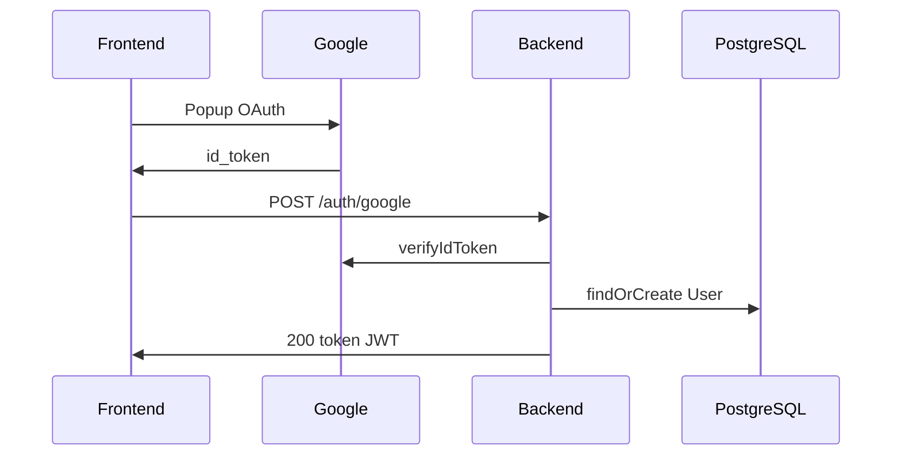

# 4.4. Módulo de Autenticação — Visão Arquitetural

Documento técnico para uso no DAS (Documento de Arquitetura de Software) e no módulo de Reutilização de Software do projeto **Eu Amo Piri**.

---

## 1. Introdução e contexto

O Eu Amo Piri é uma aplicação web para compartilhamento de experiências sobre Pirenópolis. Para liberar funcionalidades colaborativas (ex.: registrar experiências em locais), o sistema exige autenticação de usuários por **email e senha**, com tokens **JWT** para rotas protegidas.

Este módulo foi implementado no backend (`backend/`) reutilizando bibliotecas consolidadas do ecossistema Node.js, com frontend em `frontend/` e documentação Swagger em `/api-docs`.

---

## 2. Reutilização de software

| Componente | Origem | Papel no Eu Amo Piri |
|---|---|---|
| **Passport.js** | [passportjs.org](https://www.passportjs.org/) | Fachada unificada de autenticação |
| **passport-local** | Passport ecosystem | Estratégia email/senha |
| **passport-jwt** | Passport ecosystem | Estratégia JWT para rotas protegidas |
| **google-auth-library** | Google Cloud | Validação do `id_token` OAuth |
| **bcrypt** | npm | Hash de senhas |
| **jsonwebtoken** | npm | Emissão e verificação de JWT |
| **swagger-jsdoc + swagger-ui-express** | npm | Documentação OpenAPI da API |
| **@react-oauth/google** | npm (frontend) | Botão Google no frontend de teste |

### O que foi reutilizado vs. implementado pelo projeto

| Reutilizado (biblioteca) | Implementado pelo Eu Amo Piri |
|---|---|
| Interface `passport.authenticate()` | Model `User` no Prisma |
| Estratégias local e jwt | Validações de cadastro e senha |
| `verifyIdToken()` do Google | Endpoints `/auth/*` |
| Emissão JWT via jsonwebtoken | Vínculo `userId` em experiências |
| UI Swagger | Regras BDD (404 USER_NOT_FOUND) |

---

## 3. Bibliotecas utilizadas no escopo da task

Esta seção detalha **cada biblioteca reutilizada** na implementação do RF01 (autenticação), com finalidade técnica, referência oficial e ponto de integração no código do Eu Amo Piri.

### 3.1 Backend — autenticação e API

#### Passport.js (`passport`)

| Item | Detalhe |
|---|---|
| **Versão** | ^0.7.0 |
| **Licença** | MIT |
| **Referência** | [https://www.passportjs.org/](https://www.passportjs.org/) · [GitHub](https://github.com/jaredhanson/passport) |
| **Finalidade** | Orquestrar autenticação no Express via interface unificada `passport.authenticate()`, atuando como **Facade** do subsistema de auth. |
| **Uso no projeto** | `backend/src/config/passport.ts`, `backend/src/server.ts` (`passport.initialize()`) |
| **Justificativa** | Evita acoplar controllers diretamente a bcrypt, JWT ou Google; permite registrar múltiplas estratégias de login de forma extensível. |

#### passport-local

| Item | Detalhe |
|---|---|
| **Versão** | ^1.0.0 |
| **Referência** | [http://www.passportjs.org/packages/passport-local/](http://www.passportjs.org/packages/passport-local/) |
| **Finalidade** | Estratégia **Strategy** para login com email e senha. Valida credenciais contra o banco via callback customizado. |
| **Uso no projeto** | `backend/src/config/passport.ts` — campos `email` e `password`; retorna `USER_NOT_FOUND` ou senha inválida. |
| **Justificativa** | Padrão consolidado para autenticação local; integra nativamente com Passport. |

#### passport-jwt

| Item | Detalhe |
|---|---|
| **Versão** | ^4.0.1 |
| **Referência** | [https://www.passportjs.org/packages/passport-jwt/](https://www.passportjs.org/packages/passport-jwt/) |
| **Finalidade** | Estratégia **Strategy** para proteger rotas com Bearer token JWT no header `Authorization`. |
| **Uso no projeto** | `backend/src/config/passport.ts`, `backend/src/middleware/authMiddleware.ts`, rota `GET /auth/me` |
| **Justificativa** | API REST stateless; valida sessão da aplicação sem armazenar estado no servidor. |

#### google-auth-library

| Item | Detalhe |
|---|---|
| **Versão** | ^10.7.0 |
| **Referência** | [GitHub — googleapis/google-auth-library-nodejs](https://github.com/googleapis/google-auth-library-nodejs) · [Documentação Google Cloud](https://cloud.google.com/nodejs/docs/reference/google-auth-library/latest) |
| **Finalidade** | Validar criptograficamente o `id_token` recebido do Google OAuth (OpenID Connect), extraindo `email`, `name` e `sub` (googleId). |
| **Uso no projeto** | `backend/src/services/googleAuthService.ts` — método `OAuth2Client.verifyIdToken()` |
| **Justificativa** | Biblioteca **oficial** do Google para verificação de tokens no backend; evita confiar cegamente no payload enviado pelo frontend. |

#### bcrypt

| Item | Detalhe |
|---|---|
| **Versão** | ^6.0.0 |
| **Referência** | [https://github.com/kelektiv/node.bcrypt.js](https://github.com/kelektiv/node.bcrypt.js) |
| **Finalidade** | Hash irreversível de senhas no cadastro (`hash`) e comparação segura no login (`compare`). |
| **Uso no projeto** | `backend/src/utils/password.ts`, chamado por `authService.ts` e estratégia `local` |
| **Justificativa** | Padrão de mercado para armazenamento seguro de senhas; senhas nunca persistidas em texto plano. |

#### jsonwebtoken

| Item | Detalhe |
|---|---|
| **Versão** | ^9.0.3 |
| **Referência** | [https://github.com/auth0/node-jsonwebtoken](https://github.com/auth0/node-jsonwebtoken) · [RFC 7519](https://tools.ietf.org/html/rfc7519) |
| **Finalidade** | Emitir e verificar JWT assinado com `JWT_SECRET` após login/cadastro bem-sucedido. |
| **Uso no projeto** | `backend/src/utils/jwt.ts` — payload `{ sub: userId, email }` |
| **Justificativa** | Token compacto e stateless para autorizar requisições subsequentes sem sessão server-side. |

#### cors

| Item | Detalhe |
|---|---|
| **Versão** | ^2.8.6 |
| **Referência** | [https://github.com/expressjs/cors](https://github.com/expressjs/cors) |
| **Finalidade** | Permitir requisições do frontend de teste (`http://localhost:5173`) para a API (`http://localhost:3000`). |
| **Uso no projeto** | `backend/src/server.ts` — `cors({ origin: CORS_ORIGIN })` |
| **Justificativa** | Necessário em arquitetura SPA + API em origens diferentes durante desenvolvimento. |

### 3.2 Backend — documentação da API

#### swagger-jsdoc

| Item | Detalhe |
|---|---|
| **Versão** | ^6.3.0 |
| **Referência** | [https://github.com/Surnet/swagger-jsdoc](https://github.com/Surnet/swagger-jsdoc) |
| **Finalidade** | Gerar especificação **OpenAPI 3.0** a partir de anotações JSDoc `@openapi` nos arquivos de rotas. |
| **Uso no projeto** | `backend/src/config/swagger.ts`, comentários em `authRoutes.ts`, `placeRoutes.ts`, `experienceRoutes.ts` |
| **Justificativa** | Documentação viva junto ao código; facilita testes e integração pelo time de frontend. |

#### swagger-ui-express

| Item | Detalhe |
|---|---|
| **Versão** | ^5.0.1 |
| **Referência** | [https://github.com/scottie1984/swagger-ui-express](https://github.com/scottie1984/swagger-ui-express) |
| **Finalidade** | Servir interface interativa Swagger UI em `/api-docs`. |
| **Uso no projeto** | `backend/src/server.ts` — `app.use('/api-docs', swaggerUi.serve, swaggerUi.setup(swaggerSpec))` |
| **Justificativa** | Permite explorar e testar endpoints (incluindo Bearer JWT) sem ferramentas externas. |

### 3.3 Frontend de teste — OAuth Google

#### @react-oauth/google

| Item | Detalhe |
|---|---|
| **Versão** | ^0.13.5 |
| **Referência** | [https://github.com/MomenSherif/react-oauth](https://github.com/MomenSherif/react-oauth) · [npm](https://www.npmjs.com/package/@react-oauth/google) |
| **Finalidade** | Componentes React (`GoogleOAuthProvider`, `GoogleLogin`) para obter `credential` (id_token) via popup OAuth do Google. |
| **Uso no projeto** | `frontend/src/App.tsx`, `frontend/src/pages/LoginPage.tsx` |
| **Justificativa** | Integração declarativa com Google Identity Services; evita implementar fluxo OAuth manualmente no frontend. |

#### react-router-dom

| Item | Detalhe |
|---|---|
| **Versão** | ^7.17.0 |
| **Referência** | [https://reactrouter.com/](https://reactrouter.com/) |
| **Finalidade** | Rotas `/login`, `/register`, `/` e redirecionamentos pós-autenticação. |
| **Uso no projeto** | `frontend/src/App.tsx`, páginas em `frontend/src/pages/` |
| **Justificativa** | Suporte a navegação SPA exigida pelos cenários BDD (redirect para home ou cadastro). |

### 3.4 Bibliotecas de suporte (já existentes no projeto)

| Biblioteca | Papel no escopo de auth |
|---|---|
| **Express** | Servidor HTTP e registro de rotas `/auth/*` |
| **Prisma + PostgreSQL** | Persistência do model `User` e vínculo `userId` em `Experiences` |
| **dotenv** | Carregamento de `JWT_SECRET`, `GOOGLE_CLIENT_ID`, `CORS_ORIGIN` |
| **Vite + React** | Scaffold do frontend de teste |

### 3.5 Mapa biblioteca → arquivo no repositório

| Biblioteca | Arquivo(s) principal(is) |
|---|---|
| passport | `backend/src/config/passport.ts` |
| passport-local | `backend/src/config/passport.ts` |
| passport-jwt | `backend/src/config/passport.ts`, `backend/src/middleware/authMiddleware.ts` |
| google-auth-library | `backend/src/services/googleAuthService.ts` |
| bcrypt | `backend/src/utils/password.ts` |
| jsonwebtoken | `backend/src/utils/jwt.ts` |
| swagger-jsdoc | `backend/src/config/swagger.ts` |
| swagger-ui-express | `backend/src/server.ts` |
| cors | `backend/src/server.ts` |
| @react-oauth/google | `frontend/src/pages/LoginPage.tsx` |

---

## 4. Visão lógica

### 4.1 Diagrama de componentes



### 4.2 Fluxo — Login email/senha



### 4.3 Fluxo — Login Google



---

## 5. Padrões de projeto

### 5.1 Facade — Passport.js

**Definição:** O padrão Facade oferece uma interface unificada e simplificada para um subsistema complexo.

**Aplicação:** O subsistema de autenticação envolve bcrypt, JWT, Google OAuth e Prisma. Sem Passport, cada controller precisaria conhecer cada mecanismo. Com Passport, a aplicação usa uma única interface:

```typescript
passport.authenticate('local', { session: false })
passport.authenticate('jwt', { session: false })
```

**Benefício:** Reduz acoplamento entre controllers e bibliotecas de baixo nível; centraliza a lógica de autenticação.

**Arquivo de referência:** `backend/src/config/passport.ts`

### 5.2 Strategy — passport-local, passport-jwt

**Definição:** O padrão Strategy define uma família de algoritmos intercambiáveis encapsulados em classes/estratégias distintas.

**Aplicação:**

| Estratégia | Algoritmo | Biblioteca subjacente |
|---|---|---|
| `local` | Email + senha | bcrypt + Prisma |
| `jwt` | Bearer token | jsonwebtoken + Prisma |
| Google (custom) | id_token | google-auth-library |

Cada estratégia implementa o mesmo contrato Passport (`verify` callback), permitindo trocar o mecanismo sem alterar a interface do controller.

**Benefício:** Extensível — novas estratégias (ex.: GitHub OAuth) podem ser adicionadas sem refatorar rotas existentes.

### 5.3 Middleware (complementar)

Express + `passport-jwt` aplicam o padrão Middleware para interceptar requisições em rotas protegidas (`POST /places/:id/experiences`) antes de chegar ao controller.

**Arquivo de referência:** `backend/src/middleware/authMiddleware.ts`

---

## 6. Decisões arquiteturais (ADRs)

### ADR-01: Fluxo Google via id_token (SPA) em vez de redirect server-side

**Contexto:** Frontend React consome API REST; redirect OAuth clássico complicaria o fluxo SPA.

**Decisão:** Frontend obtém `id_token` via `@react-oauth/google` e envia a `POST /auth/google`. Backend valida com `google-auth-library`.

**Consequência:** Sem necessidade de sessão server-side ou cookies; stateless com JWT.

### ADR-02: JWT stateless em vez de sessão server-side

**Contexto:** API REST consumida por SPA; escalabilidade horizontal.

**Decisão:** Após autenticação, backend emite JWT assinado com `JWT_SECRET`.

**Consequência:** Rotas protegidas validam token via `passport-jwt` sem consultar sessão em memória.

### ADR-03: Não utilizar node-oauth2-server

**Contexto:** Avaliou-se [node-oauth2-server](https://github.com/oauthjs/node-oauth2-server) para OAuth.

**Decisão:** Rejeitado — a lib implementa um **servidor OAuth** (Eu Amo Piri como provider), não integração **como cliente** do Google.

**Alternativa escolhida:** Passport.js + google-auth-library.

---

## 7. Mapeamento requisitos → implementação

### Critérios de aceitação

| Critério | Implementação |
|---|---|
| Login Google válido | `POST /auth/google` + `google-auth-library` |
| Login email/senha | `POST /auth/login` + `passport-local` |
| Cadastro simples | `POST /auth/register` (Nome, Email, Senha + campos das telas) |
| Conta inexistente | HTTP 404, `code: USER_NOT_FOUND` |
| Redirect home após login | Frontend de teste: `navigate('/')` |

### Cenários BDD

**Conta cadastrada:**
- Dado visitante na tela de login
- Quando email/senha corretos e clica Entrar
- Então JWT retornado e redirect para home

**Conta não cadastrada:**
- Dado visitante na tela de login
- Quando email inexistente e clica Entrar
- Então 404 + mensagem + link para cadastro

---

## 8. Endpoints documentados

Documentação interativa: `http://localhost:3000/api-docs`

| Método | Rota | Autenticação |
|---|---|---|
| POST | `/auth/register` | Não |
| POST | `/auth/login` | Não |
| POST | `/auth/google` | Não |
| GET | `/auth/me` | Bearer JWT |
| POST | `/places/:placeId/experiences` | Bearer JWT |

---

## 9. Artefatos complementares

| Artefato | Localização | Finalidade |
|---|---|---|
| Swagger UI | `/api-docs` | Documentação e teste da API |
| Frontend de teste | `frontend/` | Validação manual dos fluxos |
| Migration User | `prisma/migrations/20260614200000_add_user_auth/` | Schema de autenticação |

---

## 10. Referências

### Documentação oficial das bibliotecas

| Biblioteca | Link |
|---|---|
| Passport.js | [https://www.passportjs.org/docs/](http://www.passportjs.org/docs/) |
| passport-local | [http://www.passportjs.org/packages/passport-local/](http://www.passportjs.org/packages/passport-local/) |
| passport-jwt | [https://www.passportjs.org/packages/passport-jwt/](https://www.passportjs.org/packages/passport-jwt/) |
| google-auth-library | [https://github.com/googleapis/google-auth-library-nodejs](https://github.com/googleapis/google-auth-library-nodejs) |
| bcrypt | [https://github.com/kelektiv/node.bcrypt.js](https://github.com/kelektiv/node.bcrypt.js) |
| jsonwebtoken | [https://github.com/auth0/node-jsonwebtoken](https://github.com/auth0/node-jsonwebtoken) |
| swagger-jsdoc | [https://github.com/Surnet/swagger-jsdoc](https://github.com/Surnet/swagger-jsdoc) |
| swagger-ui-express | [https://github.com/scottie1984/swagger-ui-express](https://github.com/scottie1984/swagger-ui-express) |
| @react-oauth/google | [https://www.npmjs.com/package/@react-oauth/google](https://www.npmjs.com/package/@react-oauth/google) |
| cors | [https://github.com/expressjs/cors](https://github.com/expressjs/cors) |

### Normas e especificações

- [RFC 6749 — OAuth 2.0](https://tools.ietf.org/html/rfc6749)
- [RFC 7519 — JSON Web Token (JWT)](https://tools.ietf.org/html/rfc7519)
- [OpenAPI Specification 3.0](https://swagger.io/specification/)

### Outras referências do projeto

- [Prisma ORM](https://www.prisma.io/docs)
- [Google Cloud — OAuth 2.0 Client IDs](https://developers.google.com/identity/protocols/oauth2)
- [Express.js](https://expressjs.com/)

---

## 11. Histórico de versões

| Versão | Data | Autor | Descrição |
|---|---|---|---|
| 1.0 | 14/06/2026 | Grupo 05 Eu Amo Piri | Versão inicial — auth Passport + Google + Swagger + frontend teste |
| 1.1 | 15/06/2026 | Grupo 05 Eu Amo Piri | Seção detalhada de bibliotecas utilizadas no escopo da task |
