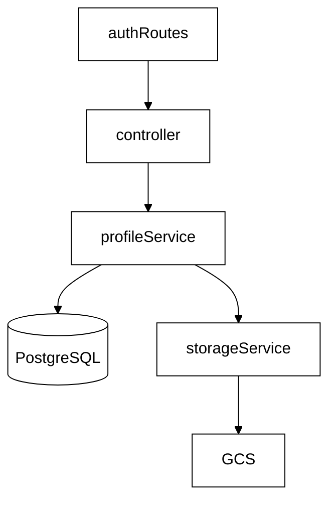
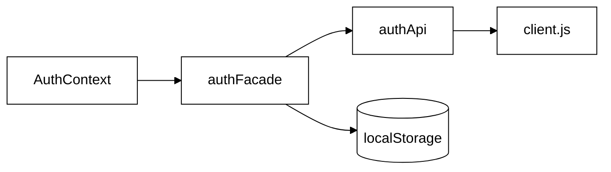
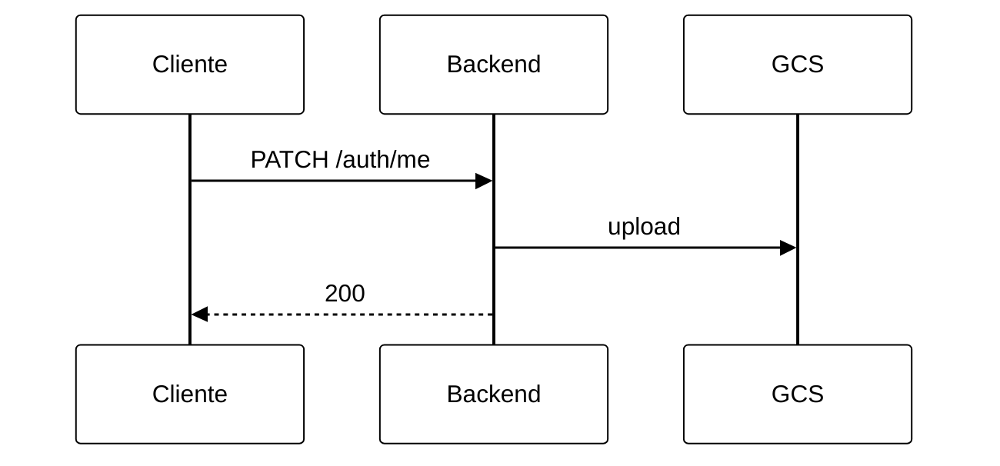

# 4.5. Foto de Perfil — Google Cloud Storage (Reutilização de Software)

Documento técnico do módulo de Reutilização de Software do projeto **Eu Amo Piri**.

---

## 1. Introdução e contexto

A edição de perfil permite que o usuário autenticado altere dados textuais (nome, e-mail, profissão, contato, data de nascimento, biografia) e **foto de perfil** (JPG/PNG, máximo 5 MB).

As fotos são armazenadas no **Google Cloud Storage (GCS)** em bucket **privado** (`profile_photo_euamopiri`). O PostgreSQL guarda apenas a **chave do objeto** (`profilePhotoUrl`), nunca o binário da imagem.

---

## 2. Reutilização de software

| Componente | Origem | Papel no Eu Amo Piri |
|---|---|---|
| **@google-cloud/storage** | Google Cloud | Upload, delete e stream de objetos no bucket |
| **multer** | npm | Parse de `multipart/form-data` com `memoryStorage` |
| **Passport JWT** | Passport ecosystem | Proteção de `PATCH /auth/me` e `GET /auth/me/photo` |
| **Prisma** | npm | Persistência de metadados do usuário |
| **Axios / fetch** | npm / Web API | Cliente HTTP e blob da foto no frontend |

### O que foi reutilizado vs. implementado pelo projeto

| Reutilizado (biblioteca) | Implementado pelo Eu Amo Piri |
|---|---|
| SDK `@google-cloud/storage` | `storageService` (porta de infra) |
| `multer.memoryStorage()` | `uploadProfilePhotoMiddleware` (JPG/PNG, 5 MB) |
| JWT via Passport | `profileService` (diff, validação de e-mail, orquestração) |
| Prisma `User` | Endpoints `PATCH /auth/me`, `GET /auth/me/photo` |
| Proxy Vite `/api` (dev) | Módulo `api/auth/` (`authApi`, `authMapper`, `authSessionStorage`, `authFacade`) |

---

## 3. Arquitetura limpa — mapeamento de camadas

| Camada | Artefato | Responsabilidade |
|--------|----------|------------------|
| **Entities** | `User` (Prisma) | Dados persistidos; `profilePhotoUrl` = referência GCS |
| **Use cases** | `profileService` | Diff obrigatório, validação de e-mail, orquestra upload/remoção |
| **Interface adapters** | `authController`, `authRoutes`, `userView`, `uploadProfilePhotoMiddleware` | HTTP, multipart, JSON de resposta |
| **Infra** | `storageService` | Isola `@google-cloud/storage` |
| **API (frontend)** | `api/client.js`, `api/auth/*`, proxy Vite `/api` | Ver seção 3.1 |
| **Apresentação** | `AuthContext`, `ProfilePage` | Estado React e UI; blob URL no Avatar |

**Princípio:** `profileService` não importa `@google-cloud/storage` diretamente — depende de `storageService` (inversão de dependência).

### 3.1 Frontend — módulo de autenticação (SRP)

O subsistema de auth fica em **`frontend/src/api/auth/`**, com cliente HTTP em **`frontend/src/api/client.js`**.

| Arquivo | Caminho | Padrão | Responsabilidade | Motivo de mudança |
|---------|---------|--------|------------------|-------------------|
| `client.js` | `api/` | — | Axios + interceptors | Configuração HTTP global |
| `authApi.js` | `api/auth/` | Gateway | Chamadas HTTP a `/auth/*` | Contrato ou rotas da API |
| `authMapper.js` | `api/auth/` | **Adapter** | Tradução de DTOs frontend/backend | Formato dos dados |
| `authSessionStorage.js` | `api/auth/` | — | Token e usuário no `localStorage` | Estratégia de sessão |
| `authFacade.js` | `api/auth/` | **Facade** | Orquestra os módulos acima | Fluxos expostos à UI |

`AuthContext` importa apenas `api/auth/authFacade` — não acessa `localStorage` nem `api/client` diretamente.

**Princípio:** cada módulo tem um motivo de mudança distinto (SRP). A fachada `authFacade` mantém API estável para o restante da aplicação.

---

## 4. Registro de decisões arquiteturais (ADRs)

### ADR-01 — Referência no banco, binário no bucket

| | |
|--|--|
| **Contexto** | Fotos JPG/PNG até 5 MB; PostgreSQL para dados relacionais |
| **Decisão** | `profilePhotoUrl` armazena apenas a chave GCS (ex.: `profile_photo/1-1718650000.jpg`) |
| **Alternativas rejeitadas** | BLOB no Postgres; data URL em TEXT |
| **Consequências (+)** | Banco leve; migrations rápidas |
| **Consequências (−)** | Exibição depende do GCS + proxy backend |

### ADR-02 — Proxy de imagem no backend (bucket privado)

| | |
|--|--|
| **Contexto** | Bucket configurado como não público |
| **Decisão** | `GET /auth/me/photo` autenticado (JWT) faz stream GCS → cliente |
| **Alternativas rejeitadas** | Objetos publicRead; signed URL no `` |
| **Consequências (+)** | Credenciais GCP só no servidor |
| **Consequências (−)** | Frontend usa `fetch` + blob (`` não envia Bearer) |

### ADR-03 — Proxy Vite `/api` (somente desenvolvimento)

| | |
|--|--|
| **Contexto** | Frontend `:5173`, API `:3000` |
| **Decisão** | Proxy dev `/api` → backend; sem proxy de imagens GCS |
| **Alternativas** | URL absoluta em todo `apiClient` |
| **Consequências (+)** | Código desacoplado de host/porta no dev |
| **Consequências (−)** | Produção usa `VITE_API_URL` (fase Render) |

### ADR-04 — Separação SRP e padrões Facade + Adapter no frontend

| | |
|--|--|
| **Contexto** | Auth envolve HTTP, mapeamento de DTOs e persistência de sessão no browser |
| **Decisão** | `authFacade.js` (padrão **Facade**); `authMapper.js` (padrão **Adapter** / anti-corruption); `authApi.js` + `authSessionStorage.js`; HTTP em `api/client.js` |
| **Alternativas rejeitadas** | Um único módulo `authAdaptor` misturando orquestração e tradução de DTOs |
| **Consequências (+)** | Nomenclatura alinhada aos padrões GoF; motivos de mudança isolados |
| **Consequências (−)** | Mais arquivos; consumidores devem usar `authFacade`, não módulos internos |

---

## 5. Fluxo principal — troca de foto de perfil

Após o PATCH, o frontend chama `GET /auth/me/photo`, converte a resposta em blob URL e atualiza o Avatar.

---

## 6. Variáveis de ambiente

Ver `backend/.env.example` (placeholders genéricos). Valores reais ficam apenas no `.env` local.

| Variável | Descrição |
|----------|-----------|
| `GCS_BUCKET_NAME` | Nome do bucket |
| `GCS_PROJECT_ID` | Project ID GCP |
| `GCS_PROFILE_PREFIX` | Prefixo das chaves (ex.: `profile_photo/`) |
| `GOOGLE_APPLICATION_CREDENTIALS` | Caminho ao JSON da service account (dev local) |
| `GCS_CREDENTIALS_JSON` | JSON inline (fase 2 — Render) |

---

## 7. Endpoints

| Método | Rota | Auth | Descrição |
|--------|------|------|-----------|
| `PATCH` | `/auth/me` | JWT | Atualiza perfil; multipart com campo `profilePhoto` |
| `GET` | `/auth/me/photo` | JWT | Stream da foto atual do usuário logado |

---

## 8. Critérios de aceitação (BDD)

| Critério | Implementação |
|----------|---------------|
| Formulário exibe dados atuais | `useForm` + `reset(user)` |
| JPG/PNG ≤ 5 MB | Validação frontend + multer/backend |
| E-mail validado se preenchido | pattern frontend + regex backend |
| Nenhum campo obrigatório na edição | sem `required` no form |
| Ao menos uma alteração | `hasLocalChanges` + `hasProfileChanges` |
| Foto persistida | objeto no GCS + blob via proxy |

---

## 9. Referências

- [@google-cloud/storage](https://cloud.google.com/nodejs/docs/reference/storage/latest)
- [Clean Architecture (Uncle Bob)](https://blog.cleancoder.com/uncle-bob/2012/08/13/the-clean-architecture.html)
- [Documentação GCP Storage](https://cloud.google.com/storage/docs)

---

## 10. Histórico de versões

| Versão | Data | Descrição |
|--------|------|-----------|
| 1.0 | 2026-06-16 | Edição de perfil com foto no GCS e proxy backend |
| 1.1 | 2026-06-16 | Refatoração SRP: `authApi`, `authMapper`, `authSessionStorage`, `authFacade` (ADR-04) |
| 1.2 | 2026-06-16 | Reorganização para `src/api/client.js` e `src/api/auth/` |
| 1.3 | 2026-06-16 | Renomeação `authAdaptor` → `authFacade` (padrão Facade explícito) |
