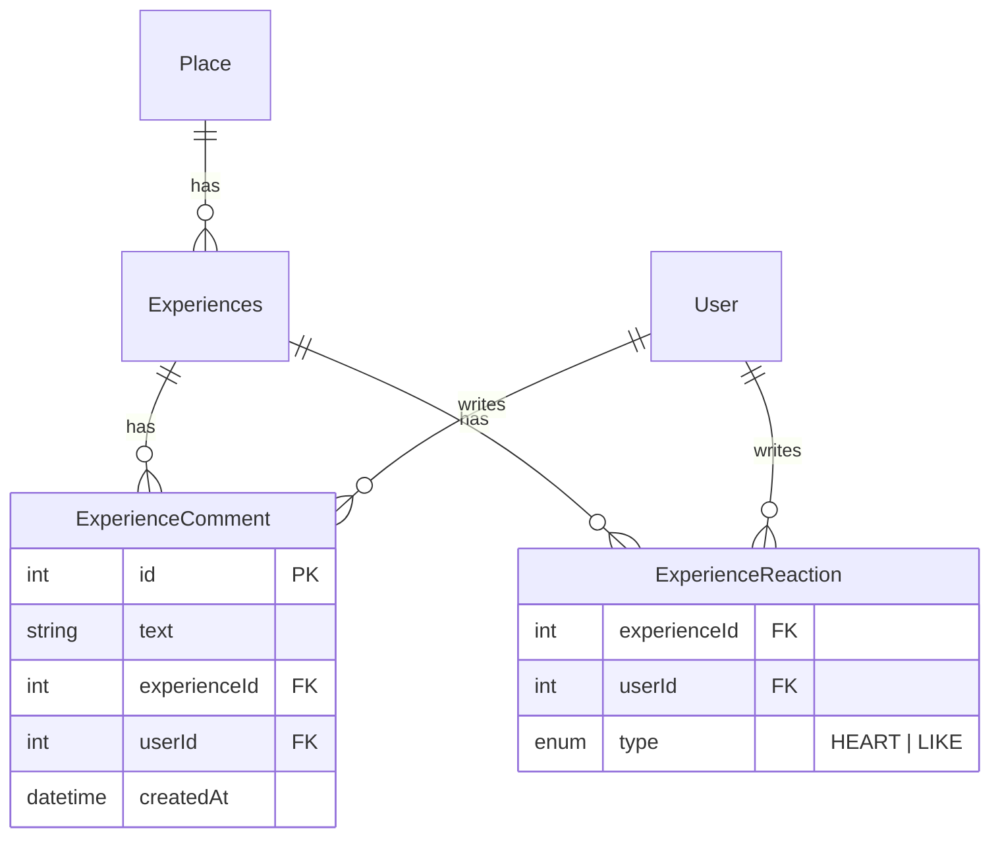
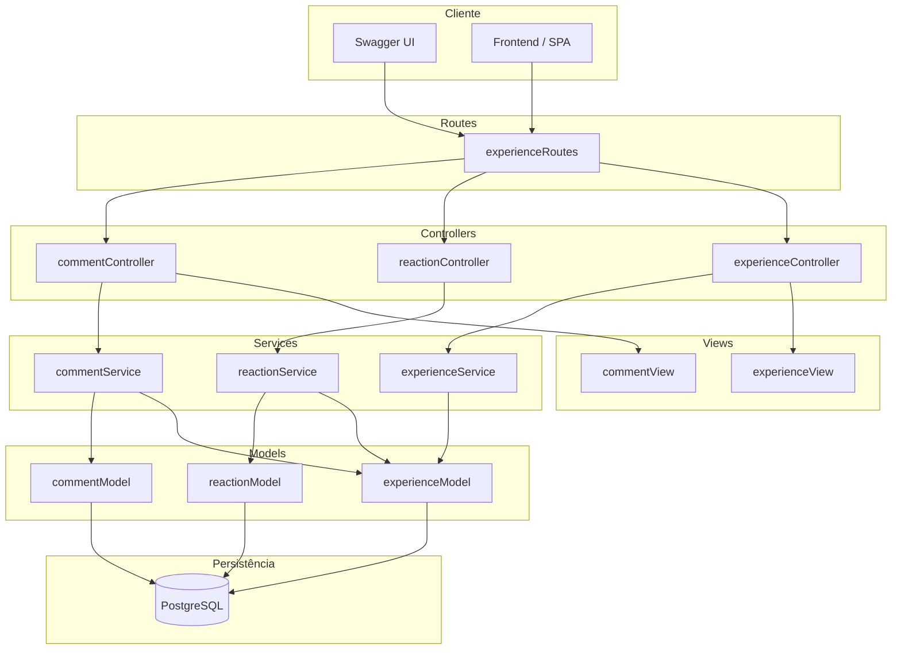
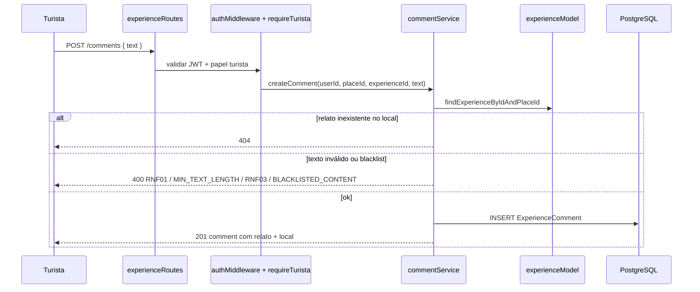
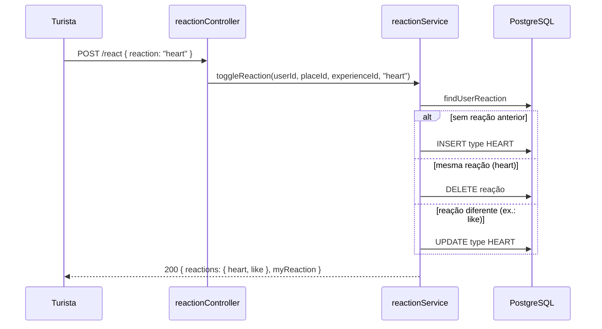

# 4.6. Comentários e Reações em Relatos (RF12 / RF13) — Reutilização de Software

Documento técnico do módulo de Reutilização de Software do projeto **Eu Amo Piri**.

---

## 1. Introdução e contexto

O Eu Amo Piri permite que turistas compartilhem **relatos de experiência** (`Experiences`) vinculados a **locais** (`Place`). Os requisitos **RF12** e **RF13** estendem essa colaboração com interações sociais sobre o relato:

| RF | Descrição | Escopo |
|----|-----------|--------|
| **RF12** | Comentário em texto sobre um relato de outro usuário | Turista autenticado publica texto; leitura pública |
| **RF13** | Reação com emoji sobre um relato | Turista autenticado reage com ❤️ (`heart`) ou 👍 (`like`) |

### Hierarquia de domínio

As interações respeitam a cadeia **Local → Relato → Comentário / Reação**:

```
Place (local)
 └── Experiences (relato)
      ├── ExperienceComment (comentário em texto)
      └── ExperienceReaction (reação emoji — somente no relato)
```

**Regra de negócio importante:** reações emoji aplicam-se **apenas ao relato**, nunca a comentários. Cada turista pode ter **no máximo uma reação** por relato (`@@unique([experienceId, userId])`).

A implementação está no backend (`backend/`), seguindo o mesmo padrão de camadas já usado em relatos e autenticação. A documentação interativa da API permanece em `/api-docs`.

---

## 2. Reutilização de software

| Componente | Origem | Papel no Eu Amo Piri |
|---|---|---|
| **Prisma ORM** | [prisma.io](https://www.prisma.io/) | Models `ExperienceComment`, `ExperienceReaction`; FKs e `groupBy` para contadores |
| **Passport JWT** | Passport ecosystem | `authMiddleware` nas mutações; `optionalAuthMiddleware` na listagem de relatos |
| **Express** | npm | Registro de rotas aninhadas em `experienceRoutes` |
| **Vitest** | npm | Testes unitários de serviços e constantes |
| **swagger-jsdoc + swagger-ui-express** | npm | Schemas OpenAPI `ExperienceComment`, `ReactionResponse` |

### O que foi reutilizado vs. implementado pelo projeto

| Reutilizado (biblioteca ou código existente) | Implementado pelo Eu Amo Piri |
|---|---|
| Prisma models e migrations | `ExperienceComment`, `ExperienceReaction`, enum `ReactionType` |
| `passport-jwt` + `authMiddleware` | `optionalAuthMiddleware` para hidratar `myReaction` sem bloquear visitantes |
| `requireTurista` (`requireAccountTypeMiddleware`) | Restrição de POST comment / POST react a turistas |
| `blacklist.ts` (já usado em relatos) | Validação de linguagem ofensiva em comentários |
| Padrão MVC de `experience*` | Módulos `comment*` e `reaction*` espelhando routes → controller → service → model → view |
| `findExperienceByIdAndPlaceId` | Validação da cadeia Local → Relato na URL |
| `formatExperience` enriquecido | Campos `commentsCount`, `reactions`, `myReaction` no GET de relatos |

**Não há biblioteca externa nova** dedicada a comentários ou reações (ex.: sem Redis, Socket.io ou pacote de “reactions prontas”). A lógica de **toggle/troca de emoji** é implementação própria em `reactionService.ts`.

---

## 3. Bibliotecas utilizadas no escopo da task

Esta seção detalha as bibliotecas **reutilizadas** na implementação de RF12/RF13. Nenhuma dependência nova foi adicionada ao `package.json` exclusivamente para estes requisitos.

### 3.1 Backend — persistência e API

#### Prisma (`@prisma/client` + `prisma`)

| Item | Detalhe |
|---|---|
| **Versão** | ^7.8.0 |
| **Referência** | [https://www.prisma.io/docs](https://www.prisma.io/docs) |
| **Finalidade** | ORM para PostgreSQL; relações FK com cascade; agregações `groupBy` para contagem de comentários e reações por relato. |
| **Uso no projeto** | `backend/prisma/schema.prisma`, `commentModel.ts`, `reactionModel.ts` |
| **Justificativa** | Mesma stack de persistência do restante do backend; evita SQL manual e mantém tipagem gerada. |

#### Passport JWT (`passport-jwt`)

| Item | Detalhe |
|---|---|
| **Versão** | ^4.0.1 |
| **Referência** | [https://www.passportjs.org/packages/passport-jwt/](https://www.passportjs.org/packages/passport-jwt/) |
| **Finalidade** | Autenticar turista nas rotas de escrita; opcionalmente identificar usuário na listagem para retornar `myReaction`. |
| **Uso no projeto** | `authMiddleware.ts`, `optionalAuthMiddleware`, rotas POST em `experienceRoutes.ts` |
| **Justificativa** | Reutiliza infraestrutura de auth do RF01 sem duplicar verificação de token. |

#### Vitest

| Item | Detalhe |
|---|---|
| **Versão** | ^1.6.0 |
| **Referência** | [https://vitest.dev/](https://vitest.dev/) |
| **Finalidade** | Testes unitários de validação de comentário, parser de reação e toggle de emoji. |
| **Uso no projeto** | `commentService.test.ts`, `reactionService.test.ts`, `reactionTypes.test.ts` |
| **Justificativa** | Mesmo runner de testes já adotado no backend. |

### 3.2 Backend — documentação da API

#### swagger-jsdoc

| Item | Detalhe |
|---|---|
| **Versão** | ^6.3.0 |
| **Referência** | [https://github.com/Surnet/swagger-jsdoc](https://github.com/Surnet/swagger-jsdoc) |
| **Finalidade** | Schemas `ExperienceComment`, `CreateCommentRequest`, `ReactToExperienceRequest`, `ReactionResponse`; campos novos em `Experience`. |
| **Uso no projeto** | `backend/src/config/swagger.ts`, anotações em `experienceRoutes.ts` |
| **Justificativa** | Documentação viva junto ao código; facilita testes manuais pelo time. |

### 3.3 Código do projeto reutilizado (não é lib npm)

| Artefato | Caminho | Papel em RF12/RF13 |
|---|---|---|
| Blacklist de conteúdo | `backend/src/utils/blacklist.ts` | `containsBlacklistedWord()` em `commentService` — mesmo utilitário de `experienceService` |
| Middleware de papel | `backend/src/middleware/requireAccountTypeMiddleware.ts` | `requireTurista` bloqueia morador/admin nas mutações |
| Model de relato | `backend/src/model/experienceModel.ts` | `findExperienceByIdAndPlaceId` garante relato pertencente ao local da URL |
| View de relato | `backend/src/views/experienceView.ts` | Enriquecimento com `commentsCount`, `reactions`, `myReaction` |

### 3.4 Mapa biblioteca / artefato → arquivo

| Biblioteca ou artefato | Arquivo(s) principal(is) |
|---|---|
| Prisma | `schema.prisma`, `commentModel.ts`, `reactionModel.ts` |
| passport-jwt | `authMiddleware.ts`, `experienceRoutes.ts` |
| blacklist (projeto) | `commentService.ts` |
| requireTurista (projeto) | `experienceRoutes.ts` |
| Vitest | `*.test.ts` em `services/` e `constants/` |
| swagger-jsdoc | `swagger.ts`, `experienceRoutes.ts` |

---

## 4. Visão lógica

### 4.1 Modelo de dados (ER)



- `ON DELETE CASCADE` em comentários e reações quando o relato ou usuário é removido.
- Índice único `(experienceId, userId)` em `ExperienceReaction` — uma reação por turista por relato.

### 4.2 Diagrama de componentes (camadas MVC)



| Camada | Artefato | Responsabilidade |
|--------|----------|------------------|
| **Routes** | `experienceRoutes.ts` | Monta rotas aninhadas sob `/places/:placeId/experiences/...` |
| **Controllers** | `commentController`, `reactionController` | Parse de params/body, HTTP status, delegação ao service |
| **Services** | `commentService`, `reactionService` | Regras de negócio, validação, toggle de reação |
| **Models** | `commentModel`, `reactionModel` | Queries Prisma (create, list, count, groupBy) |
| **Views** | `commentView`, `experienceView` | Formatação JSON com cadeia Local → Relato explícita |

### 4.3 Fluxo RF12 — criar comentário



### 4.4 Fluxo RF13 — toggle de reação (cenário coração)



A API usa chaves em minúsculas na resposta (`heart`, `like`); no banco o enum Prisma é `HEART` | `LIKE`. A tradução fica centralizada em `reactionTypes.ts`.

### 4.5 Agregação na listagem de relatos

O `GET /places/:placeId/experiences` carrega contadores em lote para evitar N+1:

1. `commentService.getCommentCountsByExperienceIds`
2. `reactionService.getReactionCountsByExperienceIds`
3. Se JWT presente (`optionalAuthMiddleware`): `reactionService.getUserReactionMap`

O `experienceView.formatExperience` mescla esses dados em cada item da lista.

---

## 5. Padrões de projeto

### 5.1 Camadas MVC (reutilização estrutural)

RF12/RF13 **não introduzem um framework novo**; espelham o desenho já usado em relatos (`experienceController` → `experienceService` → `experienceModel` → `experienceView`). Isso reduz curva de aprendizado e mantém consistência no repositório.

### 5.2 Middleware em cadeia (Express + Passport)

| Rota | Middlewares |
|------|-------------|
| `GET .../comments` | Nenhum (público) |
| `POST .../comments` | `authMiddleware` → `requireTurista` |
| `POST .../react` | `authMiddleware` → `requireTurista` |
| `GET .../experiences` | `optionalAuthMiddleware` (JWT opcional) |

`optionalAuthMiddleware` segue o padrão **Middleware**: se não houver `Authorization: Bearer`, a requisição prossegue sem `req.user`; se houver token válido, `req.user` é preenchido para personalizar `myReaction`.

### 5.3 Anti-Corruption Layer — `reactionTypes.ts`

O enum do banco (`HEART`, `LIKE`) difere do contrato da API (`heart`, `like`). O módulo `constants/reactionTypes.ts` atua como camada de tradução, evitando vazar detalhes do Prisma para controllers e clientes.

---

## 6. Decisões arquiteturais (ADRs)

### ADR-01: Reações apenas no relato, não em comentários

| | |
|--|--|
| **Contexto** | RF13 fala em reação a relatos; comentários são RF12 (texto). |
| **Decisão** | `ExperienceReaction.experienceId` aponta só para `Experiences`; não há FK de reação em `ExperienceComment`. |
| **Consequência** | Modelo simples; UI de reação fica no card do relato. |

### ADR-02: Uma reação por usuário por relato (toggle)

| | |
|--|--|
| **Contexto** | Evitar inflar contadores com múltiplos cliques do mesmo turista. |
| **Decisão** | `@@unique([experienceId, userId])` + lógica de toggle/troca em `toggleReaction`. |
| **Consequência** | Segundo clique na mesma reação remove; clique em outra troca o tipo. |

### ADR-03: Tipos de reação `heart` e `like` apenas

| | |
|--|--|
| **Contexto** | Versão inicial incluía `dislike`; removido por decisão de produto. |
| **Decisão** | Enum e API restritos a `heart` e `like`; migration `20260621190000_remove_dislike_reaction`. |
| **Consequência** | Contrato alinhado entre backend, Swagger e frontend de produção. |

### ADR-04: Validação de comentário reutiliza blacklist de relatos

| | |
|--|--|
| **Contexto** | RNF de linguagem respeitosa já implementada para texto de relato. |
| **Decisão** | Importar `containsBlacklistedWord` de `utils/blacklist.ts` em `commentService`. |
| **Consequência** | Uma única lista de termos; manutenção centralizada. |

### ADR-05: URL aninhada com validação Local → Relato

| | |
|--|--|
| **Contexto** | Rotas usam `/places/:placeId/experiences/:experienceId/...`. |
| **Decisão** | Todo service chama `findExperienceByIdAndPlaceId` antes de operar. |
| **Consequência** | IDs inconsistentes retornam 404 em vez de criar comentário em relato de outro local. |

---

## 7. Mapeamento requisitos → implementação

### RF12 — Comentários

| Critério | Implementação |
|----------|---------------|
| Turista comenta relato de outro | `POST .../comments` + `requireTurista` |
| Texto mínimo 3 caracteres | `commentService` → `MIN_TEXT_LENGTH` |
| Texto máximo 500 caracteres | `commentService` → `MAX_TEXT_LENGTH`, código `RNF03` |
| Conteúdo ofensivo bloqueado | `blacklist.ts` → código `BLACKLISTED_CONTENT` |
| Listagem pública | `GET .../comments` sem auth |
| Resposta com contexto do relato e local | `commentView.formatComment` → objetos `relato` e `local` |

**Exemplo de resposta (201 / GET item):**

```json
{
  "id": 1,
  "text": "Adorei o relato!",
  "userId": 2,
  "userName": "Maria",
  "createdAt": "2026-06-21T18:00:00.000Z",
  "relato": {
    "id": 3,
    "title": "Pôr do sol na praça",
    "placeId": 3
  },
  "local": {
    "id": 3,
    "name": "Praça da Matriz"
  },
  "experienceId": 3
}
```

O campo `experienceId` permanece por compatibilidade com clientes que não leem o objeto `relato`.

### RF13 — Reações

| Critério | Implementação |
|----------|---------------|
| Turista reage com emoji | `POST .../react` body `{ "reaction": "heart" \| "like" }` |
| Toggle na mesma reação | `toggleReaction` remove registro se tipo igual |
| Troca de reação | `updateReaction` se tipo diferente |
| Contadores na listagem | `reactions.heart`, `reactions.like`, `commentsCount` |
| Estado do usuário logado | `myReaction` quando Bearer JWT válido no GET relatos |

**Exemplo de resposta do POST /react:**

```json
{
  "reactions": { "heart": 5, "like": 2 },
  "myReaction": "heart"
}
```

### Códigos de erro relevantes

| HTTP | code | Situação |
|------|------|----------|
| 400 | `RNF01` | Comentário vazio |
| 400 | `MIN_TEXT_LENGTH` | Menos de 3 caracteres |
| 400 | `RNF03` | Mais de 500 caracteres |
| 400 | `BLACKLISTED_CONTENT` | Termo na blacklist |
| 400 | `INVALID_REACTION_TYPE` | `reaction` diferente de `heart`/`like` |
| 401 | — | Sem JWT nas rotas protegidas |
| 403 | — | Morador ou admin tentando comentar/reagir |
| 404 | — | Relato não encontrado no `placeId` informado |

---

## 8. Endpoints documentados

Documentação interativa: `http://localhost:3000/api-docs`

| Método | Rota | Autenticação | RF |
|--------|------|--------------|-----|
| `GET` | `/places/:placeId/experiences` | Opcional (Bearer) | — (agrega RF12/RF13) |
| `GET` | `/places/:placeId/experiences/:experienceId/comments` | Não | RF12 |
| `POST` | `/places/:placeId/experiences/:experienceId/comments` | Bearer JWT + Turista | RF12 |
| `POST` | `/places/:placeId/experiences/:experienceId/react` | Bearer JWT + Turista | RF13 |

---

## 9. Artefatos e migrations

| Artefato | Localização | Finalidade |
|----------|-------------|------------|
| Schema Prisma | `backend/prisma/schema.prisma` | Models e enum `ReactionType` |
| Migration inicial RF12/RF13 | `prisma/migrations/20260621180000_add_experience_comments_reactions/` | Tabelas e enum |
| Migration remove dislike | `prisma/migrations/20260621190000_remove_dislike_reaction/` | Enum só HEART/LIKE |
| Constantes de reação | `backend/src/constants/reactionTypes.ts` | Parser API ↔ enum |
| Swagger | `backend/src/config/swagger.ts` | Contratos OpenAPI |
| Testes | `backend/src/services/*.test.ts`, `constants/reactionTypes.test.ts` | Regressão RF12/RF13 |

### Checklist pós-deploy

- [ ] `npx prisma migrate deploy` no ambiente alvo
- [ ] `npx prisma generate` se necessário
- [ ] Reiniciar processo do backend (`npm run dev` ou equivalente) para carregar rotas novas
- [ ] Testar via Swagger: login turista → POST comment → POST react → GET relatos com `myReaction`
- [ ] Confirmar morador recebe 403 em POST comment/react

---

## 10. Estrutura de arquivos (backend)

```
backend/src/
├── constants/
│   └── reactionTypes.ts          # heart/like ↔ HEART/LIKE
├── controllers/
│   ├── commentController.ts
│   └── reactionController.ts
├── middleware/
│   └── authMiddleware.ts         # + optionalAuthMiddleware
├── model/
│   ├── commentModel.ts
│   ├── reactionModel.ts
│   └── experienceModel.ts        # findExperienceByIdAndPlaceId
├── routes/
│   └── experienceRoutes.ts       # rotas /comments e /react
├── services/
│   ├── commentService.ts
│   ├── reactionService.ts
│   └── experienceService.ts      # agregação na listagem
├── utils/
│   └── blacklist.ts              # reutilizado
└── views/
    ├── commentView.ts
    └── experienceView.ts         # commentsCount, reactions, myReaction
```

---

## 11. Referências

### Documentação oficial

| Biblioteca | Link |
|---|---|
| Prisma ORM | [https://www.prisma.io/docs](https://www.prisma.io/docs) |
| Passport JWT | [https://www.passportjs.org/packages/passport-jwt/](https://www.passportjs.org/packages/passport-jwt/) |
| Vitest | [https://vitest.dev/](https://vitest.dev/) |
| swagger-jsdoc | [https://github.com/Surnet/swagger-jsdoc](https://github.com/Surnet/swagger-jsdoc) |
| OpenAPI 3.0 | [https://swagger.io/specification/](https://swagger.io/specification/) |

### Documentos relacionados no projeto

- [4.4. Autenticação (Reutilização de Software)](/docs/requisitos/RF01-backend/4.4.Autenticacao.md) — JWT e `requireTurista`
- [4.5. Foto de Perfil — GCS](/docs/requisitos/RF03-backend/4.5.EdicaoPerfil.md) — padrão de camadas e reutilização

---

## 12. Histórico de versões

| Versão | Data | Autor | Descrição |
|--------|------|-------|-----------|
| 1.0 | 21/06/2026 | Grupo 05 Eu Amo Piri | Versão inicial — RF12 comentários, RF13 reações heart/like, arquitetura e reutilização |
