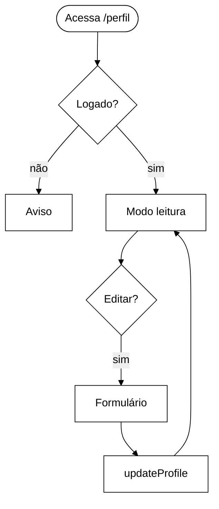
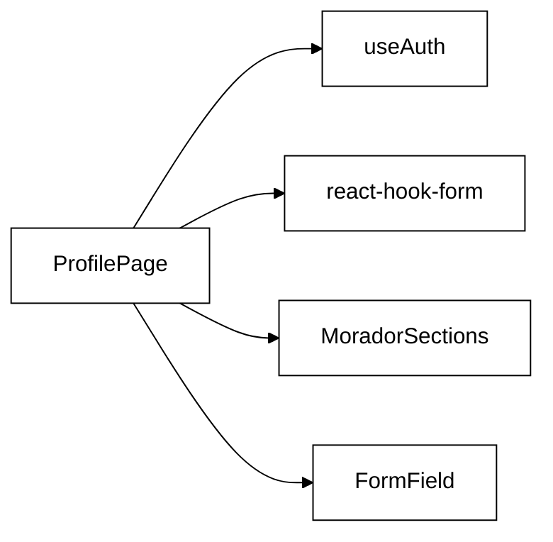

# RF03 — Gestão de Perfil do Usuário

## Requisito

> **RF03** — O sistema deve permitir que o usuário autenticado edite atributos como nome completo, e-mail, profissão, contato, data de nascimento, biografia e foto de perfil.
> *(Entrega_1_G5_Arquitetura_Desenho_SW — tabela de Requisitos Funcionais)*

## Diagrama de Atividades

## Diagrama de Componentes

## O que foi feito

Implementação e evolução da página `ProfilePage` com dois modos: **visualização** e **edição**, diferenciando a interface por papel (`morador` / `turista`).

**Modo leitura:**
- Cabeçalho com avatar, nome, badge de papel, e-mail e bio
- Botões de ação: "Deletar Perfil" (vermelho), "Editar Perfil" (marrom), "Cadastrar Novo Local" para morador ou "Cadastrar Novo Relato" para turista (verde)
- Seções específicas por role:
  - **Morador**: "ÚLTIMOS RELATOS" (scroll horizontal com local, autor, likes) e "LOCAIS CADASTRADOS" (lista com ícone, categoria, rating, preço e botões "Editar Local" / "Excluir Local")
  - **Turista**: "AVALIAÇÕES CADASTRADAS" (scroll horizontal com local, título, texto, botões "Editar Avaliação" / "Excluir Avaliação")

**Modo edição (ao clicar em "Editar Perfil"):**
- Formulário com campos: Nome, E-mail, Profissão, Contato, Data de nascimento, Biografia
- Seção "CADASTRAR NOVA SENHA" com campos Senha Atual, Nova Senha, Confirmar Nova Senha e botão "Atualizar Senha" (marrom) — disponível para Morador e Turista
- Botões "Cancelar" e "Atualizar Perfil" (verde)

**Restrições por papel:**
- Morador não vê botões de editar/excluir nos *relatos recebidos* (apenas visualiza autor, texto e likes) — esses relatos pertencem a turistas
- Morador vê botões de editar/excluir nos *locais cadastrados* por ele

## Como foi feito

- Atomic Design: `ProfilePage` (page) → `MoradorSections` / `TuristaSections` (subcomponents internos) → `StarRating`, `Button`, `Badge`, `Avatar` (atoms)
- Estado do usuário lido e atualizado via `useAuth()` do `AuthContext`
- Validação de formulário com `react-hook-form` (regras `required`, `pattern`, `maxLength`)
- Validação de senha feita localmente (sem lib) via `handlePasswordUpdate`: verifica campos preenchidos, igualdade e comprimento mínimo
- Botões de ação com cores semânticas via variantes do átomo `Button`: `danger` (#EB4335), `secondary` (#7F5539), `primary` (#6B8E23), `rust` (#C0550E)
- Layout responsivo: botões de ação em linha no desktop, empilhados em coluna no mobile (`max-width: 768px`)
- Locais cadastrados (morador): layout de lista vertical com `border-left` verde, ícone emoji, info à esquerda, botões à direita

## Testes (ProfilePage.test.jsx)

30 casos organizados em 5 grupos:

**Modo leitura** — nome, e-mail, profissão, badge, aviso de não autenticado

**Botões de ação** — presença de "Deletar Perfil", "Editar Perfil" e "Cadastrar Novo Local" para morador; "Cadastrar Novo Relato" (não "Cadastrar Novo Local") para turista

**Formulário de edição** — abertura do form, pré-preenchimento, cancelamento, chamada a `updateProfile`, mensagem de sucesso, validação de campo obrigatório

**Seção de senha** — ausência em modo leitura; presença em modo edição (morador e turista); erros de validação (campos vazios, senhas diferentes, senha curta); mensagem de sucesso

**Seções por role** — morador: títulos "ÚLTIMOS RELATOS" / "LOCAIS CADASTRADOS", ausência de botões editar/excluir nos relatos, presença de "Editar Local" / "Excluir Local" nos locais; turista: título "AVALIAÇÕES CADASTRADAS", presença de "Editar Avaliação" / "Excluir Avaliação", ausência de "LOCAIS CADASTRADOS"

## Reutilização de Software

| Biblioteca / Componente | Papel | Padrão |
|---|---|---|
| `react-hook-form` | Gerencia estado do formulário, validação e submit sem re-renders excessivos | Library wrapper |
| `AuthContext` / `useAuth()` | Fornece `user`, `updateProfile` e `isMorador` de forma global | Context + Custom Hook |
| `FormField` (molecule) | Encapsula label + input + mensagem de erro | Composite Component |
| `Input` / `Textarea` (atoms) | Componentes de entrada estilizados com design tokens | Atomic Design — Atom |
| `Avatar` (atom) | Exibe foto de perfil com fallback por iniciais + upload comprimido via canvas | Atomic Design — Atom |
| `Badge` (atom) | Mostra o papel do usuário com cor semântica | Atomic Design — Atom |
| `StarRating` (atom) | Avaliação nos cards de locais e avaliações | Atomic Design — Atom |
| `Button` (atom) — variantes `danger`, `secondary`, `rust`, `primary` | Botões semânticos por ação: vermelho=destruição, marrom=edição, ferrugem=exclusão, verde=criação | Atomic Design — Atom (múltiplas variantes) |
| `MdLocationOn`, `MdEdit`, `MdOutlineDelete` (react-icons) | Ícones de pin, edição e lixeira reutilizados em cards e botões | Icon Library |
