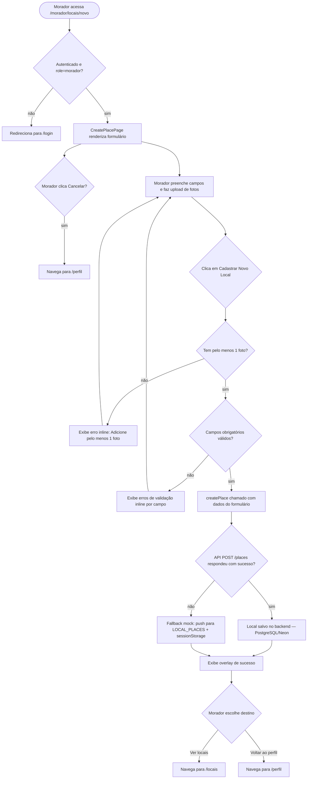
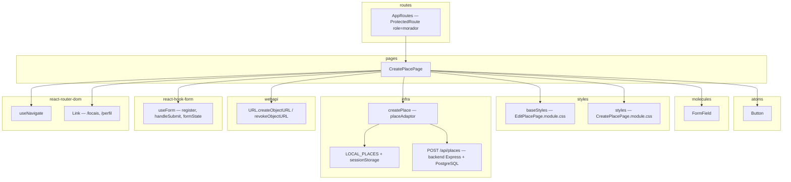

# RF04 — Cadastro de Novo Local (Morador)

## Requisito

> **RF04** — O sistema deve permitir que o usuário 'Morador' cadastre um novo local (estabelecimento ou ponto turístico), informando nome, endereço, categoria, descrição, classificação de custo e pelo menos uma foto.
> *(Entrega_1_G5_Arquitetura_Desenho_SW — tabela de Requisitos Funcionais)*

## Diagrama de Atividades

## Diagrama de Componentes

## O que foi feito

**CreatePlacePage (`/morador/locais/novo`):**
- Formulário completo para cadastro de novo local: nome, categoria (select com 7 opções), endereço, faixa de preço (select $/$$/$$$/$$$$), telefone (opcional), data de abertura (date, opcional), descrição (maxLength 2000) e link do Google Maps (opcional)
- Zona de upload de fotos por arrastar-e-soltar ou clique: aceita 1 a 3 imagens (JPG, PNG, WEBP); exibe preview de cada foto com botão de remoção (×) individual
- Contador de vagas restantes ("X vaga(s) restante(s)") atualizado dinamicamente; zona de drop some ao atingir 3 fotos
- Validação inline com `react-hook-form`: nome, endereço, categoria e descrição obrigatórios; categoria valida que não seja a opção vazia
- Validação manual de fotos: `photos.length < 1` bloqueia o submit e exibe "Adicione pelo menos 1 foto" com `role="alert"`
- Overlay de sucesso: "Local cadastrado com sucesso!" com botões "Ver locais" (→ `/locais`) e "Voltar ao meu perfil" (→ `/perfil`)
- Overlay de erro: "Falha ao cadastrar local" com botão "Voltar ao formulário"
- Botões full-width: no desktop, Cancelar e Cadastrar dividem igualmente a largura; no mobile, empilham em coluna invertida (Cadastrar em cima via `flex-direction: column-reverse`)
- Reutiliza os estilos de card, grid de formulário, selects e overlays do `EditPlacePage.module.css`, complementados por classes específicas em `CreatePlacePage.module.css`

## Como foi feito

**`CreatePlacePage.jsx` (novo):**
- `useRef(null)` para `fileInputRef`: dispara o seletor de arquivo nativo ao clicar na zona de drop, sem expor o `<input type="file">` visualmente (`display: none`)
- `addFiles(fileList)`: filtra apenas `image/*`, limita às vagas restantes (`3 - photos.length`) e cria previews com `URL.createObjectURL(file)`; o objeto `{ file, previewUrl }` é armazenado no estado `photos`
- `removePhoto(index)`: chama `URL.revokeObjectURL` para liberar memória antes de filtrar o array
- Drag-and-drop: `onDragOver` → `setDragOver(true)` aplica classe `.dragOver` (borda colorida); `onDrop` extrai `e.dataTransfer.files`
- `onSubmit`: acessa `photos[i].file` (File object) e `photos[i].previewUrl` (blob URL para preview); os arquivos reais são passados ao adaptor para envio como `multipart/form-data`

**`placeAdaptor.js` — integração real com fallback mock:**
- Usa `apiClient` (Axios com token JWT automático) e `postFormData` de `api/client.js`
- `createPlace`: monta um `FormData` com os campos obrigatórios (`name`, `address`, `category`, `description`) e opcionais, appenda cada `file` em `photos[]`, e chama `POST /api/places`; em caso de falha (backend offline), faz fallback para `LOCAL_PLACES` + sessionStorage
- `fetchMyPlaces`: usa `GET /places?moradorId=X` (lê o ID do usuário logado do localStorage); mescla resultados da API com mocks e `LOCAL_PLACES`
- `LOCAL_PLACES` persiste no sessionStorage para sobreviver ao HMR do Vite sem reload completo
- Fotos retornadas pelo backend passam por `resolveMediaUrl` (`utils/mediaUrl.js`) para converter caminhos relativos (`/places/1/photos/2`) em URLs utilizáveis no ``

**`CreatePlacePage.module.css` (novo):**
- `.formActions > *`: `flex: 1 1 0; min-width: 0; width: 100%` — garante botões de mesma largura independente do texto
- `@media (max-width: 600px)`: `flex-direction: column-reverse` — inverte a ordem visual para exibir "Cadastrar" acima de "Cancelar" sem alterar a ordem no DOM
- `.uploadZone`: borda tracejada com transição de cor ao hover/drag (`border-color: var(--color-primary)`)
- `.previewItem`: `position: relative` para ancorar o `.removePreviewBtn` (absolute top-right)

**Proteção de rota:**
- `CreatePlacePage` registrada em `AppRoutes.jsx` em `/morador/locais/novo` com `ProtectedRoute requiredRole="morador"`, impedindo acesso por Turistas ou não autenticados

## Reutilização de Software

| Biblioteca / Componente | Papel | Padrão |
|---|---|---|
| `createPlace` — `placeAdaptor` | Abstrai fonte de dados (backend Express/PostgreSQL → mock em memória) sem alterar o componente | Adapter Pattern |
| `LOCAL_PLACES` + `sessionStorage` | Persiste locais criados nesta sessão mesmo após hot reload do Vite | Session State Pattern |
| `useForm` (react-hook-form) | Validação declarativa de campos, mapeamento de erros e `handleSubmit`; reutilizado do `EditPlacePage` e `LoginPage` | Third-party hook |
| `FormField` (molecule) | Campo de formulário com label + input/textarea + mensagem de erro; reutilizado em todas as páginas de formulário do projeto | Atomic Design — Molecule |
| `Button` (atom) | Botões de ação, cancelamento e navegação nos overlays | Atomic Design — Atom |
| `EditPlacePage.module.css` (baseStyles) | Estilos de page, container, card, grid, selects e overlays reutilizados sem duplicação | CSS Module sharing |
| `URL.createObjectURL / revokeObjectURL` | Preview local de imagens sem upload imediato; libera memória ao remover | Web API nativa |
| `useRef` (React) | Referência ao `<input type="file">` oculto para acionamento programático | React Hook |
| `useNavigate` + `Link` (react-router-dom) | Navegação programática (Cancelar) e declarativa (overlays) | React Router |
| `ProtectedRoute` (routes) | Proteção de rota por papel, reutilizada de `AppRoutes` | Guard Pattern |
