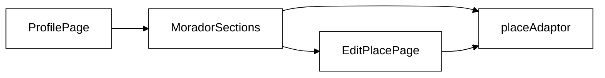

# RF07 — Edição e Exclusão de Locais (Morador)

## Requisito

> **RF07** — O sistema deve permitir que o usuário 'Morador' edite e exclua os locais que ele próprio cadastrou.
> *(Entrega_1_G5_Arquitetura_Desenho_SW — tabela de Requisitos Funcionais)*

## Diagrama de Atividades

```mermaid
%%{init: {'theme':'base','themeVariables':{'primaryColor':'#fff','primaryTextColor':'#000','primaryBorderColor':'#000','lineColor':'#000','secondaryColor':'#eee','tertiaryColor':'#fff','clusterBkg':'#fff','clusterBorder':'#000','actorBkg':'#fff','actorBorder':'#000','actorTextColor':'#000'}}}%%
flowchart TD
    A([/perfil]) --> B{Morador?}
    B -- não --> C[/login]
    B -- sim --> D[Lista locais]
    D --> E{Editar?}
    E -- sim --> F[EditPlacePage]
    F --> G[updatePlace]
    D --> H{Excluir?}
    H -- sim --> I[deletePlace]
```

## Diagrama de Componentes



## O que foi feito

**EditPlacePage (`/morador/locais/:id/editar`):**
- Formulário completo para edição de local: nome, categoria, endereço, classificação de custo, horário de funcionamento, telefone e descrição
- Pré-popula todos os campos ao montar via `fetchPlaceById(id)`
- Validação com `react-hook-form`: nome e endereço obrigatórios; descrição limitada a 500 caracteres
- Selects estilizados para categoria (6 opções) e custo ($, $$, $$$) com seta customizada via CSS
- Feedback inline de sucesso ("Local atualizado! Redirecionando...") com redirecionamento automático para `/perfil` após 1,2 s
- Estado de loading (Spinner) durante o carregamento inicial e estado de erro caso o local não exista
- Layout responsivo: grid de 2 colunas no desktop, 1 coluna no mobile

**ProfilePage — MoradorSections:**
- Botão "Editar Local" agora é um `Link` para `/morador/locais/:id/editar`
- Botão "Excluir Local" abre modal de confirmação com o nome do local
- Modal de confirmação: overlay escuro, caixa centralizada, nome do local em negrito, botões "Cancelar" e "Excluir"
- Clicar fora do dialog (no overlay) fecha o modal
- Após exclusão confirmada: `deletePlace` é chamado, item removido da lista sem recarga de página
- Erro de exclusão exibido dentro do modal (não fecha o modal em caso de falha)
- Estado vazio ("Nenhum local cadastrado.") quando todos os locais forem excluídos

## Como foi feito

**`EditPlacePage.jsx` (novo):**
- `useParams()` extrai `id` da URL
- `useEffect` dispara no mount: chama `fetchPlaceById(id)` e usa `reset()` do `react-hook-form` para popular o form com os dados retornados
- `onSubmit` chama `updatePlace(id, data)` e em caso de sucesso exibe feedback + `setTimeout(() => navigate('/perfil'), 1200)`
- Select customizado com `appearance: none` e `background-image` SVG para seta, mantendo consistência visual com os inputs pilula já existentes no projeto

**`EditPlacePage.module.css` (novo):**
- `.formGrid`: `grid-template-columns: 1fr 1fr` no desktop, `1fr` no mobile
- `.select`: estilo idêntico aos inputs do projeto (borda, border-radius pilula, focus com glow verde)
- `.feedback.success / .error`: mesmas classes de cor de `ProfilePage.module.css` para consistência

**`ProfilePage.jsx` — MoradorSections:**
- Refatorado de função sem estado para componente React com hooks: `useState` para `locais`, `confirmId`, `deleting`, `deleteErr`
- `locais` começa com `MOCK_LOCAIS_MORADOR` e é atualizado imutavelmente em exclusões
- `setConfirmId(l.id)` abre o modal; `setConfirmId(null)` fecha
- `handleDeleteLocal`: chama `await deletePlace(confirmId)`, filtra o item da lista, fecha o modal

**`ProfilePage.module.css` — estilos do modal:**
- `.confirmOverlay`: `position: fixed; inset: 0; z-index: 1000` — mesmo padrão do modal de comentários do `PlaceDetailPage`
- `.confirmDialog`: max-width 420px, padding `var(--space-6)`, sombra `0 8px 32px rgba(0,0,0,.22)`

**Proteção de rota:**
- `EditPlacePage` já está registrada em `AppRoutes.jsx` em `/morador/locais/:id/editar` com `ProtectedRoute requiredRole="morador"`

## Reutilização de Software

| Biblioteca / Componente | Papel | Padrão |
|---|---|---|
| `fetchPlaceById` / `updatePlace` / `deletePlace` | Abstrai fonte de dados (mock → API real) sem alterar os componentes | Adapter Pattern |
| `useForm` (react-hook-form) | Validação e pré-população do formulário; reutilizado do formulário de edição de perfil | Third-party hook |
| `FormField` (molecule) | Campo de formulário com label + input + erro; reutilizado em todas as páginas de formulário | Atomic Design — Molecule |
| `Button` (atom) | Botões de ação, cancelamento e confirmação | Atomic Design — Atom |
| `Spinner` (atom) | Feedback visual de carregamento na `EditPlacePage` | Atomic Design — Atom |
| `ProtectedRoute` (routes) | Proteção de rota por papel reutilizada de `AppRoutes` | Guard Pattern |
| `useState` + `useEffect` (React) | Gerencia estado local do formulário e do modal de confirmação | React Hooks |
| `useNavigate` + `useParams` (react-router-dom) | Extrai ID da URL e redireciona após salvar | React Router |
| Modal overlay inline | Mesmo padrão visual do `CommentsModal` do `PlaceDetailPage` | Padrão de projeto interno |
