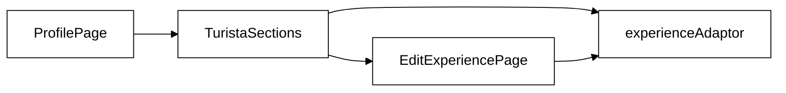

# RF08 — Edição e Exclusão de Relatos (Turista)

## Requisito

> **RF08** — O sistema deve permitir que o usuário 'Turista' edite e exclua os relatos de experiência que ele próprio publicou.
> *(Entrega_1_G5_Arquitetura_Desenho_SW — tabela de Requisitos Funcionais)*

## Diagrama de Atividades

```mermaid
%%{init: {'theme':'base','themeVariables':{'primaryColor':'#fff','primaryTextColor':'#000','primaryBorderColor':'#000','lineColor':'#000','secondaryColor':'#eee','tertiaryColor':'#fff','clusterBkg':'#fff','clusterBorder':'#000','actorBkg':'#fff','actorBorder':'#000','actorTextColor':'#000'}}}%%
flowchart TD
    A([/perfil]) --> B{Turista?}
    B -- não --> C[/login]
    B -- sim --> D[Lista relatos]
    D --> E{Editar?}
    E -- sim --> F[EditExperiencePage]
    F --> G[updateExperience]
    D --> H{Excluir?}
    H -- sim --> I[deleteExperience]
```

## Diagrama de Componentes



## O que foi feito

**EditExperiencePage (`/locais/:placeId/relatos/:id/editar`):**
- Página já esqueletada; implementação completa aproveitando o `ExperienceForm` existente (RF05)
- Carrega o relato por `placeId` e `id` via `fetchExperiencesByPlace`, passa como `defaultValues` ao form
- Ao submeter chama `updateExperience(placeId, id, data)` e redireciona para `/locais/:placeId`
- Spinner de carregamento enquanto busca o relato
- Reutiliza `CreateExperiencePage.module.css` para consistência visual

**ProfilePage — TuristaSections:**
- Botão "Editar Avaliação" agora é um `Link` para `/locais/:placeId/relatos/:id/editar`
- Botão "Excluir Avaliação" abre modal de confirmação com o nome do local avaliado
- Modal de confirmação: overlay escuro, caixa centralizada, nome do local em negrito, botões "Cancelar" e "Excluir"
- Clicar fora do dialog (no overlay) fecha o modal
- Após exclusão confirmada: `deleteExperience` é chamado, avaliação removida da lista sem recarga
- Erro de exclusão exibido dentro do modal sem fechá-lo
- Estado vazio ("Nenhuma avaliação cadastrada.") quando todas as avaliações forem excluídas

## Como foi feito

**`EditExperiencePage.jsx` (implementado):**
- `useParams()` extrai `placeId` e `id` da URL
- `useEffect` busca `fetchExperiencesByPlace(placeId)` e localiza o relato por `id`; passa o objeto encontrado como `defaultValues` ao `ExperienceForm`
- `handleSubmit` chama `updateExperience(placeId, id, data)` e redireciona para `/locais/${placeId}` após sucesso
- Reutiliza `ExperienceForm` sem modificação — o componente já suporta `defaultValues` para pré-popular campos

**`ProfilePage.jsx` — TuristaSections:**
- Refatorado de função sem estado para componente React com hooks: `useState` para `avaliacoes`, `confirmId`, `deleting`, `deleteErr`
- Mock `MOCK_AVALIACOES_TURISTA` atualizado para incluir `placeId` em cada avaliação, necessário para montar a rota de edição (`/locais/:placeId/relatos/:id/editar`)
- `handleDeleteAvaliacao`: chama `await deleteExperience(toDelete.placeId, confirmId)`, filtra o item da lista, fecha o modal

**`experienceAdaptor.js` — funções utilizadas:**
- `fetchExperiencesByPlace(placeId)`: já existente; retorna experiências filtradas por `placeId`
- `updateExperience(placeId, experienceId, data)`: já existente (mock); retorna o objeto atualizado
- `deleteExperience(placeId, experienceId)`: já existente (mock); retorna `{ success: true }`

**`ProfilePage.module.css` — estilos do modal:**
- Classes `.confirmOverlay`, `.confirmDialog`, `.confirmTitle`, `.confirmBody`, `.confirmError`, `.confirmActions` adicionadas — mesmo padrão visual compartilhado com RF07 e com o `CommentsModal` do `PlaceDetailPage`

## Reutilização de Software

| Biblioteca / Componente | Papel | Padrão |
|---|---|---|
| `ExperienceForm` (organism) | Formulário de relato reutilizado sem alteração na página de edição; suporte a `defaultValues` já embutido | Atomic Design — Organism |
| `fetchExperiencesByPlace` / `updateExperience` / `deleteExperience` | Abstrai fonte de dados (mock → API real) sem alterar os componentes | Adapter Pattern |
| `Button` (atom) | Botões de ação, cancelamento e confirmação | Atomic Design — Atom |
| `Spinner` (atom) | Feedback visual de carregamento na `EditExperiencePage` | Atomic Design — Atom |
| `ProtectedRoute` (routes) | Proteção de rota por papel reutilizada de `AppRoutes` | Guard Pattern |
| `useState` + `useEffect` (React) | Gerencia estado local do modal de confirmação e da lista de avaliações | React Hooks |
| `useNavigate` + `useParams` (react-router-dom) | Extrai IDs da URL e redireciona após salvar | React Router |
| Modal overlay inline | Mesmo padrão visual do RF07 e do `CommentsModal` do `PlaceDetailPage`; CSS compartilhado em `ProfilePage.module.css` | Padrão de projeto interno |
| `CreateExperiencePage.module.css` | CSS reutilizado pela `EditExperiencePage` sem criar nova folha de estilos | Reutilização direta de CSS Module |
